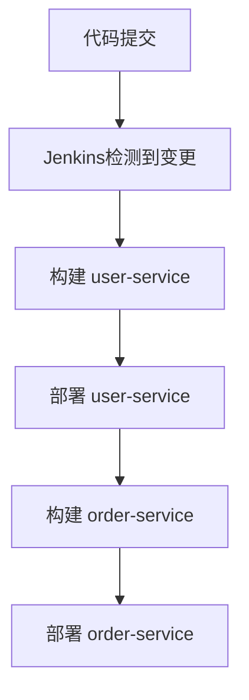

## 介绍

在现代软件开发中，微服务架构已经成为一种流行的设计模式。微服务将应用程序拆分为多个小型、独立的服务，每个服务都可以独立开发、部署和扩展。然而，这种架构也带来了新的挑战，特别是在持续集成和持续交付（CI/CD）方面。

Jenkins 是一个开源的自动化服务器，广泛用于实现CI/CD流水线。通过Jenkins，开发团队可以自动化构建、测试和部署微服务，从而提高开发效率和软件质量。

本文将逐步介绍如何使用Jenkins为微服务架构实现CI/CD流水线，并提供实际案例和代码示例。

## 微服务CI/CD的挑战

在微服务架构中，每个服务都是独立的，这意味着每个服务都需要有自己的CI/CD流水线。这带来了以下挑战：

1. **多流水线管理**：每个微服务都需要独立的构建、测试和部署流程。
2. **依赖管理**：微服务之间可能存在依赖关系，需要确保依赖服务的正确版本被部署。
3. **环境一致性**：确保开发、测试和生产环境的一致性，以避免“在我机器上可以运行”的问题。

## Jenkins 与微服务CI/CD

Jenkins 提供了强大的插件和灵活的流水线配置，能够很好地应对微服务CI/CD的挑战。以下是使用Jenkins实现微服务CI/CD的关键步骤：

### 1. 创建Jenkins流水线

Jenkins流水线可以通过Jenkinsfile定义，Jenkinsfile是一个文本文件，包含了流水线的各个阶段。以下是一个简单的Jenkinsfile示例：

```groovy
pipeline {
    agent any

    stages {
        stage('Build') {
            steps {
                echo 'Building the microservice...'
                sh 'mvn clean package'
            }
        }
        stage('Test') {
            steps {
                echo 'Running tests...'
                sh 'mvn test'
            }
        }
        stage('Deploy') {
            steps {
                echo 'Deploying the microservice...'
                sh 'kubectl apply -f k8s/deployment.yaml'
            }
        }
    }
}
```

在这个示例中，流水线分为三个阶段：构建、测试和部署。每个阶段都执行相应的命令。

### 2. 管理多流水线

对于多个微服务，可以为每个服务创建一个独立的Jenkinsfile，并在Jenkins中配置多个流水线任务。Jenkins的多分支流水线功能可以自动检测代码仓库中的分支，并为每个分支创建独立的流水线。

### 3. 处理依赖关系

微服务之间的依赖关系可以通过版本控制或服务发现机制来管理。例如，可以使用Docker镜像标签来标识不同版本的微服务，并在部署时确保依赖服务的正确版本被部署。

### 4. 环境一致性

使用容器化技术（如Docker）和基础设施即代码（如Kubernetes）可以确保环境的一致性。Jenkins可以与这些工具集成，自动化环境的创建和配置。

## 实际案例

假设我们有一个简单的微服务架构，包含两个服务：`user-service` 和 `order-service`。`order-service` 依赖于 `user-service`。以下是使用Jenkins实现CI/CD的步骤：

1. **创建Jenkinsfile**：为每个服务创建一个Jenkinsfile，定义构建、测试和部署的步骤。
2. **配置多分支流水线**：在Jenkins中配置多分支流水线，自动检测代码仓库中的分支。
3. **部署依赖服务**：在部署 `order-service` 之前，确保 `user-service` 已经部署。

以下是一个简化的部署流程：



## 总结

通过Jenkins，开发团队可以有效地管理微服务架构的CI/CD流程。Jenkins的灵活性和强大的插件生态系统使其成为实现微服务CI/CD的理想工具。

## 附加资源

- [Jenkins官方文档](https://www.jenkins.io/doc/)
- [Kubernetes官方文档](https://kubernetes.io/docs/home/)
- [Docker官方文档](https://docs.docker.com/)

## 练习

1. 为你的微服务项目创建一个简单的Jenkinsfile，并配置Jenkins流水线。
2. 尝试使用多分支流水线功能，为不同的Git分支创建独立的流水线。
3. 研究如何通过Jenkins与Kubernetes集成，实现自动化部署。

希望本文能帮助你理解如何使用Jenkins实现微服务CI/CD。如果你有任何问题，欢迎在评论区留言！