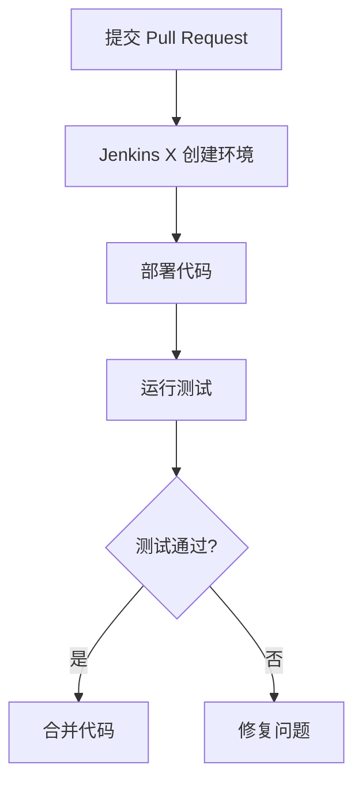
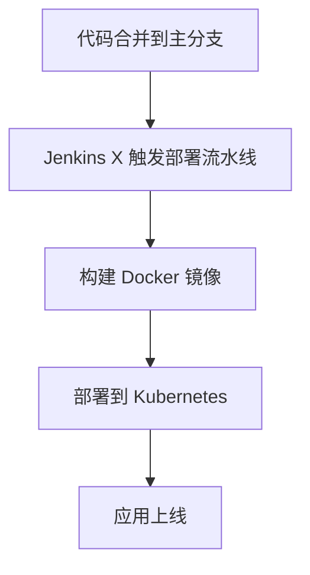

## 什么是 Jenkins X？

Jenkins X 是一个专为云原生应用设计的开源持续集成和持续交付（CI/CD）平台。它基于 Jenkins 构建，但针对 Kubernetes 和云原生环境进行了优化。Jenkins X 的目标是简化开发者在云原生环境中的 CI/CD 流程，提供自动化、可扩展和高效的解决方案。

Jenkins X 的核心功能包括：
- **自动化 CI/CD 流水线**：通过预定义的流水线模板，自动构建、测试和部署应用。
- **环境管理**：为每个 Pull Request 自动创建独立的环境，便于测试和验证。
- **GitOps 工作流**：使用 Git 作为单一事实来源，管理应用的配置和部署。
- **与 Kubernetes 深度集成**：充分利用 Kubernetes 的弹性、可扩展性和自动化能力。

## Jenkins X 的核心概念

### 1. 流水线（Pipeline）

Jenkins X 使用流水线来自动化应用的构建、测试和部署。流水线通常包括以下阶段：
- **构建**：编译代码并生成可部署的工件（如 Docker 镜像）。
- **测试**：运行单元测试、集成测试等。
- **部署**：将应用部署到 Kubernetes 集群中。

以下是一个简单的 Jenkins X 流水线示例：

```groovy
pipeline {
    agent any
    stages {
        stage('Build') {
            steps {
                sh 'mvn clean package'
            }
        }
        stage('Test') {
            steps {
                sh 'mvn test'
            }
        }
        stage('Deploy') {
            steps {
                sh 'jx promote --version 1.0.0'
            }
        }
    }
}
```

### 2. 环境（Environment）

Jenkins X 为每个 Pull Request 自动创建一个独立的环境，用于测试和验证代码变更。这些环境是临时的，通常在 Pull Request 合并后自动销毁。

:::note
环境管理是 Jenkins X 的一大亮点，它允许开发者在隔离的环境中测试代码，而不会影响生产环境。
:::

### 3. GitOps

Jenkins X 采用 GitOps 工作流，将 Git 作为配置和部署的唯一事实来源。所有环境配置、应用部署和流水线定义都存储在 Git 仓库中，确保可追溯性和一致性。

## Jenkins X 的实际应用场景

### 场景 1：自动创建 Pull Request 环境

假设你正在开发一个微服务应用，并提交了一个 Pull Request。Jenkins X 会自动创建一个独立的环境，部署你的代码变更，并运行所有测试。如果测试通过，你可以安全地合并代码。



### 场景 2：自动化部署到生产环境

当代码合并到主分支后，Jenkins X 会自动触发生产环境的部署流水线。流水线会构建新的 Docker 镜像，并将其部署到 Kubernetes 集群中。



## 总结

Jenkins X 是一个强大的工具，专为云原生环境设计，能够显著简化 CI/CD 流程。通过自动化流水线、环境管理和 GitOps 工作流，Jenkins X 帮助开发者更高效地构建、测试和部署应用。

:::tip
如果你是初学者，建议从 Jenkins X 的官方文档开始，逐步探索其功能和用法。
:::

## 附加资源

- [Jenkins X 官方文档](https://jenkins-x.io/docs/)
- [Kubernetes 官方文档](https://kubernetes.io/docs/home/)
- [GitOps 简介](https://www.weave.works/technologies/gitops/)

## 练习

1. 尝试在本地 Kubernetes 集群中安装 Jenkins X，并创建一个简单的流水线。
2. 提交一个 Pull Request，观察 Jenkins X 如何自动创建环境并运行测试。
3. 探索 Jenkins X 的 GitOps 工作流，尝试修改环境配置并观察其如何自动同步到集群。