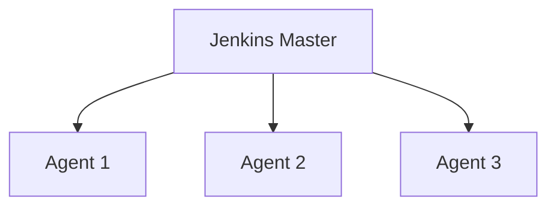

# Jenkins 性能优化

Jenkins是一个广泛使用的持续集成和持续交付（CI/CD）工具，但随着项目规模的扩大和构建任务的增多，Jenkins的性能可能会受到影响。本文将介绍一些Jenkins性能优化的最佳实践，帮助你提升构建效率，减少资源消耗。

## 1. 介绍

Jenkins的性能优化是一个持续的过程，旨在通过调整配置、优化构建脚本和合理分配资源来提高系统的整体效率。对于初学者来说，理解这些优化策略可以帮助你更好地管理Jenkins实例，避免常见的性能瓶颈。

## 2. 优化策略

### 2.1 减少构建队列中的任务

Jenkins的构建队列是任务等待执行的地方。如果队列中的任务过多，可能会导致构建延迟。以下是一些减少构建队列中任务的策略：

- **限制并发构建**：通过设置`Executor`的数量来限制并发构建的数量。可以在`Manage Jenkins` -> `Configure System`中调整`# of executors`。
  
  ```groovy
  // 示例：限制并发构建数量
  jenkins.model.Jenkins.instance.setNumExecutors(4)
  ```

- **使用构建触发器**：合理配置构建触发器，避免不必要的构建。例如，可以使用`Poll SCM`而不是`Build periodically`来减少构建频率。

### 2.2 优化构建脚本

构建脚本的优化可以显著提高构建速度。以下是一些优化建议：

- **减少不必要的步骤**：检查构建脚本，移除不必要的步骤或命令。
  
- **并行执行任务**：如果构建脚本中有多个独立的任务，可以考虑并行执行它们。例如，使用`parallel`步骤：

  ```groovy
  // 示例：并行执行任务
  parallel(
      task1: {
          echo 'Task 1'
      },
      task2: {
          echo 'Task 2'
      }
  )
  ```

### 2.3 使用分布式构建

当单个Jenkins节点无法满足构建需求时，可以考虑使用分布式构建。通过添加多个`Agent`节点，可以将构建任务分发到不同的机器上执行，从而减轻主节点的负载。



### 2.4 优化Jenkins配置

Jenkins的配置也会影响其性能。以下是一些常见的优化配置：

- **调整JVM参数**：通过调整Jenkins的JVM参数，可以优化内存使用和垃圾回收。可以在`Jenkins`启动脚本中添加以下参数：

  ```bash
  # 示例：调整JVM参数
  JAVA_OPTS="-Xmx2048m -Xms1024m -XX:MaxPermSize=512m"
  ```

- **清理旧构建**：定期清理旧的构建记录，释放磁盘空间。可以使用`Discard Old Builds`插件或手动删除旧构建。

### 2.5 使用缓存

缓存可以显著减少构建时间，尤其是在依赖项较多的情况下。以下是一些常见的缓存策略：

- **Maven/Gradle缓存**：配置Maven或Gradle使用本地缓存，避免每次构建都下载依赖项。

  ```groovy
  // 示例：配置Gradle缓存
  gradle.properties
  org.gradle.caching=true
  ```

- **Docker镜像缓存**：在Docker构建中使用缓存层，减少镜像构建时间。

  ```dockerfile
  # 示例：使用Docker缓存
  FROM node:14
  COPY package.json .
  RUN npm install
  COPY . .
  ```

## 3. 实际案例

### 3.1 案例：优化大型项目的构建时间

假设你有一个大型Java项目，每次构建都需要下载大量的依赖项，导致构建时间过长。通过以下优化措施，你可以显著减少构建时间：

1. **配置Maven本地仓库**：将Maven的本地仓库配置为共享目录，避免每次构建都下载依赖项。
   
   ```xml
   <!-- 示例：配置Maven本地仓库 -->
   <settings>
       <localRepository>/path/to/shared/repo</localRepository>
   </settings>
   ```

2. **并行执行测试**：将测试任务并行化，减少测试时间。

   ```groovy
   // 示例：并行执行测试
   parallel(
       unitTests: {
           sh 'mvn test -Dtest=UnitTests'
       },
       integrationTests: {
           sh 'mvn test -Dtest=IntegrationTests'
       }
   )
   ```

3. **清理旧构建**：定期清理旧的构建记录，释放磁盘空间。

   ```groovy
   // 示例：清理旧构建
   properties([
       buildDiscarder(logRotator(numToKeepStr: '10'))
   ])
   ```

通过以上优化措施，该项目的构建时间从原来的30分钟减少到了10分钟。

## 4. 总结

Jenkins性能优化是一个持续的过程，需要根据项目的具体情况进行调整。通过减少构建队列中的任务、优化构建脚本、使用分布式构建、调整Jenkins配置和使用缓存，你可以显著提升Jenkins的性能，减少资源消耗。

## 5. 附加资源

- [Jenkins官方文档](https://www.jenkins.io/doc/)
- [Jenkins性能优化指南](https://www.jenkins.io/doc/book/scaling/performance/)
- [Maven本地仓库配置](https://maven.apache.org/guides/mini/guide-configuring-maven.html)

## 6. 练习

1. 尝试在你的Jenkins实例中调整`Executor`的数量，观察构建队列的变化。
2. 优化一个现有的构建脚本，移除不必要的步骤或并行执行独立任务。
3. 配置Maven或Gradle使用本地缓存，观察构建时间的变化。

:::tip
记住，性能优化是一个持续的过程，定期检查和调整你的Jenkins配置和构建脚本，以确保系统始终处于最佳状态。
:::