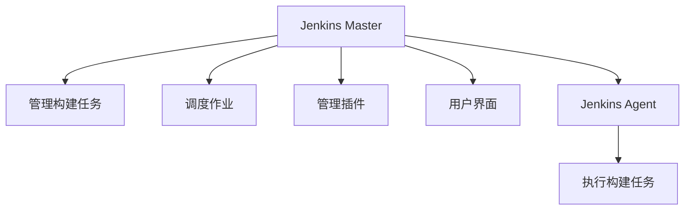

## 介绍

Jenkins是一个开源的持续集成和持续交付（CI/CD）工具，广泛用于自动化构建、测试和部署软件。Jenkins的核心优势之一是其**可扩展架构**，允许用户通过插件和自定义扩展来增强其功能。这种架构使得Jenkins能够适应各种复杂的CI/CD需求，从简单的构建任务到复杂的多环境部署。

在本篇文章中，我们将深入探讨Jenkins的可扩展架构，了解其核心组件、插件系统以及如何通过自定义扩展来满足特定需求。

## Jenkins 的核心架构

Jenkins的核心架构由以下几个主要组件组成：

1. **Jenkins Master**：负责管理构建任务、调度作业、管理插件和用户界面。
2. **Jenkins Agent**：执行具体的构建任务，通常运行在远程机器上。
3. **插件系统**：Jenkins的核心功能通过插件扩展，用户可以根据需要安装和配置插件。



## 插件系统

Jenkins的插件系统是其可扩展架构的核心。通过插件，用户可以轻松地扩展Jenkins的功能，例如集成版本控制系统、构建工具、测试框架等。

### 安装插件

在Jenkins中安装插件非常简单。可以通过Jenkins的Web界面或使用Jenkins CLI来安装插件。

1. **通过Web界面安装插件**：
   - 进入Jenkins管理界面。
   - 选择“Manage Jenkins” > “Manage Plugins”。
   - 在“Available”选项卡中搜索所需的插件，然后点击“Install without restart”。

2. **通过Jenkins CLI安装插件**：
   ```bash
   java -jar jenkins-cli.jar -s http://localhost:8080/ install-plugin <plugin-name>
   ```

### 常用插件示例

以下是一些常用的Jenkins插件及其功能：

- **Git Plugin**：集成Git版本控制系统。
- **Pipeline Plugin**：支持Jenkins Pipeline，允许用户以代码的形式定义构建流程。
- **Docker Plugin**：集成Docker，支持在Docker容器中运行构建任务。

## 自定义扩展

除了使用现有的插件，Jenkins还允许用户通过编写自定义插件或脚本扩展其功能。Jenkins提供了丰富的API和扩展点，使得开发人员可以根据需要定制Jenkins的行为。

### 编写自定义插件

编写自定义插件需要一定的Java编程知识。以下是一个简单的自定义插件示例，该插件在构建任务完成后发送通知。

```java
import hudson.Extension;
import hudson.Launcher;
import hudson.model.AbstractBuild;
import hudson.model.AbstractProject;
import hudson.model.BuildListener;
import hudson.tasks.BuildStepDescriptor;
import hudson.tasks.Builder;
import hudson.tasks.Notifier;
import org.kohsuke.stapler.DataBoundConstructor;

public class CustomNotifier extends Notifier {

    @DataBoundConstructor
    public CustomNotifier() {
    }

    @Override
    public boolean perform(AbstractBuild<?, ?> build, Launcher launcher, BuildListener listener) {
        listener.getLogger().println("Build completed! Sending notification...");
        // 在这里添加发送通知的逻辑
        return true;
    }

    @Extension
    public static final class DescriptorImpl extends BuildStepDescriptor<Builder> {
        @Override
        public boolean isApplicable(Class<? extends AbstractProject> jobType) {
            return true;
        }

        @Override
        public String getDisplayName() {
            return "Custom Notifier";
        }
    }
}
```

### 使用Groovy脚本扩展

Jenkins还支持通过Groovy脚本进行扩展。以下是一个简单的Groovy脚本示例，该脚本在构建任务完成后打印一条消息。

```groovy
def build = Thread.currentThread().executable
build.addAction(new hudson.model.CauseAction(new hudson.model.Cause.UserIdCause()))
build.save()
println "Build completed by user: ${build.getCause(hudson.model.Cause.UserIdCause).getUserId()}"
```

## 实际案例

假设你正在开发一个微服务架构的应用程序，每个服务都有自己的代码库和构建流程。为了简化CI/CD流程，你可以使用Jenkins Pipeline插件来定义整个构建流程，并通过自定义插件在构建完成后发送通知。

```groovy
pipeline {
    agent any
    stages {
        stage('Build') {
            steps {
                sh 'mvn clean package'
            }
        }
        stage('Test') {
            steps {
                sh 'mvn test'
            }
        }
        stage('Deploy') {
            steps {
                sh 'mvn deploy'
            }
        }
    }
    post {
        success {
            echo 'Build succeeded! Sending notification...'
            // 在这里调用自定义插件的通知逻辑
        }
        failure {
            echo 'Build failed! Sending notification...'
            // 在这里调用自定义插件的通知逻辑
        }
    }
}
```

## 总结

Jenkins的可扩展架构使其成为一个功能强大且灵活的CI/CD工具。通过插件系统和自定义扩展，用户可以根据需要轻松地扩展Jenkins的功能，满足各种复杂的构建和部署需求。无论是通过现有的插件还是编写自定义插件，Jenkins都提供了丰富的工具和API来支持用户的需求。

## 附加资源

- [Jenkins官方文档](https://www.jenkins.io/doc/)
- [Jenkins插件开发指南](https://www.jenkins.io/doc/developer/)
- [Jenkins Pipeline语法参考](https://www.jenkins.io/doc/book/pipeline/syntax/)

## 练习

1. 在Jenkins中安装一个你感兴趣的插件，并尝试配置和使用它。
2. 编写一个简单的Groovy脚本，在构建任务完成后打印一条自定义消息。
3. 尝试编写一个简单的Jenkins插件，扩展Jenkins的功能。

通过以上练习，你将更深入地理解Jenkins的可扩展架构，并掌握如何通过插件和自定义扩展来增强Jenkins的功能。