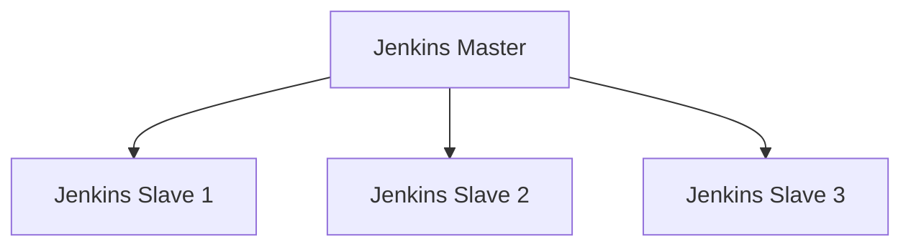
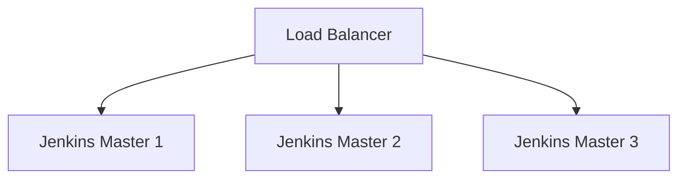

## 介绍

Jenkins是一个广泛使用的持续集成和持续交付（CI/CD）工具，用于自动化构建、测试和部署软件。由于Jenkins在现代软件开发中扮演着关键角色，确保其高可用性和灾难恢复能力至关重要。Jenkins灾备方案旨在通过备份、冗余和快速恢复机制，确保在发生硬件故障、数据丢失或其他灾难性事件时，Jenkins系统能够迅速恢复正常运行。

本文将逐步介绍如何为Jenkins实施灾备方案，涵盖备份策略、高可用性配置以及灾难恢复的最佳实践。

## 1. 备份策略

### 1.1 备份Jenkins主目录

Jenkins的所有配置、作业数据和插件都存储在Jenkins主目录中。定期备份该目录是灾备方案的基础。

```bash
# 备份Jenkins主目录
tar -czf jenkins_home_backup_$(date +%F).tar.gz /var/lib/jenkins
```

:::tip
建议将备份文件存储在远程位置或云存储中，以防止本地硬件故障导致的数据丢失。
:::

### 1.2 备份Jenkins配置文件

除了主目录，Jenkins的配置文件（如`/etc/sysconfig/jenkins`或`/etc/default/jenkins`）也应定期备份。

```bash
# 备份Jenkins配置文件
cp /etc/sysconfig/jenkins /backup/jenkins_config_$(date +%F).conf
```

## 2. 高可用性配置

### 2.1 使用Jenkins主从架构

Jenkins支持主从架构，通过将工作负载分配到多个从节点，可以提高系统的可用性和扩展性。



:::note
在主节点发生故障时，从节点可以继续执行任务，减少业务中断。
:::

### 2.2 使用负载均衡器

在多个Jenkins主节点前部署负载均衡器，可以进一步提高系统的可用性。



## 3. 灾难恢复

### 3.1 恢复Jenkins主目录

在灾难发生后，可以通过备份文件快速恢复Jenkins主目录。

```bash
# 恢复Jenkins主目录
tar -xzf jenkins_home_backup_2023-10-01.tar.gz -C /var/lib/jenkins
```

### 3.2 恢复Jenkins配置文件

恢复Jenkins配置文件以确保系统配置的一致性。

```bash
# 恢复Jenkins配置文件
cp /backup/jenkins_config_2023-10-01.conf /etc/sysconfig/jenkins
```

## 4. 实际案例

### 4.1 案例：硬件故障后的快速恢复

某公司使用Jenkins进行持续集成，某天主服务器发生硬件故障，导致Jenkins服务中断。由于该公司实施了灾备方案，他们迅速从备份中恢复了Jenkins主目录和配置文件，并在备用服务器上重新启动了Jenkins服务，业务在短时间内恢复正常。

## 总结

Jenkins灾备方案是确保系统高可用性和快速恢复的关键。通过定期备份、配置高可用性架构以及制定灾难恢复计划，可以有效减少业务中断时间，保障持续集成和交付流程的稳定性。

## 附加资源

- [Jenkins官方文档](https://www.jenkins.io/doc/)
- [Jenkins备份与恢复指南](https://www.jenkins.io/doc/book/system-administration/backing-up/)
- [Jenkins高可用性配置](https://www.jenkins.io/doc/book/scaling/high-availability/)

## 练习

1. 为你的Jenkins实例创建一个备份脚本，并测试其恢复过程。
2. 配置一个Jenkins主从架构，并模拟主节点故障，观察从节点的表现。
3. 研究并尝试使用负载均衡器来提高Jenkins的可用性。
