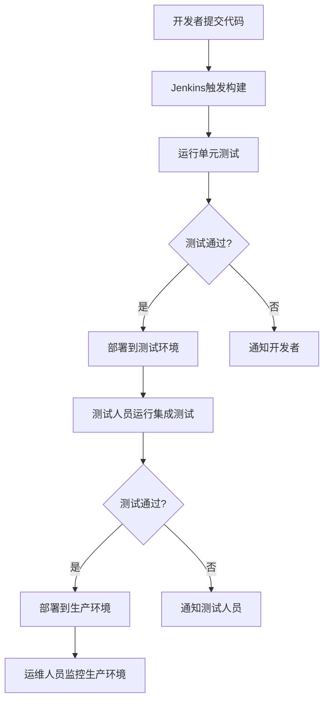

# Jenkins 团队协作

在现代软件开发中，团队协作是成功的关键。Jenkins作为一款流行的持续集成和持续交付（CI/CD）工具，提供了强大的功能来支持团队协作。本文将介绍如何在Jenkins中实现高效的团队协作，包括权限管理、共享流水线和最佳实践。

## 介绍

Jenkins团队协作的核心在于如何让多个开发者、测试人员和运维人员共同使用Jenkins，同时确保系统的安全性和稳定性。通过合理的权限管理、共享流水线和清晰的沟通机制，团队可以更高效地完成开发和部署任务。

## 权限管理

在Jenkins中，权限管理是团队协作的基础。通过配置用户和角色，可以确保每个团队成员只能访问和操作他们需要的资源。

### 安装Role Strategy插件

首先，需要安装`Role Strategy`插件来管理用户角色和权限。

1. 进入Jenkins管理界面。
2. 选择`Manage Plugins`。
3. 在`Available`选项卡中搜索`Role Strategy`插件并安装。

### 配置角色和权限

安装插件后，可以配置角色和权限。

1. 进入`Manage Jenkins` > `Manage and Assign Roles` > `Manage Roles`。
2. 创建全局角色（Global Roles）和项目角色（Item Roles）。
3. 为每个角色分配相应的权限。

```groovy
// 示例：创建一个全局角色
role('developer', {
    permissions: [
        'hudson.model.Item.Build',
        'hudson.model.Item.Read',
        'hudson.model.Item.Workspace'
    ]
})
```

:::tip
确保为每个角色分配最小必要的权限，以遵循最小权限原则。
:::

## 共享流水线

在团队协作中，共享流水线是提高效率的关键。通过共享流水线，团队成员可以复用已有的流水线配置，减少重复工作。

### 使用共享库

Jenkins支持使用共享库（Shared Libraries）来存储和复用流水线脚本。

1. 在Jenkins中创建一个共享库仓库。
2. 在Jenkins配置中定义共享库。

```groovy
// 示例：定义共享库
library 'my-shared-library@main'
```

3. 在流水线脚本中引用共享库。

```groovy
@Library('my-shared-library') _
pipeline {
    agent any
    stages {
        stage('Build') {
            steps {
                script {
                    mySharedLibrary.build()
                }
            }
        }
    }
}
```

:::note
共享库可以包含通用的构建、测试和部署逻辑，供多个项目复用。
:::

## 实际案例

假设一个团队正在开发一个Web应用，团队成员包括开发者、测试人员和运维人员。通过Jenkins的团队协作功能，他们可以高效地完成以下任务：

1. **开发者**：提交代码后，自动触发构建和单元测试。
2. **测试人员**：在测试环境中部署应用并运行集成测试。
3. **运维人员**：在生产环境中部署应用并监控运行状态。



## 总结

通过合理的权限管理、共享流水线和清晰的沟通机制，团队可以在Jenkins中实现高效的协作。这不仅提高了开发效率，还确保了系统的安全性和稳定性。

## 附加资源

- [Jenkins官方文档](https://www.jenkins.io/doc/)
- [Role Strategy插件文档](https://plugins.jenkins.io/role-strategy/)
- [Shared Libraries文档](https://www.jenkins.io/doc/book/pipeline/shared-libraries/)

## 练习

1. 在Jenkins中创建一个新的全局角色，并为其分配适当的权限。
2. 创建一个共享库，并在流水线脚本中引用它。
3. 设计一个简单的流水线，模拟开发、测试和部署流程。

通过以上练习，你将更好地理解Jenkins团队协作的实际应用。