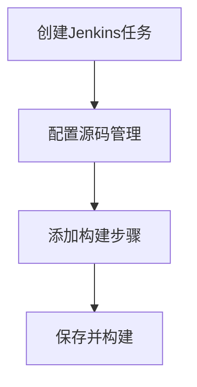

# Jenkins 构建步骤

Jenkins是一个开源的自动化服务器，广泛用于持续集成和持续交付（CI/CD）。在Jenkins中，**构建步骤**是构建任务的核心部分，它定义了在构建过程中需要执行的操作。本文将详细介绍Jenkins中的构建步骤，帮助初学者理解如何配置和执行这些步骤。

## 什么是构建步骤？

构建步骤是Jenkins任务中的一个或多个操作，用于执行特定的任务，例如编译代码、运行测试、打包应用程序等。每个构建步骤可以是脚本、命令或插件提供的功能。Jenkins支持多种类型的构建步骤，包括Shell脚本、Windows批处理命令、Maven构建等。

## 常见的构建步骤类型

### 1. Shell脚本

Shell脚本是最常见的构建步骤之一，适用于Linux和Unix系统。你可以在构建步骤中编写Shell命令来执行各种操作。

```bash
echo "开始构建..."
mvn clean install
echo "构建完成！"
```

**输入：** 上述脚本将执行Maven的`clean install`命令，清理项目并构建它。

**输出：** 控制台输出将显示构建过程的详细信息。

### 2. Windows批处理命令

对于Windows系统，你可以使用批处理命令来执行构建步骤。

```batch
echo 开始构建...
mvn clean install
echo 构建完成！
```

**输入：** 上述脚本将执行Maven的`clean install`命令。

**输出：** 控制台输出将显示构建过程的详细信息。

### 3. Maven构建

如果你使用的是Maven项目，Jenkins提供了专门的Maven构建步骤。

```xml
<project>
  <modelVersion>4.0.0</modelVersion>
  <groupId>com.example</groupId>
  <artifactId>my-app</artifactId>
  <version>1.0-SNAPSHOT</version>
  <build>
    <plugins>
      <plugin>
        <groupId>org.apache.maven.plugins</groupId>
        <artifactId>maven-compiler-plugin</artifactId>
        <version>3.8.1</version>
        <configuration>
          <source>1.8</source>
          <target>1.8</target>
        </configuration>
      </plugin>
    </plugins>
  </build>
</project>
```

**输入：** 上述`pom.xml`文件配置了Maven项目的构建信息。

**输出：** Jenkins将根据`pom.xml`文件执行Maven构建。

## 实际案例：构建一个Java项目

假设我们有一个简单的Java项目，使用Maven进行构建。以下是如何在Jenkins中配置构建步骤的示例。

1. **创建Jenkins任务：** 在Jenkins中创建一个新的自由风格项目。
2. **配置源码管理：** 选择Git，并填写项目的Git仓库URL。
3. **添加构建步骤：** 在构建步骤中选择“Invoke top-level Maven targets”，并填写`clean install`。
4. **保存并构建：** 保存配置并触发构建。



**输入：** 上述步骤配置了一个简单的Maven构建任务。

**输出：** Jenkins将拉取代码并执行`clean install`命令，生成构建结果。

## 总结

Jenkins的构建步骤是自动化构建过程的核心部分。通过配置不同的构建步骤，你可以实现从代码编译到测试、打包和部署的完整流程。本文介绍了常见的构建步骤类型，并通过一个实际案例展示了如何配置和执行构建任务。

:::tip
**提示：** 在实际项目中，你可以结合多个构建步骤来实现复杂的构建流程。例如，先编译代码，然后运行单元测试，最后打包应用程序。
:::

## 附加资源

- [Jenkins官方文档](https://www.jenkins.io/doc/)
- [Maven官方文档](https://maven.apache.org/guides/)
- [Shell脚本教程](https://www.shellscript.sh/)

## 练习

1. 在Jenkins中创建一个新的任务，配置一个Shell脚本构建步骤，输出“Hello, Jenkins!”。
2. 尝试使用Maven构建步骤构建一个简单的Java项目，并观察构建结果。

通过以上练习，你将更好地理解Jenkins构建步骤的配置和执行过程。