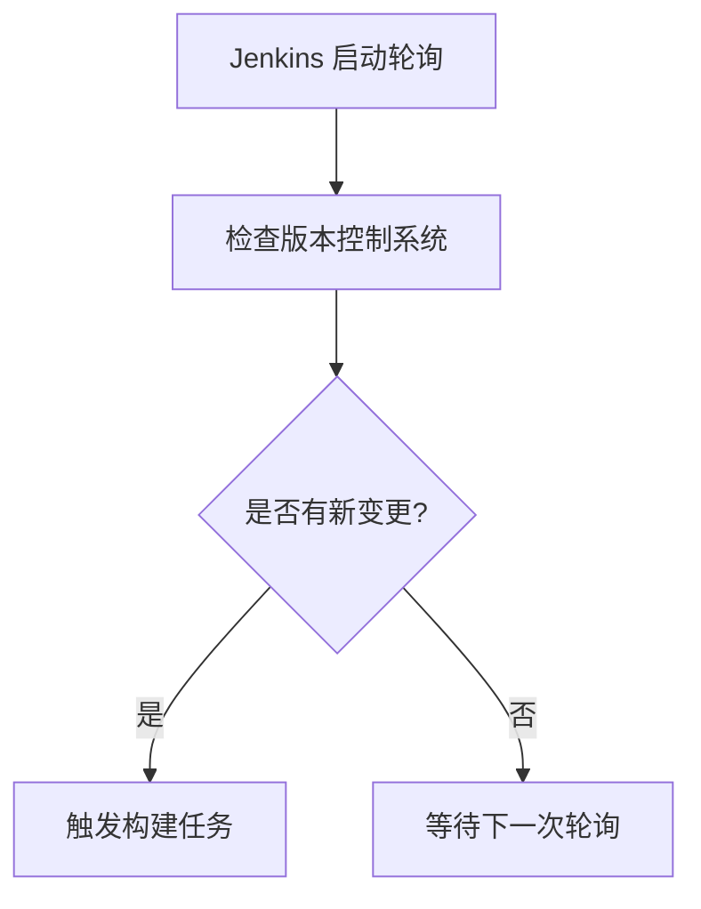

# Jenkins 变更集检测

在持续集成（CI）和持续交付（CD）的实践中，Jenkins 是一个广泛使用的自动化工具。它能够与版本控制系统（如 Git、SVN 等）集成，自动检测代码库中的变更，并触发相应的构建和测试流程。**变更集检测**是 Jenkins 的核心功能之一，它确保每次代码提交后，Jenkins 都能及时响应并执行构建任务。

本文将详细介绍 Jenkins 的变更集检测功能，帮助初学者理解其工作原理、配置方法以及实际应用场景。

---

## 什么是变更集检测？

变更集检测是指 Jenkins 能够监控版本控制系统中的代码库，检测是否有新的提交或变更。当检测到变更时，Jenkins 会自动触发构建任务，确保代码库的最新状态能够通过构建和测试流程。

例如，当开发人员向 Git 仓库推送新的提交时，Jenkins 会检测到这些变更，并启动构建任务。这种机制确保了代码的持续集成，避免了手动触发构建的繁琐操作。

---

## 如何配置变更集检测？

Jenkins 的变更集检测功能通常与版本控制系统（如 Git、SVN 等）集成。以下是配置变更集检测的步骤：

### 1. 安装必要的插件
首先，确保 Jenkins 已经安装了与版本控制系统相关的插件。例如，如果使用 Git，需要安装 **Git Plugin**。

:::tip
可以通过 Jenkins 的插件管理页面（`Manage Jenkins > Manage Plugins`）搜索并安装所需插件。
:::

### 2. 配置版本控制系统
在 Jenkins 任务（Job）的配置页面中，找到 **Source Code Management** 部分。选择你的版本控制系统（如 Git），并填写仓库的 URL 和凭证信息。

```plaintext
Repository URL: https://github.com/your-username/your-repo.git
Credentials: (选择或添加你的 Git 凭证)
```

### 3. 启用变更集检测
在 **Build Triggers** 部分，启用 **Poll SCM** 选项。Poll SCM 是 Jenkins 检测变更集的主要方式。你可以设置一个时间间隔（如 `H/5 * * * *`），让 Jenkins 每隔 5 分钟检查一次代码库是否有变更。

```plaintext
Poll SCM: H/5 * * * *
```

:::note
`H/5 * * * *` 是 Cron 表达式，表示每隔 5 分钟检查一次。你可以根据需要调整时间间隔。
:::

### 4. 保存并测试
保存配置后，Jenkins 会开始定期检查代码库的变更。如果有新的提交，Jenkins 会自动触发构建任务。

---

## 变更集检测的工作原理

Jenkins 的变更集检测依赖于版本控制系统的 API 或命令行工具。以下是其工作原理的简要说明：

1. **轮询（Polling）**：Jenkins 定期向版本控制系统发送请求，检查是否有新的提交。
2. **变更集比较**：Jenkins 会比较当前代码库的状态与上一次构建时的状态，确定是否有新的变更。
3. **触发构建**：如果检测到变更，Jenkins 会启动构建任务。

以下是一个简单的流程图，展示了变更集检测的过程：



---

## 实际应用场景

### 场景 1：团队协作开发
在一个团队协作开发的项目中，多个开发人员会频繁地向 Git 仓库提交代码。通过配置 Jenkins 的变更集检测，可以确保每次提交后，代码都能通过自动化测试，避免引入错误。

### 场景 2：持续交付管道
在持续交付管道中，变更集检测是确保代码从开发环境到生产环境无缝流转的关键步骤。Jenkins 检测到变更后，可以自动触发测试、构建和部署流程。

---

## 总结

Jenkins 的变更集检测功能是持续集成和持续交付的核心组成部分。通过配置 Poll SCM，Jenkins 能够自动检测代码库的变更，并触发构建任务，确保代码的持续集成和测试。

对于初学者来说，掌握变更集检测的配置和使用方法，是迈向高效开发和自动化运维的重要一步。

---

## 附加资源与练习

### 资源
- [Jenkins 官方文档](https://www.jenkins.io/doc/)
- [Git Plugin 使用指南](https://plugins.jenkins.io/git/)

### 练习
1. 创建一个 Jenkins 任务，配置 Git 仓库并启用 Poll SCM。
2. 向 Git 仓库提交代码，观察 Jenkins 是否自动触发构建。
3. 尝试调整 Poll SCM 的时间间隔，测试不同配置的效果。

通过实践，你将更深入地理解 Jenkins 变更集检测的工作原理和应用场景。