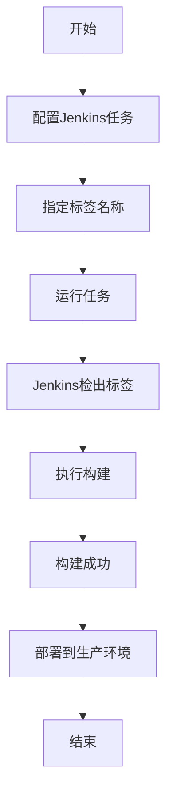

# Jenkins 标签检出

Jenkins是一个广泛使用的持续集成和持续交付（CI/CD）工具，它可以帮助开发团队自动化构建、测试和部署流程。在版本控制系统中，标签（Tag）是一个重要的概念，它通常用于标记特定的代码版本（例如发布版本）。Jenkins的**标签检出**功能允许你在构建过程中检出特定的标签，从而确保构建的代码版本是稳定且可预测的。

本文将详细介绍Jenkins中的标签检出功能，并通过实际案例帮助你理解其应用场景。

---

## 什么是标签检出？

在版本控制系统（如Git）中，标签是一个指向特定提交的引用。它通常用于标记重要的里程碑，例如发布版本（如`v1.0.0`）。Jenkins的标签检出功能允许你在构建过程中检出特定的标签，而不是默认的分支（如`main`或`master`）。这对于需要基于特定版本进行构建的场景非常有用。

:::note
标签检出与分支检出的区别：
- **分支检出**：检出分支的最新提交，通常用于持续集成。
- **标签检出**：检出特定标签指向的提交，通常用于发布构建或回滚。
:::

---

## 如何在Jenkins中配置标签检出？

在Jenkins中配置标签检出非常简单，以下是具体步骤：

### 1. 创建或编辑一个Jenkins任务
首先，进入Jenkins仪表盘，创建一个新的任务或编辑一个现有的任务。

### 2. 配置版本控制
在任务配置页面，找到**源代码管理**部分，选择你的版本控制系统（如Git）。填写仓库URL和凭据信息。

### 3. 指定标签
在**分支**字段中，输入你想要检出的标签名称。例如，如果你想检出`v1.0.0`标签，可以输入：
```
refs/tags/v1.0.0
```

:::tip
如果你不确定标签名称，可以在Git仓库中运行以下命令查看所有标签：
```bash
git tag
```
:::

### 4. 保存并运行任务
保存配置后，运行任务。Jenkins将检出指定的标签并执行构建。

---

## 实际案例：基于标签的发布构建

假设你正在开发一个Web应用程序，并使用Git进行版本控制。你刚刚完成了`v1.0.0`版本的开发，并为其打上了标签。现在，你需要使用Jenkins构建并部署这个版本。

### 步骤：
1. 在Git仓库中创建标签：
   ```bash
   git tag v1.0.0
   git push origin v1.0.0
   ```

2. 在Jenkins中配置任务，检出`v1.0.0`标签：
   - 在**分支**字段中输入：`refs/tags/v1.0.0`。

3. 运行任务，Jenkins将检出`v1.0.0`标签并执行构建。

4. 构建成功后，部署到生产环境。

:::caution
确保标签名称正确，否则Jenkins将无法检出代码并导致构建失败。
:::

---

## 使用Mermaid绘制标签检出流程

以下是一个简单的流程图，展示了Jenkins标签检出的过程：



---

## 总结

Jenkins的标签检出功能是一个强大的工具，特别适用于需要基于特定版本进行构建的场景。通过本文的学习，你应该已经掌握了如何在Jenkins中配置和使用标签检出功能，并理解了其在实际开发中的应用。

---

## 附加资源与练习

### 资源
- [Jenkins官方文档](https://www.jenkins.io/doc/)
- [Git标签管理指南](https://git-scm.com/book/en/v2/Git-Basics-Tagging)

### 练习
1. 在你的Jenkins任务中，尝试检出不同的标签并观察构建结果。
2. 创建一个新的Git标签，并使用Jenkins构建该标签。
3. 探索Jenkins的其他版本控制功能，例如分支检出和参数化构建。

通过实践，你将更深入地理解Jenkins的标签检出功能，并能够灵活应用于实际项目中。