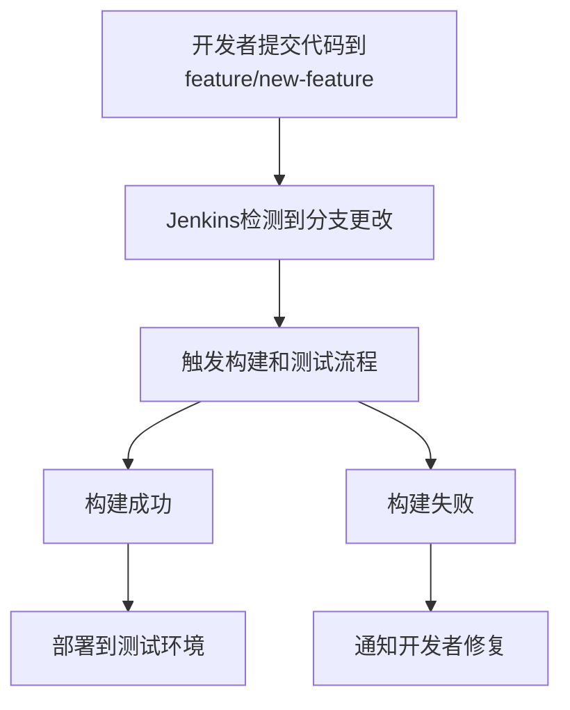

# Jenkins 分支管理

在现代软件开发中，分支管理是版本控制的核心部分。Jenkins作为一款流行的持续集成工具，提供了强大的分支管理功能，帮助团队高效地构建、测试和部署代码。本文将详细介绍Jenkins中的分支管理，并通过实际案例展示其应用。

## 什么是Jenkins分支管理？

Jenkins分支管理是指在Jenkins中配置和管理代码库中的不同分支，以便为每个分支自动触发构建、测试和部署流程。通过分支管理，团队可以并行开发多个功能或修复多个问题，而不会影响主分支的稳定性。

## 为什么需要分支管理？

1. **并行开发**：多个开发者可以在不同的分支上同时工作，互不干扰。
2. **隔离风险**：新功能或修复可以在独立的分支上开发和测试，避免影响主分支。
3. **持续集成**：每个分支的更改可以自动触发构建和测试，确保代码质量。

## Jenkins 分支管理的基本配置

在Jenkins中，分支管理通常通过插件（如Git插件）实现。以下是一个简单的配置示例：

1. **安装Git插件**：在Jenkins的插件管理中安装Git插件。
2. **配置Git仓库**：在Jenkins任务中配置Git仓库地址。
3. **设置分支触发器**：配置Jenkins任务以监听特定分支的更改。

```groovy
pipeline {
    agent any
    triggers {
        pollSCM('H/5 * * * *') // 每5分钟检查一次分支更改
    }
    stages {
        stage('Checkout') {
            steps {
                git branch: 'feature-branch', url: 'https://github.com/your-repo.git'
            }
        }
        stage('Build') {
            steps {
                sh 'mvn clean install'
            }
        }
        stage('Test') {
            steps {
                sh 'mvn test'
            }
        }
    }
}
```

:::note
在上面的示例中，Jenkins会每5分钟检查`feature-branch`分支是否有新的提交，并自动触发构建和测试流程。
:::

## 多分支流水线

Jenkins的多分支流水线（Multibranch Pipeline）功能允许您为每个分支自动创建和管理独立的流水线。这对于拥有多个活跃分支的项目非常有用。

### 配置多分支流水线

1. **创建多分支流水线任务**：在Jenkins中创建一个多分支流水线任务。
2. **配置分支源**：指定Git仓库和分支过滤规则。
3. **自动发现分支**：Jenkins会自动发现仓库中的所有分支，并为每个分支创建独立的流水线。

```groovy
pipeline {
    agent any
    stages {
        stage('Checkout') {
            steps {
                checkout scm
            }
        }
        stage('Build') {
            steps {
                sh 'mvn clean install'
            }
        }
        stage('Test') {
            steps {
                sh 'mvn test'
            }
        }
    }
}
```

:::tip
多分支流水线会自动为每个分支创建独立的构建历史，方便您查看每个分支的构建状态。
:::

## 实际案例：功能分支开发

假设您的团队正在开发一个新功能，并且您希望在独立的分支上进行开发和测试。以下是如何使用Jenkins分支管理来实现这一目标的步骤：

1. **创建功能分支**：在Git中创建一个新的功能分支`feature/new-feature`。
2. **配置Jenkins任务**：在Jenkins中配置一个任务，监听`feature/new-feature`分支的更改。
3. **自动构建和测试**：每次在`feature/new-feature`分支上提交代码时，Jenkins会自动触发构建和测试流程。



:::caution
如果构建失败，Jenkins会通知开发者修复问题，确保代码质量。
:::

## 总结

Jenkins分支管理是持续集成和持续交付流程中的重要组成部分。通过合理配置分支管理，团队可以高效地并行开发多个功能，同时确保代码质量和稳定性。本文介绍了Jenkins分支管理的基本概念、配置方法以及实际应用案例，希望对您的学习和实践有所帮助。

## 附加资源

- [Jenkins官方文档](https://www.jenkins.io/doc/)
- [Git插件使用指南](https://plugins.jenkins.io/git/)
- [多分支流水线教程](https://www.jenkins.io/doc/book/pipeline/multibranch/)

## 练习

1. 在Jenkins中创建一个多分支流水线任务，并配置它监听您Git仓库中的多个分支。
2. 尝试在某个分支上提交代码，观察Jenkins是否自动触发构建和测试流程。
3. 修改流水线脚本，添加一个新的阶段（如代码质量检查），并验证其是否正常工作。

通过以上练习，您将更深入地理解Jenkins分支管理的实际应用。