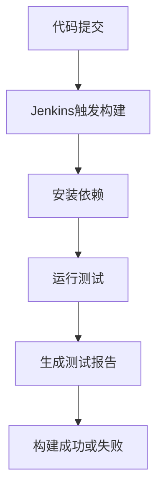

# Jenkins 集成测试

在现代软件开发中，集成测试是确保代码质量的重要环节。Jenkins作为一个流行的持续集成工具，可以帮助我们自动化这一过程。本文将详细介绍如何使用Jenkins进行集成测试，并通过实际案例展示其应用。

## 什么是集成测试？

集成测试是指在软件开发过程中，将各个模块或组件组合在一起进行测试，以确保它们能够协同工作。与单元测试不同，集成测试关注的是模块之间的交互和整体功能。

## Jenkins 与集成测试

Jenkins是一个开源的持续集成工具，可以自动化构建、测试和部署过程。通过Jenkins，我们可以配置自动化任务，在每次代码提交后自动运行集成测试，确保代码的稳定性。

### 配置Jenkins进行集成测试

1. **安装Jenkins**：首先，确保你已经安装了Jenkins。可以从[Jenkins官网](https://www.jenkins.io/)下载并安装。

2. **创建Jenkins任务**：
   - 登录Jenkins，点击“新建任务”。
   - 输入任务名称，选择“自由风格项目”，然后点击“确定”。
   - 在“源码管理”部分，选择你的版本控制系统（如Git），并配置仓库URL。
   - 在“构建触发器”部分，选择“GitHub hook trigger for GITScm polling”以在每次代码提交时触发构建。
   - 在“构建”部分，添加构建步骤，选择“执行Shell”或“执行Windows批处理命令”，并输入测试命令。例如：
     ```bash
     npm install
     npm test
     ```

3. **配置测试报告**：
   - 在“构建后操作”部分，添加“Publish JUnit test result report”以生成测试报告。
   - 配置测试报告路径，例如：`**/test-results/*.xml`。

### 实际案例

假设我们有一个Node.js项目，使用Mocha进行测试。我们可以通过以下步骤在Jenkins中配置集成测试：

1. **安装依赖**：
   ```bash
   npm install mocha chai --save-dev
   ```

2. **编写测试用例**：
   ```javascript
   // test/test.js
   const chai = require('chai');
   const expect = chai.expect;

   describe('Array', function() {
     describe('#indexOf()', function() {
       it('should return -1 when the value is not present', function() {
         expect([1, 2, 3].indexOf(4)).to.equal(-1);
       });
     });
   });
   ```

3. **配置Jenkins任务**：
   - 在Jenkins任务中，添加以下构建步骤：
     ```bash
     npm install
     npm test
     ```

4. **查看测试结果**：
   - 构建完成后，可以在Jenkins中查看测试报告，确保所有测试用例通过。

### 使用Mermaid绘制流程图

以下是一个简单的Jenkins集成测试流程图：



## 总结

通过Jenkins进行集成测试，可以确保代码在合并到主分支之前通过所有测试，从而提高代码质量。本文介绍了如何配置Jenkins任务、编写测试用例以及查看测试报告。希望这些内容能帮助你更好地理解和使用Jenkins进行集成测试。

## 附加资源

- [Jenkins官方文档](https://www.jenkins.io/doc/)
- [Mocha测试框架文档](https://mochajs.org/)
- [Chai断言库文档](https://www.chaijs.com/)

## 练习

1. 在你的项目中配置Jenkins，实现自动化集成测试。
2. 编写更多的测试用例，覆盖更多的功能模块。
3. 尝试使用不同的测试框架（如Jest）进行集成测试。

:::tip
在配置Jenkins任务时，确保你的测试命令能够正确运行，并且测试报告路径配置正确。
:::