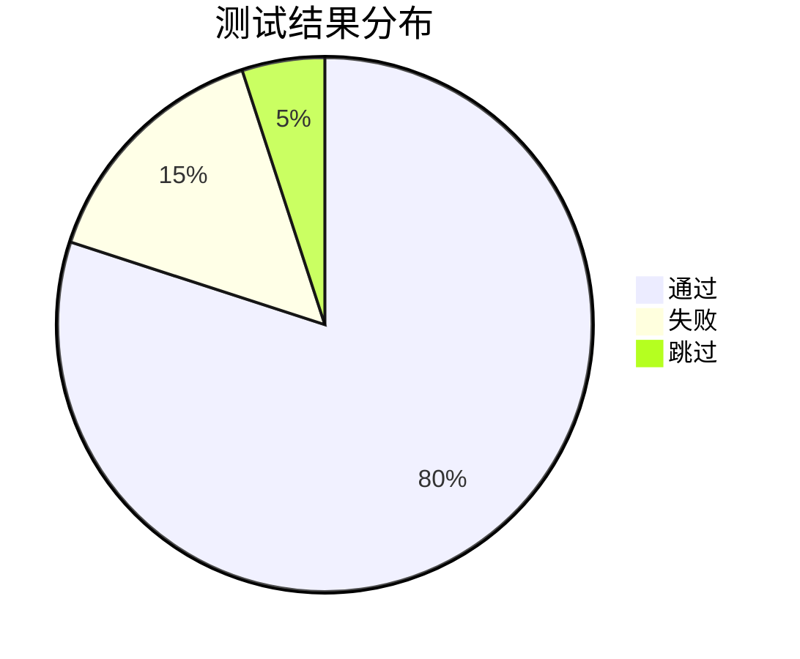

# Jenkins 测试结果分析

在持续集成（CI）和持续交付（CD）的流程中，Jenkins 是一个广泛使用的自动化工具。它不仅能够自动化构建和部署，还可以与测试工具集成，生成详细的测试结果报告。本文将介绍如何通过 Jenkins 分析测试结果，帮助你更好地理解测试报告并优化开发流程。

## 什么是 Jenkins 测试结果分析？

Jenkins 测试结果分析是指通过 Jenkins 收集、解析和展示测试工具生成的测试报告。这些报告可以帮助开发团队快速识别代码中的问题，了解测试覆盖率，并评估代码质量。Jenkins 支持多种测试工具（如 JUnit、TestNG、Cucumber 等），并能够将这些工具的测试结果以可视化的方式展示在 Jenkins 的界面上。

## 如何配置 Jenkins 收集测试结果

在 Jenkins 中，测试结果的收集通常通过插件实现。以下是配置 Jenkins 收集测试结果的基本步骤：

1. **安装插件**：确保 Jenkins 安装了必要的插件，例如 JUnit Plugin 或 TestNG Plugin。
2. **配置构建任务**：在 Jenkins 的构建任务中，添加一个步骤来运行测试工具并生成测试报告。
3. **指定测试报告路径**：在 Jenkins 的构建后操作中，指定测试报告文件的路径，以便 Jenkins 能够解析并展示结果。

以下是一个简单的 Jenkins Pipeline 示例，展示了如何运行 JUnit 测试并收集测试结果：

```groovy
pipeline {
    agent any
    stages {
        stage('Build') {
            steps {
                sh 'mvn clean compile'
            }
        }
        stage('Test') {
            steps {
                sh 'mvn test'
            }
        }
    }
    post {
        always {
            junit '**/target/surefire-reports/*.xml'
        }
    }
}
```

在这个示例中，`junit` 步骤指定了 JUnit 测试报告的位置。Jenkins 会在构建完成后解析这些报告，并在界面上展示测试结果。

## 测试结果的展示与分析

Jenkins 提供了多种方式来展示测试结果，包括：

- **测试结果趋势图**：展示测试通过率、失败率和跳过率的变化趋势。
- **测试详情页面**：展示每个测试用例的执行结果，包括通过、失败和跳过的测试。
- **测试覆盖率报告**：如果使用了代码覆盖率工具（如 JaCoCo），Jenkins 还可以展示代码覆盖率报告。

以下是一个测试结果趋势图的示例：



:::tip
通过 Jenkins 的测试结果趋势图，你可以快速发现测试失败率是否在增加，从而及时修复问题。
:::

## 实际案例：分析 JUnit 测试结果

假设你正在开发一个 Java 项目，并使用 JUnit 进行单元测试。以下是一个简单的 JUnit 测试类：

```java
import org.junit.jupiter.api.Test;
import static org.junit.jupiter.api.Assertions.*;

class CalculatorTest {
    @Test
    void testAdd() {
        Calculator calculator = new Calculator();
        assertEquals(5, calculator.add(2, 3));
    }

    @Test
    void testSubtract() {
        Calculator calculator = new Calculator();
        assertEquals(1, calculator.subtract(3, 2));
    }
}
```

在 Jenkins 中运行这些测试后，你可以在 Jenkins 的界面上看到类似以下的测试结果：

- **通过**：`testAdd` 和 `testSubtract` 都通过了测试。
- **失败**：如果某个测试失败，Jenkins 会显示失败的测试用例及其错误信息。
- **跳过**：如果有测试被跳过，Jenkins 也会显示跳过的测试用例。

:::caution
如果测试失败，请仔细查看错误信息，并修复代码中的问题。测试失败可能是由于代码逻辑错误或测试用例本身的问题。
:::

## 总结

Jenkins 测试结果分析是持续集成流程中的重要环节。通过 Jenkins，你可以轻松收集、解析和展示测试结果，从而快速发现代码中的问题并提高代码质量。本文介绍了如何配置 Jenkins 收集测试结果，并展示了如何分析测试结果的实际案例。

## 附加资源与练习

- **练习**：尝试在你的 Jenkins 项目中集成 JUnit 或 TestNG，并分析测试结果。
- **资源**：
  - [Jenkins 官方文档](https://www.jenkins.io/doc/)
  - [JUnit 5 用户指南](https://junit.org/junit5/docs/current/user-guide/)
  - [TestNG 官方文档](https://testng.org/doc/)

通过不断实践和优化，你将能够更好地利用 Jenkins 的测试结果分析功能，提升项目的开发效率和质量。