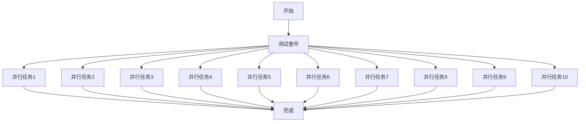

# Jenkins 并行测试

在现代软件开发中，测试是确保代码质量的关键步骤。随着项目规模的扩大，测试套件的执行时间可能会显著增加，从而拖慢整个开发流程。为了解决这个问题，Jenkins 提供了并行测试的功能，允许同时运行多个测试任务，从而显著减少测试时间。

## 什么是并行测试？

并行测试是指将测试任务分成多个部分，并在多个执行环境中同时运行这些部分。通过这种方式，可以充分利用计算资源，缩短测试时间。Jenkins 提供了多种方式来实现并行测试，包括使用 Jenkins Pipeline 和插件。

## 为什么需要并行测试？

1. **缩短测试时间**：并行测试可以显著减少测试套件的总执行时间。
2. **提高资源利用率**：通过并行执行测试，可以更有效地利用计算资源。
3. **加快反馈循环**：更快的测试执行意味着开发人员可以更快地获得反馈，从而更快地修复问题。

## 如何在 Jenkins 中配置并行测试？

### 1. 使用 Jenkins Pipeline 实现并行测试

Jenkins Pipeline 是一种强大的工具，允许你以代码的形式定义构建和测试流程。通过 Pipeline，你可以轻松地配置并行测试。

以下是一个简单的 Jenkins Pipeline 示例，展示了如何并行运行两个测试任务：

```groovy
pipeline {
    agent any
    stages {
        stage('Build') {
            steps {
                echo 'Building the application...'
            }
        }
        stage('Test') {
            parallel {
                stage('Unit Tests') {
                    steps {
                        echo 'Running unit tests...'
                    }
                }
                stage('Integration Tests') {
                    steps {
                        echo 'Running integration tests...'
                    }
                }
            }
        }
        stage('Deploy') {
            steps {
                echo 'Deploying the application...'
            }
        }
    }
}
```

在这个示例中，`Test` 阶段被配置为并行运行 `Unit Tests` 和 `Integration Tests`。Jenkins 会同时启动这两个任务，从而缩短测试时间。

### 2. 使用 Jenkins 插件实现并行测试

Jenkins 提供了多种插件来支持并行测试，例如 `Parallel Test Executor` 插件。这些插件可以帮助你更轻松地配置和管理并行测试任务。

:::tip
在使用插件时，请确保你已经安装了所需的插件，并在 Jenkins 配置中启用了它们。
:::

## 实际案例

假设你有一个包含 1000 个测试用例的测试套件，每个测试用例平均需要 1 秒执行时间。如果串行执行这些测试，总执行时间将是 1000 秒（约 16.7 分钟）。如果将这些测试分成 10 个并行任务，每个任务运行 100 个测试用例，那么总执行时间将减少到约 100 秒（约 1.7 分钟）。



## 总结

并行测试是提高测试效率和缩短构建时间的有效方法。通过 Jenkins Pipeline 和插件，你可以轻松地配置和管理并行测试任务。希望本文能帮助你理解并应用并行测试的概念，从而优化你的 Jenkins 构建流程。

## 附加资源

- [Jenkins Pipeline 文档](https://www.jenkins.io/doc/book/pipeline/)
- [Parallel Test Executor 插件文档](https://plugins.jenkins.io/parallel-test-executor/)

## 练习

1. 在你的 Jenkins 项目中创建一个简单的 Pipeline，配置并行测试任务。
2. 尝试使用 `Parallel Test Executor` 插件来分割你的测试套件，并观察执行时间的变化。

:::caution
在配置并行测试时，请确保你的测试环境支持并行执行，并且测试用例之间没有依赖关系。
:::