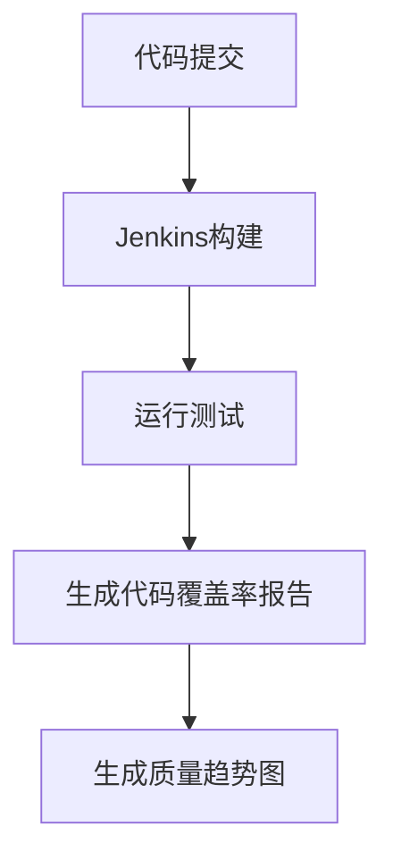

# Jenkins 质量趋势图

在软件开发过程中，代码质量是一个至关重要的指标。Jenkins作为一款流行的持续集成工具，不仅可以帮助我们自动化构建和测试，还可以通过生成质量趋势图来监控代码质量的变化。本文将详细介绍如何在Jenkins中生成和分析质量趋势图，并通过实际案例展示其应用。

## 什么是Jenkins质量趋势图？

Jenkins质量趋势图是一种可视化工具，用于展示代码质量指标随时间的变化情况。这些指标可以包括代码覆盖率、静态代码分析结果、测试通过率等。通过观察这些趋势图，开发团队可以及时发现代码质量的变化趋势，从而采取相应的措施进行改进。

## 如何生成Jenkins质量趋势图？

### 1. 安装必要的插件

首先，确保你的Jenkins实例中安装了以下插件：

- **JaCoCo Plugin**：用于生成代码覆盖率报告。
- **Checkstyle Plugin**：用于生成静态代码分析报告。
- **Warnings Next Generation Plugin**：用于收集和展示各种代码质量警告。

你可以通过Jenkins的插件管理页面安装这些插件。

### 2. 配置构建任务

在Jenkins中创建一个新的构建任务，并配置以下步骤：

1. **源代码管理**：配置你的代码仓库（如Git）。
2. **构建触发器**：设置触发构建的条件（如代码提交时触发）。
3. **构建环境**：配置构建环境（如JDK版本）。
4. **构建步骤**：添加构建步骤，如编译代码、运行测试、生成代码覆盖率报告等。

```groovy
pipeline {
    agent any
    stages {
        stage('Build') {
            steps {
                sh 'mvn clean install'
            }
        }
        stage('Test') {
            steps {
                sh 'mvn test'
            }
        }
        stage('Code Coverage') {
            steps {
                sh 'mvn jacoco:report'
            }
        }
    }
}
```

### 3. 生成质量趋势图

在构建任务完成后，Jenkins会自动收集代码质量数据，并生成趋势图。你可以在Jenkins的构建页面中找到这些图表。

## 实际案例

假设我们有一个Java项目，使用Maven进行构建。我们希望在每次构建后生成代码覆盖率趋势图。

1. **配置JaCoCo插件**：在`pom.xml`中添加JaCoCo插件的配置。

```xml
<plugin>
    <groupId>org.jacoco</groupId>
    <artifactId>jacoco-maven-plugin</artifactId>
    <version>0.8.7</version>
    <executions>
        <execution>
            <goals>
                <goal>prepare-agent</goal>
            </goals>
        </execution>
        <execution>
            <id>report</id>
            <phase>test</phase>
            <goals>
                <goal>report</goal>
            </goals>
        </execution>
    </executions>
</plugin>
```

2. **运行构建任务**：在Jenkins中运行构建任务，Jenkins会自动生成代码覆盖率报告，并在趋势图中展示。



## 总结

通过Jenkins质量趋势图，开发团队可以直观地了解代码质量的变化趋势，从而及时采取措施进行改进。本文介绍了如何配置Jenkins生成质量趋势图，并通过实际案例展示了其应用。

## 附加资源

- [Jenkins官方文档](https://www.jenkins.io/doc/)
- [JaCoCo官方文档](https://www.jacoco.org/jacoco/trunk/doc/)
- [Checkstyle官方文档](https://checkstyle.sourceforge.io/)

## 练习

1. 在你的Jenkins实例中安装JaCoCo插件，并配置一个Java项目生成代码覆盖率趋势图。
2. 尝试使用Checkstyle插件生成静态代码分析报告，并观察趋势图的变化。

:::tip
如果你在配置过程中遇到问题，可以参考Jenkins的官方文档或社区论坛寻求帮助。
:::