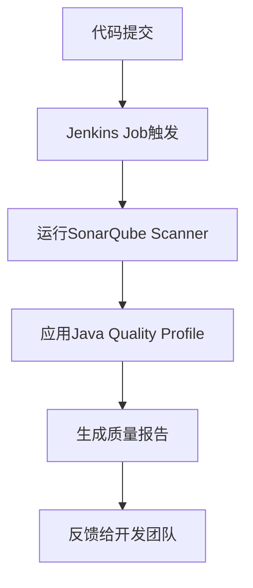

# Jenkins 质量配置文件

Jenkins是一个广泛使用的持续集成和持续交付（CI/CD）工具，它可以帮助开发团队自动化构建、测试和部署流程。在软件开发过程中，确保代码质量是至关重要的。Jenkins通过质量配置文件（Quality Profiles）来帮助团队自动化代码质量检查，确保代码符合预定义的标准。

## 什么是Jenkins质量配置文件？

质量配置文件是Jenkins中用于定义代码质量检查规则和标准的配置文件。它通常与静态代码分析工具（如SonarQube、Checkstyle、PMD等）集成，用于检查代码的规范性、安全性和性能。通过质量配置文件，团队可以定义哪些规则是必须遵守的，哪些是可选的，并为不同的项目或团队定制不同的质量要求。

## 如何配置Jenkins质量配置文件

### 1. 安装必要的插件

首先，确保你的Jenkins实例已经安装了与代码质量检查相关的插件。例如，如果你使用SonarQube进行静态代码分析，你需要安装`SonarQube Scanner for Jenkins`插件。

```bash
# 示例：安装SonarQube Scanner插件
# 在Jenkins的插件管理页面中搜索并安装 "SonarQube Scanner for Jenkins"
```

### 2. 配置SonarQube服务器

在Jenkins中配置SonarQube服务器，以便Jenkins可以与SonarQube进行通信。你可以在`Manage Jenkins` -> `Configure System`中找到SonarQube服务器的配置选项。

```bash
# 示例：配置SonarQube服务器
# 在Jenkins的 "Configure System" 页面中，找到 "SonarQube servers" 部分
# 添加一个新的SonarQube服务器，并填写服务器的URL和认证令牌
```

### 3. 创建质量配置文件

在SonarQube中，你可以创建和管理质量配置文件。质量配置文件定义了代码质量检查的规则集。你可以为不同的编程语言创建不同的质量配置文件。

```bash
# 示例：在SonarQube中创建质量配置文件
# 登录到SonarQube，进入 "Quality Profiles" 页面
# 点击 "Create" 按钮，填写配置文件的名称和语言
# 选择要应用的规则集，并保存配置文件
```

### 4. 在Jenkins Job中应用质量配置文件

在Jenkins的Job配置中，你可以指定使用哪个质量配置文件。通常，这可以通过在构建步骤中添加SonarQube Scanner的配置来实现。

```bash
# 示例：在Jenkins Job中配置SonarQube Scanner
# 在Jenkins Job的配置页面中，找到 "Build" 部分
# 添加一个 "Execute SonarQube Scanner" 构建步骤
# 在 "Analysis properties" 中指定质量配置文件的名称
```

### 5. 运行构建并查看质量报告

配置完成后，运行Jenkins Job。Jenkins将使用指定的质量配置文件对代码进行静态分析，并生成质量报告。你可以在SonarQube中查看详细的分析结果。

```bash
# 示例：运行Jenkins Job并查看质量报告
# 在Jenkins中点击 "Build Now" 按钮
# 构建完成后，登录到SonarQube查看代码质量报告
```

## 实际案例

假设你正在开发一个Java项目，并且希望确保代码符合一定的质量标准。你可以在SonarQube中创建一个名为`Java Quality Profile`的质量配置文件，并应用一些常见的Java代码检查规则，如`Checkstyle`和`PMD`。

在Jenkins中，你可以配置一个Job，使用`Java Quality Profile`对代码进行静态分析。每次代码提交后，Jenkins会自动运行该Job，并将分析结果反馈给开发团队。



## 总结

Jenkins质量配置文件是确保代码质量的重要工具。通过与静态代码分析工具（如SonarQube）集成，团队可以自动化代码质量检查流程，确保代码符合预定义的标准。通过本文的介绍，你应该已经了解了如何在Jenkins中配置和使用质量配置文件。

## 附加资源

- [SonarQube官方文档](https://docs.sonarqube.org/latest/)
- [Jenkins插件管理指南](https://www.jenkins.io/doc/book/managing/plugins/)
- [Checkstyle官方文档](https://checkstyle.sourceforge.io/)
- [PMD官方文档](https://pmd.github.io/)

## 练习

1. 在你的Jenkins实例中安装`SonarQube Scanner for Jenkins`插件。
2. 在SonarQube中创建一个新的质量配置文件，并应用一些常见的代码检查规则。
3. 在Jenkins中配置一个Job，使用你创建的质量配置文件对代码进行静态分析。
4. 运行Job并查看SonarQube中的质量报告。

通过完成这些练习，你将更深入地理解Jenkins质量配置文件的使用方法，并能够将其应用到实际项目中。