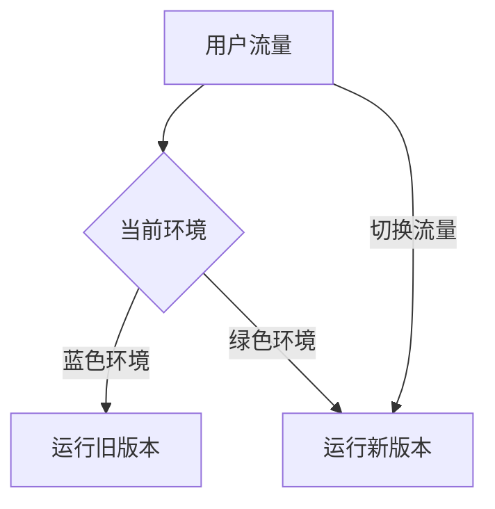
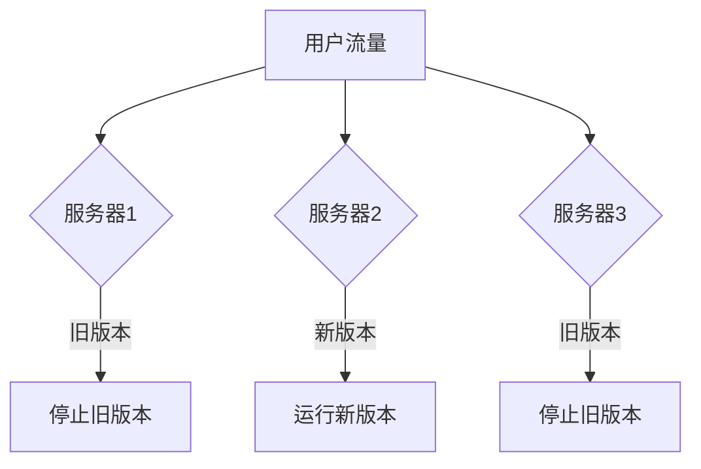
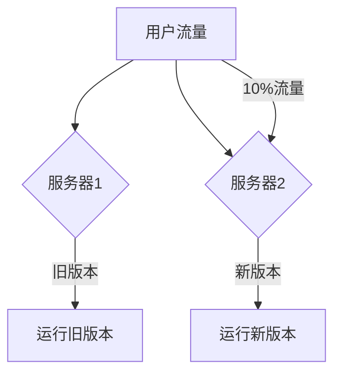

# Jenkins 部署策略

Jenkins是一个广泛使用的开源自动化服务器，用于实现持续集成和持续部署（CI/CD）。在软件开发中，部署策略是决定如何将代码从开发环境发布到生产环境的关键步骤。本文将详细介绍Jenkins中的常见部署策略，并通过实际案例帮助初学者理解如何应用这些策略。

## 什么是部署策略？

部署策略是指在软件发布过程中，如何将新版本的应用部署到生产环境的计划和方法。不同的部署策略适用于不同的场景，选择合适的策略可以最大限度地减少停机时间、降低风险并提高发布效率。

## 常见的Jenkins部署策略

### 1. 蓝绿部署（Blue-Green Deployment）

蓝绿部署是一种通过维护两个独立的生产环境（蓝色和绿色）来实现零停机部署的策略。其中一个环境用于运行当前版本的应用，另一个环境用于部署新版本。当新版本部署并测试通过后，流量会从旧环境切换到新环境。

#### 实现步骤：
1. 创建两个独立的环境：蓝色和绿色。
2. 在绿色环境中部署新版本的应用。
3. 测试绿色环境中的应用。
4. 切换流量到绿色环境。
5. 如果出现问题，可以快速切换回蓝色环境。



#### 示例：
假设我们有一个简单的Web应用，使用Jenkins进行蓝绿部署。

```bash
# Jenkins Pipeline脚本示例
pipeline {
    agent any
    stages {
        stage('Build') {
            steps {
                sh 'mvn clean package'
            }
        }
        stage('Deploy to Green') {
            steps {
                sh 'scp target/myapp.war user@green-server:/opt/tomcat/webapps/'
            }
        }
        stage('Test Green') {
            steps {
                sh 'curl -I http://green-server:8080/myapp'
            }
        }
        stage('Switch Traffic') {
            steps {
                sh 'nginx -s reload'  # 切换Nginx配置，将流量导向绿色环境
            }
        }
    }
}
```

### 2. 滚动部署（Rolling Deployment）

滚动部署是一种逐步替换旧版本应用的策略。它通过逐步将新版本的应用部署到生产环境中的一部分服务器上，同时逐步停止旧版本的应用，从而减少对用户的影响。

#### 实现步骤：
1. 将新版本的应用部署到一部分服务器上。
2. 逐步停止旧版本的应用。
3. 重复上述步骤，直到所有服务器都运行新版本。



#### 示例：
假设我们有一个集群环境，使用Jenkins进行滚动部署。

```bash
# Jenkins Pipeline脚本示例
pipeline {
    agent any
    stages {
        stage('Build') {
            steps {
                sh 'mvn clean package'
            }
        }
        stage('Deploy to Cluster') {
            steps {
                sh 'ansible-playbook deploy.yml --limit=server1'
                sh 'ansible-playbook deploy.yml --limit=server2'
                sh 'ansible-playbook deploy.yml --limit=server3'
            }
        }
    }
}
```

### 3. 金丝雀部署（Canary Deployment）

金丝雀部署是一种逐步将新版本应用发布给一小部分用户的策略。通过监控这部分用户的使用情况，可以评估新版本的稳定性和性能，然后再决定是否全面发布。

#### 实现步骤：
1. 将新版本的应用部署到一小部分服务器上。
2. 将一小部分用户流量导向新版本。
3. 监控新版本的表现。
4. 如果表现良好，逐步增加流量；如果出现问题，回滚到旧版本。



#### 示例：
假设我们有一个Web应用，使用Jenkins进行金丝雀部署。

```bash
# Jenkins Pipeline脚本示例
pipeline {
    agent any
    stages {
        stage('Build') {
            steps {
                sh 'mvn clean package'
            }
        }
        stage('Deploy Canary') {
            steps {
                sh 'scp target/myapp.war user@canary-server:/opt/tomcat/webapps/'
            }
        }
        stage('Monitor Canary') {
            steps {
                sh 'curl -I http://canary-server:8080/myapp'
                sh 'monitor-performance.sh'
            }
        }
        stage('Rollout to All') {
            steps {
                sh 'ansible-playbook deploy.yml'
            }
        }
    }
}
```

## 实际案例

### 案例：电商网站的蓝绿部署

假设我们有一个电商网站，使用Jenkins进行蓝绿部署。每当有新版本发布时，Jenkins会自动将新版本部署到绿色环境，并在测试通过后切换流量。这样可以确保用户不会遇到任何停机时间，同时也能快速回滚到旧版本。

## 总结

Jenkins提供了多种部署策略，每种策略都有其适用的场景。蓝绿部署适合需要零停机时间的场景，滚动部署适合集群环境，而金丝雀部署则适合需要逐步验证新版本的场景。选择合适的部署策略可以帮助团队更高效、更安全地发布软件。

## 附加资源与练习

- **练习**：尝试在你的Jenkins环境中实现蓝绿部署，并记录每一步的操作和结果。
- **资源**：
  - [Jenkins官方文档](https://www.jenkins.io/doc/)
  - 《持续交付：发布可靠软件的系统方法》—— Jez Humble, David Farley

通过本文的学习，你应该已经掌握了Jenkins中的常见部署策略，并能够在实际项目中应用这些策略。继续探索和实践，你将能够更深入地理解持续集成与持续部署的精髓。