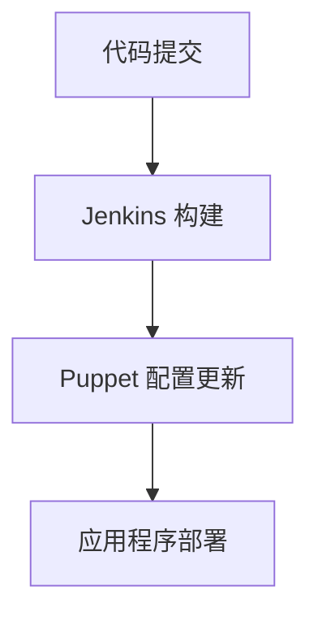

# Jenkins Puppet 集成

在现代软件开发中，自动化配置管理和持续交付是至关重要的。Jenkins 是一个广泛使用的持续集成和持续交付（CI/CD）工具，而 Puppet 则是一个强大的配置管理工具。通过将 Jenkins 与 Puppet 集成，您可以实现更高效的自动化流程，确保应用程序在开发、测试和生产环境中的一致性。

## 什么是 Jenkins 和 Puppet？

### Jenkins
Jenkins 是一个开源的自动化服务器，用于构建、测试和部署软件。它支持多种插件，可以轻松集成到各种开发工具和流程中。

### Puppet
Puppet 是一个配置管理工具，用于自动化基础设施的配置和管理。它允许您定义基础设施的状态，并确保系统始终处于所需的状态。

## 为什么需要 Jenkins 和 Puppet 集成？

将 Jenkins 与 Puppet 集成的主要目的是实现自动化配置管理和持续交付。通过这种集成，您可以在 Jenkins 中触发 Puppet 的配置更新，确保每次代码更改后，基础设施都能自动更新到最新状态。

## 如何集成 Jenkins 和 Puppet

### 步骤 1：安装必要的插件
首先，您需要在 Jenkins 中安装 Puppet 插件。可以通过 Jenkins 的插件管理界面进行安装。

1. 打开 Jenkins 仪表板。
2. 导航到 **Manage Jenkins** > **Manage Plugins**。
3. 在 **Available** 选项卡中搜索 `Puppet` 插件。
4. 安装并重启 Jenkins。

### 步骤 2：配置 Puppet 主服务器
在 Jenkins 中配置 Puppet 主服务器的连接信息。

1. 打开 Jenkins 仪表板。
2. 导航到 **Manage Jenkins** > **Configure System**。
3. 找到 **Puppet** 部分，填写 Puppet 主服务器的 URL 和认证信息。

### 步骤 3：创建 Jenkins 任务
接下来，创建一个 Jenkins 任务来触发 Puppet 配置更新。

1. 打开 Jenkins 仪表板。
2. 点击 **New Item** 创建一个新的任务。
3. 选择 **Freestyle project** 或 **Pipeline**，根据您的需求。
4. 在 **Build** 部分，添加一个 **Execute Puppet** 步骤。
5. 配置 Puppet 命令，例如 `puppet apply /path/to/manifest.pp`。

### 步骤 4：触发 Puppet 更新
您可以通过多种方式触发 Puppet 更新，例如：

- **手动触发**：在 Jenkins 任务中手动点击 **Build Now**。
- **自动触发**：配置 Jenkins 任务在代码提交或定时任务时自动触发。

## 实际案例

假设您有一个 Web 应用程序，需要在每次代码更新后自动部署到生产环境。您可以使用 Jenkins 和 Puppet 实现这一流程。

1. **代码提交**：开发人员将代码提交到版本控制系统（如 Git）。
2. **Jenkins 构建**：Jenkins 检测到代码提交，触发构建任务。
3. **Puppet 配置更新**：Jenkins 调用 Puppet 更新生产环境的配置。
4. **部署**：Puppet 确保生产环境的配置与代码保持一致，应用程序自动部署。

## 总结

通过将 Jenkins 与 Puppet 集成，您可以实现自动化配置管理和持续交付，确保应用程序在开发、测试和生产环境中的一致性。本文介绍了如何安装必要的插件、配置 Puppet 主服务器、创建 Jenkins 任务以及触发 Puppet 更新。希望这些内容能帮助您更好地理解 Jenkins 和 Puppet 的集成。

## 附加资源

- [Jenkins 官方文档](https://www.jenkins.io/doc/)
- [Puppet 官方文档](https://puppet.com/docs/)
- [Jenkins Puppet 插件文档](https://plugins.jenkins.io/puppet/)

## 练习

1. 在 Jenkins 中安装 Puppet 插件，并配置 Puppet 主服务器。
2. 创建一个 Jenkins 任务，触发 Puppet 配置更新。
3. 尝试在实际项目中应用 Jenkins 和 Puppet 集成，观察自动化流程的效果。

:::tip
如果您在集成过程中遇到问题，可以参考 Jenkins 和 Puppet 的官方文档，或者在社区论坛中寻求帮助。
:::