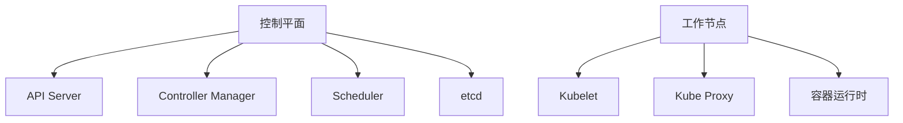

## 什么是Kubernetes？

Kubernetes（通常缩写为K8s）是一个开源的容器编排平台，用于自动化部署、扩展和管理容器化应用。它最初由Google开发，现在由云原生计算基金会（CNCF）维护。Kubernetes帮助开发者和运维团队更高效地管理容器化应用，尤其是在大规模部署时。

### 为什么需要Kubernetes？

随着微服务架构的流行，应用被拆分为多个小型、独立的服务，每个服务都可以独立部署和扩展。容器技术（如Docker）使得这些服务可以在隔离的环境中运行。然而，随着服务数量的增加，手动管理这些容器变得非常复杂。Kubernetes通过自动化这些任务，简化了容器化应用的管理。

## Kubernetes 的核心概念

在深入Kubernetes之前，我们需要了解一些核心概念：

### 1. 节点（Node）
节点是Kubernetes集群中的工作机器，可以是物理机或虚拟机。每个节点都运行着Kubelet（Kubernetes的代理），负责与主节点通信并管理容器。

### 2. 集群（Cluster）
集群是由多个节点组成的集合，这些节点共同运行容器化应用。集群通常包括一个主节点（Master Node）和多个工作节点（Worker Node）。

### 3. Pod
Pod是Kubernetes中最小的部署单元。一个Pod可以包含一个或多个容器，这些容器共享网络和存储资源。Pod是短暂的，可以被创建、销毁和替换。

### 4. 服务（Service）
服务是Kubernetes中的一种抽象，用于定义一组Pod的访问策略。服务允许Pod之间进行通信，并为外部用户提供访问入口。

### 5. 部署（Deployment）
部署是Kubernetes中用于管理Pod副本的抽象。它定义了Pod的期望状态，并确保实际状态与期望状态一致。部署还支持滚动更新和回滚。

## Kubernetes 架构

Kubernetes的架构可以分为两个主要部分：**控制平面（Control Plane）**和**工作节点（Worker Nodes）**。



### 控制平面
控制平面负责管理整个集群的状态。它包括以下组件：
- **API Server**：提供Kubernetes API，是集群的前端接口。
- **Controller Manager**：负责运行各种控制器，确保集群的期望状态与实际状态一致。
- **Scheduler**：负责将Pod调度到合适的节点上。
- **etcd**：分布式键值存储，用于保存集群的所有配置数据。

### 工作节点
工作节点负责运行容器化应用。它包括以下组件：
- **Kubelet**：负责与主节点通信，并管理节点上的容器。
- **Kube Proxy**：负责网络代理和负载均衡。
- **容器运行时**：负责运行容器，如Docker或containerd。

## 实际案例：部署一个简单的Web应用

让我们通过一个简单的例子来理解Kubernetes的工作原理。假设我们有一个简单的Web应用，我们希望将其部署到Kubernetes集群中。

### 1. 创建Deployment
首先，我们需要创建一个Deployment来定义我们的应用。以下是一个简单的Deployment配置文件：

```yaml
apiVersion: apps/v1
kind: Deployment
metadata:
  name: web-app
spec:
  replicas: 3
  selector:
    matchLabels:
      app: web-app
  template:
    metadata:
      labels:
        app: web-app
    spec:
      containers:
      - name: web-app
        image: nginx:latest
        ports:
        - containerPort: 80
```

在这个配置中，我们定义了一个名为`web-app`的Deployment，它包含3个副本（replicas），每个副本运行一个Nginx容器。

### 2. 创建Service
接下来，我们需要创建一个Service来暴露我们的应用。以下是一个简单的Service配置文件：

```yaml
apiVersion: v1
kind: Service
metadata:
  name: web-app-service
spec:
  selector:
    app: web-app
  ports:
    - protocol: TCP
      port: 80
      targetPort: 80
  type: LoadBalancer
```

这个Service将流量路由到所有带有`app: web-app`标签的Pod，并通过LoadBalancer类型将服务暴露给外部用户。

### 3. 应用配置
使用`kubectl`命令将上述配置应用到Kubernetes集群中：

```bash
kubectl apply -f deployment.yaml
kubectl apply -f service.yaml
```

### 4. 验证部署
使用以下命令查看Pod和Service的状态：

```bash
kubectl get pods
kubectl get services
```

你应该看到3个`web-app` Pod正在运行，并且`web-app-service`已经成功创建。

## 总结

Kubernetes是一个强大的容器编排平台，它简化了容器化应用的部署、扩展和管理。通过理解其核心概念和架构，你可以更好地利用Kubernetes来管理你的应用。

## 附加资源

- [Kubernetes官方文档](https://kubernetes.io/docs/home/)
- [Kubernetes入门指南](https://kubernetes.io/docs/tutorials/kubernetes-basics/)
- [Kubernetes实战](https://www.oreilly.com/library/view/kubernetes-in-action/9781617293726/)

## 练习

1. 尝试在本地或云环境中部署一个简单的Kubernetes集群。
2. 使用Kubernetes部署一个多容器应用，并配置服务以暴露应用。
3. 探索Kubernetes的滚动更新功能，尝试更新一个正在运行的应用。

:::tip
Kubernetes的学习曲线可能较陡，但通过实践和不断探索，你将逐渐掌握其强大的功能。
:::