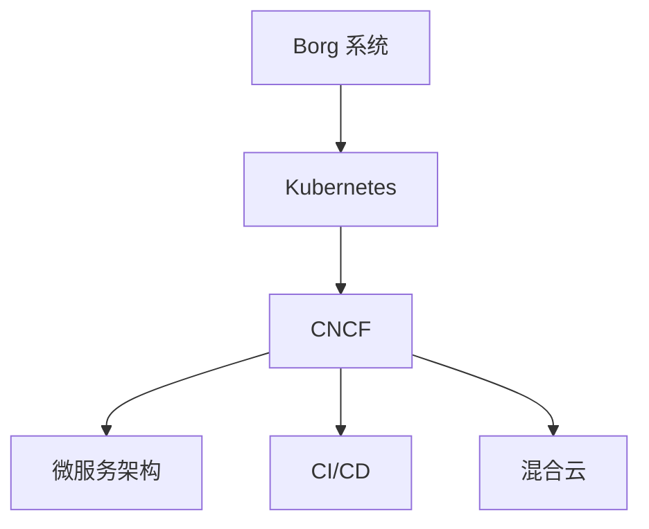

# Kubernetes 历史

Kubernetes（通常缩写为 K8s）是一个开源的容器编排平台，用于自动化应用程序的部署、扩展和管理。它最初由 Google 开发，并于 2014 年开源。Kubernetes 的诞生标志着容器技术的一个重要里程碑，尤其是在云原生应用开发领域。

## 起源

Kubernetes 的起源可以追溯到 Google 内部的 **Borg** 系统。Borg 是 Google 用于管理其大规模集群的容器编排系统。Borg 系统帮助 Google 高效地运行其全球范围内的服务，如 Gmail、Google 搜索和 YouTube 等。通过 Borg，Google 能够实现资源的高效利用、自动化的故障恢复以及大规模的应用程序部署。

:::note
**Borg 系统** 是 Kubernetes 的前身，它展示了容器编排在大规模生产环境中的潜力。
:::

## 开源与社区发展

2014 年，Google 决定将 Borg 的核心思想开源，并将其命名为 **Kubernetes**。Kubernetes 的名字来源于希腊语，意为“舵手”或“飞行员”，象征着它作为容器编排系统的导航角色。

Kubernetes 的开源迅速吸引了大量开发者和企业的关注。2015 年，Google 与 Linux 基金会合作，成立了 **Cloud Native Computing Foundation (CNCF)**，并将 Kubernetes 作为其首个托管项目。CNCF 的成立进一步推动了 Kubernetes 的标准化和社区发展。

:::tip
**CNCF** 是一个致力于推动云原生技术发展的组织，Kubernetes 是其最重要的项目之一。
:::

## 版本演进

Kubernetes 的版本发布遵循严格的周期，每三个月发布一个新版本。以下是 Kubernetes 发展过程中的一些重要里程碑：

- **v1.0 (2015年7月)**：Kubernetes 的第一个稳定版本发布，标志着它正式进入生产环境。
- **v1.2 (2016年3月)**：引入了 **Deployment** 资源，简化了应用程序的滚动更新和回滚操作。
- **v1.6 (2017年3月)**：支持了 **StatefulSets**，使得有状态应用程序的管理变得更加容易。
- **v1.14 (2019年3月)**：**Windows 容器** 支持正式进入稳定状态，扩展了 Kubernetes 的应用场景。
- **v1.20 (2020年12月)**：引入了 **Pod 拓扑分布约束**，帮助用户更好地控制 Pod 的调度。

:::caution
Kubernetes 的版本更新非常频繁，建议在生产环境中使用稳定版本，并定期关注官方发布说明。
:::

## 实际应用场景

Kubernetes 在现代云原生技术中扮演着核心角色。以下是一些 Kubernetes 的实际应用场景：

1. **微服务架构**：Kubernetes 能够轻松管理数百个微服务，确保它们的高可用性和可扩展性。
2. **持续集成与持续部署 (CI/CD)**：Kubernetes 与 Jenkins、GitLab CI 等工具集成，支持自动化构建、测试和部署流程。
3. **混合云和多云环境**：Kubernetes 能够在不同的云平台（如 AWS、Azure、GCP）上运行，帮助企业实现跨云部署。

:::warning
虽然 Kubernetes 功能强大，但其复杂性也较高。初学者建议从简单的应用场景开始，逐步深入。
:::

## 总结

Kubernetes 从 Google 的 Borg 系统演变而来，经过多年的发展，已经成为云原生技术的核心组件。它的开源和社区驱动模式使其在全球范围内得到了广泛应用。无论是微服务架构、CI/CD 流程，还是混合云环境，Kubernetes 都展现出了强大的能力。

## 附加资源与练习

- **官方文档**：[Kubernetes 官方文档](https://kubernetes.io/docs/home/) 是学习 Kubernetes 的最佳起点。
- **练习**：尝试在本地使用 Minikube 或 Kind 搭建一个 Kubernetes 集群，并部署一个简单的 Nginx 应用。

通过以上内容，您应该对 Kubernetes 的历史有了一个全面的了解。接下来，您可以继续深入学习 Kubernetes 的核心概念和实际应用。