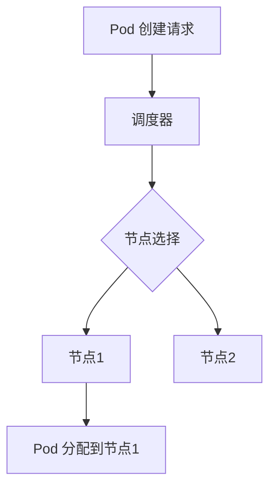

## 介绍

Kubernetes 是一个开源的容器编排平台，用于自动化部署、扩展和管理容器化应用程序。它的核心目标是通过自动化操作来简化容器化应用的运维工作。为了理解 Kubernetes 的工作原理，我们需要深入探讨其工作流程。

Kubernetes 的工作流程描述了从用户提交资源定义到 Kubernetes 集群实际运行容器的整个过程。这个过程涉及多个组件和步骤，包括 API 服务器、调度器、控制器、节点等。

## Kubernetes 工作流程概述

Kubernetes 的工作流程可以简化为以下几个关键步骤：

1. **用户提交资源定义**：用户通过 `kubectl` 或其他工具向 Kubernetes API 服务器提交资源定义（如 Pod、Deployment、Service 等）。
2. **API 服务器验证和存储**：API 服务器接收请求，验证资源定义的合法性，并将其存储在 etcd 中。
3. **调度器分配节点**：调度器根据资源需求和集群状态，将 Pod 分配到合适的节点上。
4. **节点上的 kubelet 启动容器**：目标节点上的 kubelet 接收到调度器的指令后，启动容器并监控其状态。
5. **控制器确保期望状态**：控制器（如 Deployment 控制器）持续监控集群状态，确保实际状态与用户定义的期望状态一致。

下面我们将逐步详细讲解这些步骤。

---

## 1. 用户提交资源定义

用户通过编写 YAML 或 JSON 文件定义 Kubernetes 资源，然后使用 `kubectl` 提交到集群。例如，以下是一个简单的 Pod 定义：

```yaml
apiVersion: v1
kind: Pod
metadata:
  name: my-pod
spec:
  containers:
  - name: nginx
    image: nginx:latest
```

使用以下命令提交资源定义：

```bash
kubectl apply -f pod.yaml
```

:::note
`kubectl apply` 是 Kubernetes 中常用的命令，用于创建或更新资源。
:::

---

## 2. API 服务器验证和存储

当用户提交资源定义后，`kubectl` 会将请求发送到 Kubernetes API 服务器。API 服务器是 Kubernetes 的核心组件，负责接收和处理所有请求。

API 服务器会执行以下操作：
- **验证资源定义**：检查 YAML 文件的语法和字段是否合法。
- **存储到 etcd**：将资源定义存储到 etcd 中，etcd 是 Kubernetes 的分布式键值存储系统。

:::tip
etcd 是 Kubernetes 的“大脑”，存储了集群的所有状态信息。
:::

---

## 3. 调度器分配节点

Kubernetes 调度器负责将 Pod 分配到合适的节点上运行。调度器会根据以下因素做出决策：
- 资源需求（如 CPU、内存）。
- 节点可用性。
- 亲和性和反亲和性规则。
- 污点和容忍度。

以下是一个调度过程的简化示例：



:::caution
如果集群中没有足够的资源，Pod 可能会处于 `Pending` 状态，直到有可用资源。
:::

---

## 4. 节点上的 kubelet 启动容器

一旦调度器将 Pod 分配到某个节点，该节点上的 `kubelet` 就会接收到指令。`kubelet` 是 Kubernetes 的节点代理，负责管理节点上的容器。

`kubelet` 会执行以下操作：
- 拉取容器镜像。
- 启动容器。
- 监控容器状态并报告给 API 服务器。

例如，如果 Pod 定义中指定了 `nginx:latest` 镜像，`kubelet` 会从镜像仓库拉取该镜像并启动容器。

---

## 5. 控制器确保期望状态

Kubernetes 控制器是确保集群状态与用户定义的期望状态一致的关键组件。例如，Deployment 控制器会确保指定数量的 Pod 副本始终运行。

如果某个 Pod 崩溃或被删除，控制器会检测到状态不一致，并创建新的 Pod 以替换它。

以下是一个 Deployment 的示例：

```yaml
apiVersion: apps/v1
kind: Deployment
metadata:
  name: nginx-deployment
spec:
  replicas: 3
  selector:
    matchLabels:
      app: nginx
  template:
    metadata:
      labels:
        app: nginx
    spec:
      containers:
      - name: nginx
        image: nginx:latest
```

:::warning
控制器是 Kubernetes 自动化的核心，确保系统具有自愈能力。
:::

---

## 实际案例：部署一个 Web 应用

假设我们需要部署一个简单的 Web 应用，以下是完整的流程：

1. 编写 Deployment 和 Service 的 YAML 文件。
2. 使用 `kubectl apply` 提交到集群。
3. Kubernetes 调度器将 Pod 分配到节点。
4. `kubelet` 启动容器并监控状态。
5. Deployment 控制器确保有 3 个 Pod 副本运行。
6. Service 提供稳定的网络访问。

---

## 总结

Kubernetes 的工作流程是一个高度自动化的过程，涉及多个组件的协作。从用户提交资源定义到容器实际运行，Kubernetes 通过 API 服务器、调度器、kubelet 和控制器等组件，确保集群状态始终与期望状态一致。

理解 Kubernetes 的工作流程是掌握其核心概念的关键。通过实际案例和逐步讲解，我们希望你能对 Kubernetes 的工作方式有更清晰的认识。

---

## 附加资源与练习

- **官方文档**：[Kubernetes 概念](https://kubernetes.io/docs/concepts/)
- **练习**：尝试创建一个 Deployment 并观察其工作流程。
- **深入学习**：研究 Kubernetes 控制器的工作原理，如 ReplicaSet 和 StatefulSet。

:::tip
实践是学习 Kubernetes 的最佳方式。尝试在本地或云环境中部署一个简单的应用，观察其运行状态。
:::