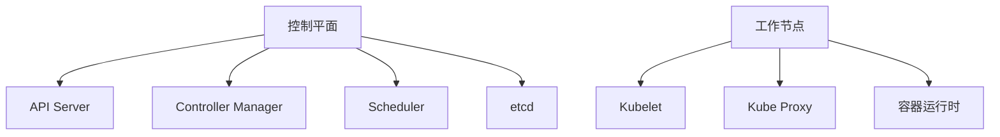

# Kubernetes 架构

Kubernetes（简称K8s）是一个开源的容器编排平台，用于自动化部署、扩展和管理容器化应用程序。要理解Kubernetes的强大功能，首先需要了解其架构。Kubernetes的架构由多个组件组成，这些组件协同工作，确保应用程序的高可用性、可扩展性和弹性。

## Kubernetes 架构概述

Kubernetes的架构可以分为两个主要部分：**控制平面（Control Plane）**和**工作节点（Worker Nodes）**。控制平面负责管理集群的状态，而工作节点则负责运行应用程序的容器。

### 控制平面（Control Plane）

控制平面是Kubernetes集群的大脑，负责管理集群的整体状态。它包括以下核心组件：

1. **API Server**：API Server是Kubernetes的前端，负责处理所有RESTful API请求。它是控制平面与工作节点之间的桥梁。

2. **Controller Manager**：Controller Manager负责运行各种控制器，这些控制器确保集群的当前状态与期望状态一致。例如，Replication Controller确保指定数量的Pod副本始终在运行。

3. **Scheduler**：Scheduler负责将Pod调度到合适的工作节点上。它根据资源需求、策略和约束条件来决定Pod的运行位置。

4. **etcd**：etcd是一个分布式键值存储，用于保存Kubernetes集群的所有配置数据和状态信息。它是Kubernetes的“记忆库”。

### 工作节点（Worker Nodes）

工作节点是Kubernetes集群中实际运行应用程序的地方。每个工作节点包括以下组件：

1. **Kubelet**：Kubelet是工作节点上的代理，负责与API Server通信，并确保节点上的容器按照PodSpec的定义运行。

2. **Kube Proxy**：Kube Proxy负责维护节点上的网络规则，确保Pod之间的网络通信。

3. **容器运行时**：容器运行时（如Docker或containerd）负责运行容器。它负责拉取容器镜像、启动和停止容器等操作。

## Kubernetes 架构的实际应用

假设你有一个Web应用程序，需要部署到Kubernetes集群中。以下是一个简单的示例，展示Kubernetes架构如何协同工作：

1. **用户提交部署请求**：用户通过`kubectl`命令行工具提交一个Deployment配置文件到API Server。

2. **API Server处理请求**：API Server接收到请求后，将其存储在etcd中，并通知Controller Manager和Scheduler。

3. **Controller Manager创建Pod**：Controller Manager根据Deployment配置创建Pod，并确保Pod的数量符合预期。

4. **Scheduler调度Pod**：Scheduler选择一个合适的工作节点，并将Pod调度到该节点上。

5. **Kubelet启动容器**：工作节点上的Kubelet接收到Pod的调度信息后，通过容器运行时启动容器。

6. **Kube Proxy配置网络**：Kube Proxy确保Pod之间的网络通信正常。

## 总结

Kubernetes的架构设计使其能够高效地管理容器化应用程序。控制平面负责集群的管理和调度，而工作节点则负责运行应用程序的容器。通过理解Kubernetes的架构，你可以更好地利用其功能来部署和管理应用程序。

## 附加资源

- [Kubernetes官方文档](https://kubernetes.io/docs/home/)
- [Kubernetes架构详解](https://kubernetes.io/docs/concepts/overview/components/)
- [Kubernetes入门指南](https://kubernetes.io/docs/tutorials/kubernetes-basics/)

## 练习

1. 使用`kubectl`命令行工具创建一个简单的Pod，并观察其调度过程。
2. 尝试修改Pod的资源配置，看看Scheduler如何重新调度Pod。
3. 研究etcd的作用，并尝试备份和恢复etcd数据。

:::tip
Kubernetes的架构虽然复杂，但通过实践和深入学习，你可以逐步掌握其核心概念和组件。
:::