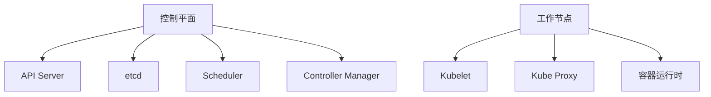

## 介绍

Kubernetes是一个开源的容器编排平台，用于自动化部署、扩展和管理容器化应用程序。要理解Kubernetes的工作原理，首先需要了解其核心组件。这些组件共同协作，确保应用程序在集群中高效、稳定地运行。

本文将详细介绍Kubernetes的主要组件，包括控制平面组件和工作节点组件，并通过实际案例展示它们如何协同工作。

## Kubernetes 架构概述

Kubernetes集群由两部分组成：**控制平面（Control Plane）**和**工作节点（Worker Nodes）**。控制平面负责管理集群的状态和调度任务，而工作节点则负责运行容器化的应用程序。



### 控制平面组件

#### 1. API Server

API Server是Kubernetes集群的前端接口，所有与集群的交互都通过它进行。它接收来自用户、命令行工具（如`kubectl`）或其他组件的请求，并将这些请求转发给适当的组件进行处理。

:::note
API Server是Kubernetes的核心组件，负责处理所有RESTful API请求。
:::

#### 2. etcd

etcd是一个分布式键值存储系统，用于保存Kubernetes集群的所有配置数据和状态信息。它是Kubernetes的“大脑”，确保集群的一致性和可靠性。

:::caution
etcd中的数据非常重要，因此需要定期备份以防止数据丢失。
:::

#### 3. Scheduler

Scheduler负责将新创建的Pod调度到合适的工作节点上。它根据资源需求、节点负载等因素做出调度决策。

:::tip
Scheduler的调度策略可以通过配置文件进行自定义，以满足特定的业务需求。
:::

#### 4. Controller Manager

Controller Manager负责运行各种控制器，确保集群的当前状态与期望状态一致。例如，Replication Controller确保指定数量的Pod副本始终在运行。

:::warning
Controller Manager是Kubernetes的“自动化引擎”，确保系统的自我修复能力。
:::

### 工作节点组件

#### 1. Kubelet

Kubelet是运行在每个工作节点上的代理，负责与API Server通信，并确保节点上的容器按照PodSpec的定义运行。

:::note
Kubelet是工作节点的“守护进程”，负责管理Pod的生命周期。
:::

#### 2. Kube Proxy

Kube Proxy负责维护节点上的网络规则，确保Pod之间的网络通信。它通过iptables或IPVS实现服务的负载均衡。

:::tip
Kube Proxy是Kubernetes网络模型的关键组件，确保服务发现和负载均衡。
:::

#### 3. 容器运行时

容器运行时是负责运行容器的软件，例如Docker或containerd。Kubernetes通过容器运行时接口（CRI）与不同的容器运行时进行交互。

:::caution
Kubernetes支持多种容器运行时，但需要确保它们与Kubernetes版本兼容。
:::

## 实际案例

假设我们有一个简单的Web应用程序，需要部署到Kubernetes集群中。以下是该应用程序的部署流程：

1. **创建Deployment**：通过`kubectl`创建一个Deployment对象，定义应用程序的副本数和容器镜像。

    ```bash
    kubectl create deployment my-web-app --image=my-web-app:1.0
    ```

2. **调度Pod**：Scheduler将Pod调度到合适的工作节点上。

3. **运行容器**：Kubelet在节点上启动容器，并确保它们按照PodSpec的定义运行。

4. **服务发现**：Kube Proxy为Pod创建网络规则，确保它们可以通过Service进行访问。

    ```bash
    kubectl expose deployment my-web-app --port=80 --target-port=8080
    ```

5. **监控和修复**：Controller Manager监控Pod的状态，并在Pod失败时自动创建新的Pod。

## 总结

Kubernetes的核心组件共同协作，确保容器化应用程序的高效运行。控制平面组件负责集群的管理和调度，而工作节点组件负责运行容器和处理网络通信。通过理解这些组件的作用，您可以更好地掌握Kubernetes的工作原理，并有效地管理您的应用程序。

## 附加资源

- [Kubernetes官方文档](https://kubernetes.io/docs/home/)
- [Kubernetes组件详解](https://kubernetes.io/docs/concepts/overview/components/)
- [Kubernetes网络模型](https://kubernetes.io/docs/concepts/services-networking/)

## 练习

1. 使用`kubectl`创建一个简单的Deployment，并观察Pod的调度过程。
2. 修改Scheduler的配置，尝试自定义调度策略。
3. 使用`kubectl`查看etcd中存储的集群状态信息。

通过以上练习，您将更深入地理解Kubernetes组件的功能和协作方式。