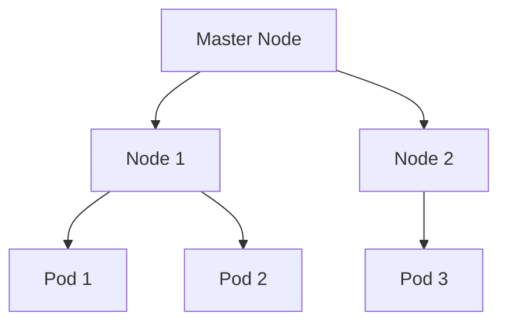

# Kubernetes 基本概念

Kubernetes（通常缩写为K8s）是一个开源的容器编排平台，用于自动化部署、扩展和管理容器化应用。它提供了一个强大的框架来管理分布式系统中的容器，确保应用的高可用性、可扩展性和可维护性。本文将介绍Kubernetes中的一些基本概念，帮助你理解其核心组件和工作原理。

## 1. 什么是Kubernetes？

Kubernetes最初由Google开发，现在由Cloud Native Computing Foundation（CNCF）维护。它的主要目标是简化容器化应用的部署和管理。通过Kubernetes，你可以轻松地管理成百上千个容器，确保它们按照预期的方式运行。

## 2. Kubernetes核心概念

### 2.1 Pod

Pod是Kubernetes中最小的部署单元。一个Pod可以包含一个或多个容器，这些容器共享相同的网络命名空间和存储卷。Pod是短暂的，它们可以被创建、销毁和替换。

```yaml
apiVersion: v1
kind: Pod
metadata:
  name: my-pod
spec:
  containers:
  - name: my-container
    image: nginx
```

:::note
Pod中的容器共享相同的IP地址和端口空间，因此它们可以通过`localhost`相互通信。
:::

### 2.2 Node

Node是Kubernetes集群中的工作节点，可以是物理机或虚拟机。每个Node上运行着Kubelet（负责与主节点通信）和容器运行时（如Docker）。Node负责运行Pod并提供计算资源。



:::tip
Node可以分为两种类型：Master Node和Worker Node。Master Node负责管理集群，而Worker Node负责运行应用。
:::

### 2.3 Service

Service是Kubernetes中用于定义一组Pod的访问策略的抽象。它为一组Pod提供稳定的IP地址和DNS名称，使得外部应用可以访问这些Pod。

```yaml
apiVersion: v1
kind: Service
metadata:
  name: my-service
spec:
  selector:
    app: my-app
  ports:
    - protocol: TCP
      port: 80
      targetPort: 9376
```

:::caution
Service的类型有多种，包括ClusterIP、NodePort和LoadBalancer。选择合适的类型取决于你的应用需求。
:::

### 2.4 Deployment

Deployment是Kubernetes中用于管理Pod副本的控制器。它允许你声明式地定义Pod的期望状态，并自动处理Pod的创建、更新和删除。

```yaml
apiVersion: apps/v1
kind: Deployment
metadata:
  name: my-deployment
spec:
  replicas: 3
  selector:
    matchLabels:
      app: my-app
  template:
    metadata:
      labels:
        app: my-app
    spec:
      containers:
      - name: my-container
        image: nginx
```

:::warning
Deployment可以确保指定数量的Pod副本始终运行，即使某些Pod失败或被删除。
:::

## 3. 实际应用场景

假设你正在开发一个Web应用，并希望将其部署到Kubernetes集群中。你可以按照以下步骤操作：

1. 创建一个Deployment来定义应用的Pod模板和副本数量。
2. 创建一个Service来暴露应用的外部访问入口。
3. 使用Kubernetes的自动扩展功能来根据流量动态调整Pod数量。

```yaml
apiVersion: apps/v1
kind: Deployment
metadata:
  name: web-app
spec:
  replicas: 3
  selector:
    matchLabels:
      app: web-app
  template:
    metadata:
      labels:
        app: web-app
    spec:
      containers:
      - name: web-container
        image: my-web-app:1.0

---
apiVersion: v1
kind: Service
metadata:
  name: web-service
spec:
  selector:
    app: web-app
  ports:
    - protocol: TCP
      port: 80
      targetPort: 8080
  type: LoadBalancer
```

## 4. 总结

Kubernetes提供了一套强大的工具来管理容器化应用。通过理解Pod、Node、Service和Deployment等基本概念，你可以更好地利用Kubernetes来部署和管理你的应用。

## 5. 附加资源

- [Kubernetes官方文档](https://kubernetes.io/docs/home/)
- [Kubernetes入门指南](https://kubernetes.io/docs/tutorials/kubernetes-basics/)
- [Kubernetes实战](https://www.oreilly.com/library/view/kubernetes-in-action/9781617293726/)

## 6. 练习

1. 创建一个简单的Pod并部署到Kubernetes集群中。
2. 使用Deployment管理多个Pod副本。
3. 创建一个Service来暴露你的应用，并通过浏览器访问它。

通过完成这些练习，你将更深入地理解Kubernetes的基本概念和操作。