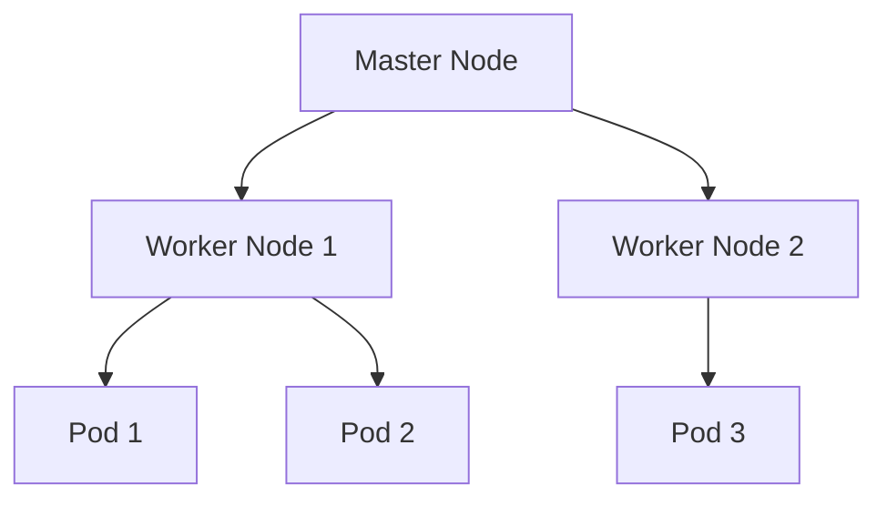

Kubernetes是一个强大的容器编排工具，用于自动化部署、扩展和管理容器化应用程序。为了有效地使用Kubernetes，理解其核心术语至关重要。本文将详细介绍Kubernetes中的关键术语，帮助你快速入门。

## 1. 什么是Kubernetes术语？

Kubernetes术语是指在Kubernetes生态系统中使用的特定词汇和概念。这些术语描述了Kubernetes的各个组件、资源类型以及它们之间的关系。理解这些术语是掌握Kubernetes的基础。

## 2. 核心术语

### 2.1 Pod

**Pod** 是Kubernetes中最小的可部署单元。一个Pod可以包含一个或多个容器，这些容器共享网络和存储资源。Pod是Kubernetes调度的基本单位。

```yaml
apiVersion: v1
kind: Pod
metadata:
  name: my-pod
spec:
  containers:
  - name: my-container
    image: nginx
```

### 2.2 Node

**Node** 是Kubernetes集群中的工作节点，可以是物理机或虚拟机。每个Node上运行着Kubernetes的kubelet服务，负责管理Pod的生命周期。



### 2.3 Deployment

**Deployment** 是Kubernetes中用于管理Pod副本的控制器。它确保指定数量的Pod副本始终运行，并支持滚动更新和回滚。

```yaml
apiVersion: apps/v1
kind: Deployment
metadata:
  name: my-deployment
spec:
  replicas: 3
  selector:
    matchLabels:
      app: my-app
  template:
    metadata:
      labels:
        app: my-app
    spec:
      containers:
      - name: my-container
        image: nginx
```

### 2.4 Service

**Service** 是Kubernetes中用于定义一组Pod的访问策略的抽象。它为一组Pod提供稳定的IP地址和DNS名称，并支持负载均衡。

```yaml
apiVersion: v1
kind: Service
metadata:
  name: my-service
spec:
  selector:
    app: my-app
  ports:
  - protocol: TCP
    port: 80
    targetPort: 9376
```

### 2.5 Namespace

**Namespace** 是Kubernetes中用于资源隔离的逻辑分区。它允许你在同一个集群中运行多个环境（如开发、测试、生产）而不会相互干扰。

```yaml
apiVersion: v1
kind: Namespace
metadata:
  name: my-namespace
```

## 3. 实际案例

假设你有一个Web应用程序，需要部署到Kubernetes集群中。你可以使用以下步骤：

1. 创建一个Deployment来管理Pod副本。
2. 创建一个Service来暴露应用程序的访问入口。
3. 使用Namespace来隔离不同的环境。

```yaml
apiVersion: apps/v1
kind: Deployment
metadata:
  name: web-app
  namespace: production
spec:
  replicas: 3
  selector:
    matchLabels:
      app: web-app
  template:
    metadata:
      labels:
        app: web-app
    spec:
      containers:
      - name: web-container
        image: my-web-app:1.0.0

---
apiVersion: v1
kind: Service
metadata:
  name: web-service
  namespace: production
spec:
  selector:
    app: web-app
  ports:
  - protocol: TCP
    port: 80
    targetPort: 8080
```

## 4. 总结

通过本文，你已经了解了Kubernetes中的一些核心术语，包括Pod、Node、Deployment、Service和Namespace。这些术语是理解和使用Kubernetes的基础。希望这些知识能帮助你在Kubernetes的学习和实践中更加得心应手。

## 5. 附加资源

- [Kubernetes官方文档](https://kubernetes.io/docs/home/)
- [Kubernetes入门指南](https://kubernetes.io/docs/tutorials/kubernetes-basics/)
- [Kubernetes实战](https://www.oreilly.com/library/view/kubernetes-in-action/9781617293726/)

:::tip
建议你通过实际操作来巩固这些概念。尝试在本地或云环境中部署一个简单的应用程序，并观察Kubernetes的行为。
:::