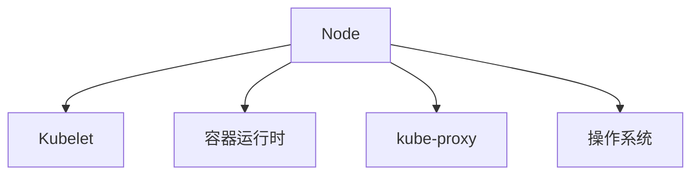

## 什么是 Kubernetes Node？

Kubernetes Node 是 Kubernetes 集群中的工作节点，负责运行容器化应用。每个 Node 可以是物理机或虚拟机，它们共同组成了 Kubernetes 集群的计算资源池。Node 的主要职责是执行由 Kubernetes 控制平面（Control Plane）分配的 Pod 和容器任务。

:::note
Node 是 Kubernetes 集群的基础组成部分，理解它的工作原理对于掌握 Kubernetes 至关重要。
:::

## Node 的组成部分

一个 Kubernetes Node 主要由以下几个组件组成：

1. **Kubelet**：负责与 Kubernetes 控制平面通信，管理 Pod 和容器的生命周期。
2. **容器运行时**：如 Docker 或 containerd，负责运行容器。
3. **kube-proxy**：管理网络规则，确保 Pod 之间的网络通信。
4. **操作系统**：Node 运行的操作系统，通常是 Linux 或 Windows。



## Node 的工作原理

当 Kubernetes 控制平面决定在某个 Node 上运行一个 Pod 时，它会通过 Kubelet 将 Pod 的配置信息发送到该 Node。Kubelet 随后会与容器运行时协作，启动并管理 Pod 中的容器。

### 示例：查看集群中的 Node

你可以使用以下命令查看 Kubernetes 集群中的所有 Node：

```bash
kubectl get nodes
```

输出示例：

```
NAME       STATUS   ROLES    AGE   VERSION
node-1     Ready    <none>   10d   v1.22.3
node-2     Ready    <none>   10d   v1.22.3
```

## Node 的实际应用场景

### 场景 1：扩展集群

假设你的应用负载增加，现有的 Node 资源不足以支撑。你可以通过添加新的 Node 来扩展集群的计算能力。Kubernetes 会自动将新的 Pod 调度到新加入的 Node 上。

### 场景 2：Node 维护

在进行 Node 维护时，你可以将该 Node 标记为不可调度（cordon），这样 Kubernetes 就不会将新的 Pod 调度到该 Node 上。维护完成后，你可以取消标记（uncordon），使其重新参与调度。

```bash
kubectl cordon node-1
kubectl uncordon node-1
```

## 总结

Kubernetes Node 是集群中的工作节点，负责运行容器化应用。它由 Kubelet、容器运行时、kube-proxy 和操作系统组成。理解 Node 的工作原理和应用场景，有助于你更好地管理和扩展 Kubernetes 集群。

## 附加资源与练习

- **官方文档**：[Kubernetes Node](https://kubernetes.io/docs/concepts/architecture/nodes/)
- **练习**：尝试在你的 Kubernetes 集群中添加一个新的 Node，并观察 Pod 的调度行为。

:::tip
深入学习 Kubernetes Node 的最佳方式是通过实际操作和实验。尝试在不同的场景下管理和调度 Node，以加深理解。
:::