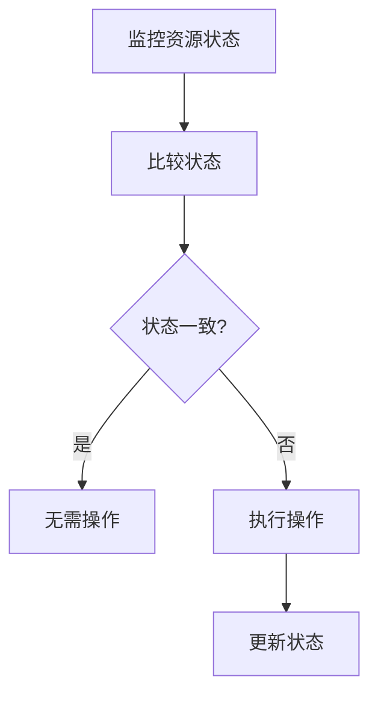

Kubernetes控制器是Kubernetes系统中的关键组件之一，负责确保集群的当前状态与用户定义的期望状态保持一致。通过控制器，Kubernetes能够自动化管理应用程序的生命周期，包括部署、扩展、更新和修复。

## 什么是Kubernetes控制器？

Kubernetes控制器是一种控制循环（Control Loop），它持续监控集群中资源的状态，并根据用户定义的期望状态进行调整。控制器通过API服务器与集群交互，确保系统的实际状态与期望状态一致。

:::note
控制器是Kubernetes的核心机制之一，用于实现声明式API和自动化管理。
:::

## 控制器的工作原理

控制器的工作流程可以概括为以下几个步骤：

1. **监控资源状态**：控制器通过API服务器监控集群中资源的状态。
2. **比较状态**：将当前状态与期望状态进行比较。
3. **执行操作**：如果当前状态与期望状态不一致，控制器会执行相应的操作来调整状态。
4. **更新状态**：控制器通过API服务器更新资源的状态。



## 常见的Kubernetes控制器

Kubernetes提供了多种内置控制器，每种控制器负责管理特定类型的资源。以下是一些常见的控制器：

### 1. Deployment控制器

Deployment控制器用于管理无状态应用的部署和更新。它确保指定数量的Pod副本始终运行，并支持滚动更新和回滚。

```yaml
apiVersion: apps/v1
kind: Deployment
metadata:
  name: nginx-deployment
spec:
  replicas: 3
  selector:
    matchLabels:
      app: nginx
  template:
    metadata:
      labels:
        app: nginx
    spec:
      containers:
      - name: nginx
        image: nginx:1.14.2
        ports:
        - containerPort: 80
```

### 2. StatefulSet控制器

StatefulSet控制器用于管理有状态应用，如数据库。它确保Pod的唯一性和稳定的网络标识。

```yaml
apiVersion: apps/v1
kind: StatefulSet
metadata:
  name: web
spec:
  serviceName: "nginx"
  replicas: 3
  selector:
    matchLabels:
      app: nginx
  template:
    metadata:
      labels:
        app: nginx
    spec:
      containers:
      - name: nginx
        image: nginx:1.14.2
        ports:
        - containerPort: 80
```

### 3. DaemonSet控制器

DaemonSet控制器确保每个节点上运行一个Pod副本，通常用于日志收集、监控等场景。

```yaml
apiVersion: apps/v1
kind: DaemonSet
metadata:
  name: fluentd
spec:
  selector:
    matchLabels:
      name: fluentd
  template:
    metadata:
      labels:
        name: fluentd
    spec:
      containers:
      - name: fluentd
        image: fluent/fluentd:v1.14-debian-1
```

### 4. Job控制器

Job控制器用于管理一次性任务，确保任务成功完成。

```yaml
apiVersion: batch/v1
kind: Job
metadata:
  name: pi
spec:
  template:
    spec:
      containers:
      - name: pi
        image: perl:5.34.0
        command: ["perl",  "-Mbignum=bpi", "-wle", "print bpi(2000)"]
      restartPolicy: Never
  backoffLimit: 4
```

## 实际应用场景

### 场景1：滚动更新

假设你有一个运行中的Deployment，需要更新应用的镜像版本。Deployment控制器会自动执行滚动更新，逐步替换旧的Pod副本，确保应用的高可用性。

```yaml
kubectl set image deployment/nginx-deployment nginx=nginx:1.16.1
```

### 场景2：自动扩展

使用Horizontal Pod Autoscaler（HPA）与Deployment控制器结合，可以根据CPU利用率自动扩展Pod副本数。

```yaml
apiVersion: autoscaling/v2beta2
kind: HorizontalPodAutoscaler
metadata:
  name: nginx-hpa
spec:
  scaleTargetRef:
    apiVersion: apps/v1
    kind: Deployment
    name: nginx-deployment
  minReplicas: 1
  maxReplicas: 10
  metrics:
  - type: Resource
    resource:
      name: cpu
      target:
        type: Utilization
        averageUtilization: 50
```

## 总结

Kubernetes控制器是Kubernetes自动化管理的核心组件，通过持续监控和调整资源状态，确保集群的稳定运行。掌握控制器的概念和工作原理，对于理解Kubernetes的自动化机制至关重要。

## 附加资源与练习

- **官方文档**：[Kubernetes Controllers](https://kubernetes.io/docs/concepts/architecture/controller/)
- **练习**：创建一个Deployment，并使用kubectl命令进行滚动更新和回滚操作。

:::tip
建议初学者通过实际操作来加深对控制器的理解，尝试创建和管理不同类型的控制器。
:::