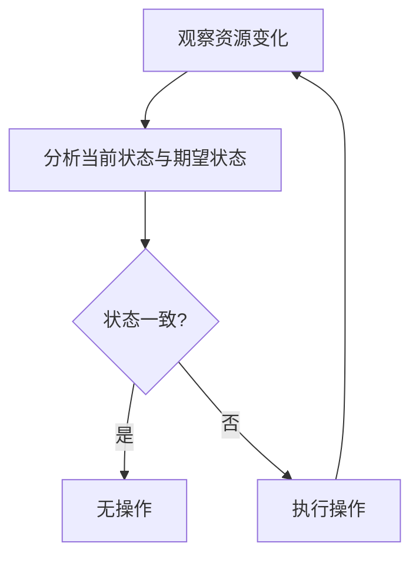

# Kubernetes 自定义控制器

Kubernetes是一个强大的容器编排平台，它通过控制器（Controller）来确保系统的期望状态与实际状态一致。Kubernetes内置了许多控制器，例如Deployment、ReplicaSet和StatefulSet等。然而，在某些情况下，内置控制器可能无法满足特定的需求。这时，自定义控制器（Custom Controller）就派上了用场。

## 什么是Kubernetes自定义控制器？

自定义控制器是用户定义的控制器，用于扩展Kubernetes的功能。它们通过监听Kubernetes API中的资源变化，并根据这些变化执行特定的操作。自定义控制器通常与自定义资源定义（Custom Resource Definition, CRD）一起使用，以创建和管理自定义资源。

### 控制器的工作原理

Kubernetes控制器遵循**控制循环**（Control Loop）模式，其核心逻辑如下：

1. **观察**：控制器通过Kubernetes API监听资源的变化。
2. **分析**：控制器比较资源的当前状态与期望状态。
3. **操作**：如果当前状态与期望状态不一致，控制器会执行相应的操作以使其一致。



## 创建自定义控制器

要创建一个自定义控制器，通常需要以下几个步骤：

1. **定义自定义资源**：使用CRD定义一个新的资源类型。
2. **编写控制器逻辑**：编写代码来监听资源变化并执行操作。
3. **部署控制器**：将控制器部署到Kubernetes集群中。

### 示例：创建一个简单的自定义控制器

假设我们想要创建一个自定义控制器，用于管理名为`MyApp`的自定义资源。以下是实现步骤：

#### 1. 定义自定义资源

首先，我们需要定义一个CRD来描述`MyApp`资源：

```yaml
apiVersion: apiextensions.k8s.io/v1
kind: CustomResourceDefinition
metadata:
  name: myapps.example.com
spec:
  group: example.com
  versions:
    - name: v1
      served: true
      storage: true
      schema:
        openAPIV3Schema:
          type: object
          properties:
            spec:
              type: object
              properties:
                replicas:
                  type: integer
  scope: Namespaced
  names:
    plural: myapps
    singular: myapp
    kind: MyApp
```

#### 2. 编写控制器逻辑

接下来，我们使用Go语言编写控制器逻辑。以下是一个简化的示例：

```go
package main

import (
    "context"
    "fmt"
    "time"

    "k8s.io/apimachinery/pkg/api/errors"
    metav1 "k8s.io/apimachinery/pkg/apis/meta/v1"
    "k8s.io/client-go/tools/cache"
    "k8s.io/client-go/util/workqueue"
    "k8s.io/klog/v2"
)

func (c *Controller) processNextItem() bool {
    // 从队列中获取一个项目
    key, quit := c.queue.Get()
    if quit {
        return false
    }
    defer c.queue.Done(key)

    // 处理项目
    err := c.syncHandler(key.(string))
    if err == nil {
        c.queue.Forget(key)
        return true
    }

    // 处理错误
    c.queue.AddRateLimited(key)
    klog.Errorf("Error syncing %v: %v", key, err)
    return true
}

func (c *Controller) syncHandler(key string) error {
    namespace, name, err := cache.SplitMetaNamespaceKey(key)
    if err != nil {
        return err
    }

    // 获取MyApp资源
    myapp, err := c.myappLister.MyApps(namespace).Get(name)
    if err != nil {
        if errors.IsNotFound(err) {
            klog.Infof("MyApp %s/%s has been deleted", namespace, name)
            return nil
        }
        return err
    }

    // 根据MyApp的期望状态执行操作
    klog.Infof("Syncing MyApp %s/%s with %d replicas", namespace, name, myapp.Spec.Replicas)
    return nil
}
```

#### 3. 部署控制器

最后，我们将控制器打包为容器镜像，并部署到Kubernetes集群中：

```yaml
apiVersion: apps/v1
kind: Deployment
metadata:
  name: myapp-controller
spec:
  replicas: 1
  selector:
    matchLabels:
      app: myapp-controller
  template:
    metadata:
      labels:
        app: myapp-controller
    spec:
      containers:
      - name: myapp-controller
        image: myapp-controller:latest
```

## 实际应用场景

自定义控制器在许多场景中都非常有用，例如：

- **自动化部署**：根据自定义资源的状态自动部署应用程序。
- **资源管理**：根据集群的资源使用情况动态调整资源分配。
- **监控和告警**：根据自定义资源的指标触发告警或执行修复操作。

:::tip
自定义控制器是Kubernetes扩展的强大工具，但它们也需要谨慎使用。确保控制器的逻辑是幂等的，以避免重复操作或资源冲突。
:::

## 总结

Kubernetes自定义控制器允许用户扩展Kubernetes的功能，以满足特定的需求。通过定义自定义资源和编写控制器逻辑，用户可以自动化复杂的集群管理任务。本文介绍了自定义控制器的基本概念、工作原理以及如何创建和部署一个简单的自定义控制器。

## 附加资源

- [Kubernetes官方文档：自定义控制器](https://kubernetes.io/docs/concepts/extend-kubernetes/api-extension/custom-resources/)
- [Kubernetes控制器模式](https://kubernetes.io/docs/concepts/architecture/controller/)
- [Kubernetes API参考](https://kubernetes.io/docs/reference/kubernetes-api/)

## 练习

1. 尝试创建一个自定义控制器，用于管理一个简单的资源类型。
2. 扩展控制器的逻辑，使其能够根据资源的状态自动创建或删除Pod。
3. 部署控制器并观察其行为，确保它能够正确处理资源的变化。

通过实践，您将更深入地理解Kubernetes自定义控制器的工作原理和应用场景。祝您学习愉快！