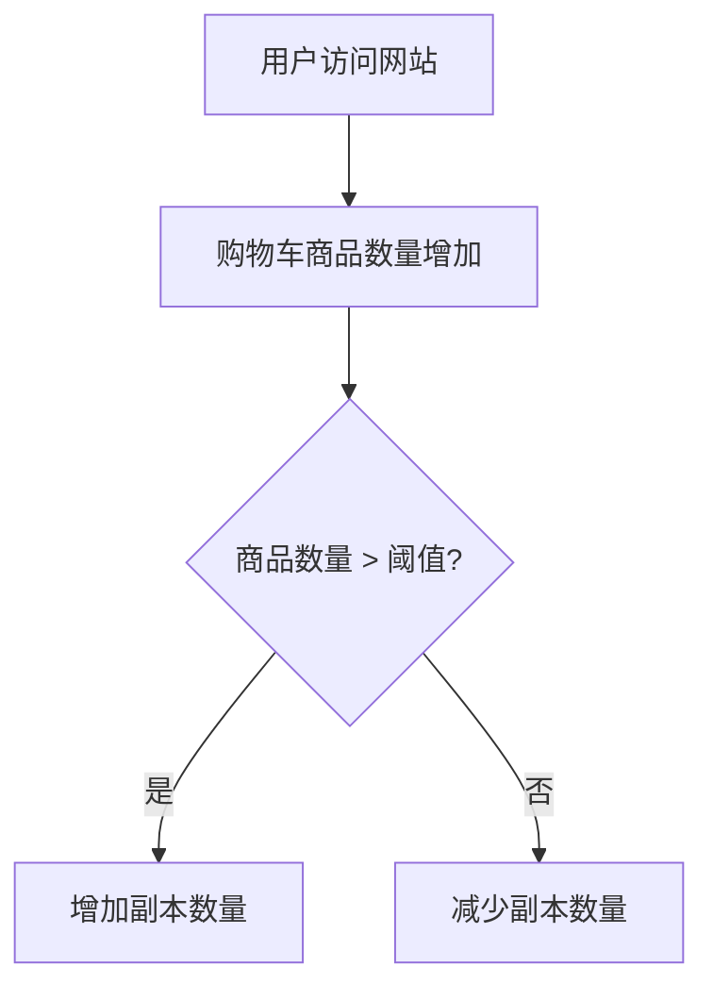

# Kubernetes 自定义指标

Kubernetes 是一个强大的容器编排平台，它允许用户通过自动扩展（Horizontal Pod Autoscaler, HPA）来动态调整应用程序的副本数量。默认情况下，HPA 使用 CPU 和内存等资源指标来进行扩展决策。然而，在实际应用中，这些指标可能不足以满足复杂的扩展需求。这时，**自定义指标**就派上了用场。

## 什么是自定义指标？

自定义指标是用户定义的、与应用程序相关的指标，例如请求延迟、队列长度、错误率等。通过使用自定义指标，Kubernetes 可以根据这些特定的业务需求来调整应用程序的规模，而不仅仅依赖于 CPU 或内存使用率。

## 如何实现自定义指标？

要在 Kubernetes 中使用自定义指标，通常需要以下几个步骤：

1. **部署 Metrics Server**：Metrics Server 是 Kubernetes 集群中的一个组件，用于收集资源使用情况（如 CPU 和内存）。它是 HPA 的基础。

2. **部署 Prometheus**：Prometheus 是一个开源的监控和告警工具，广泛用于收集和存储自定义指标。

3. **配置 Custom Metrics API**：Custom Metrics API 是 Kubernetes 的一个扩展 API，允许 HPA 访问自定义指标。

4. **创建 HPA 并指定自定义指标**：最后，你需要创建一个 HPA 对象，并指定使用自定义指标来进行扩展。

### 示例：使用 Prometheus 和 Custom Metrics API

假设我们有一个应用程序，我们希望根据 HTTP 请求的延迟来自动扩展。以下是实现这一目标的步骤：

#### 1. 部署 Prometheus

首先，我们需要在 Kubernetes 集群中部署 Prometheus。可以使用 Helm 来简化部署过程：

```bash
helm repo add prometheus-community https://prometheus-community.github.io/helm-charts
helm install prometheus prometheus-community/prometheus
```

#### 2. 配置 Custom Metrics API

接下来，我们需要部署 Custom Metrics API。可以使用 `k8s-prometheus-adapter` 来实现这一点：

```bash
helm repo add prometheus-community https://prometheus-community.github.io/helm-charts
helm install prometheus-adapter prometheus-community/prometheus-adapter
```

#### 3. 创建 HPA 并指定自定义指标

假设 Prometheus 已经收集了名为 `http_request_duration_seconds` 的指标，我们可以创建一个 HPA 对象来使用这个指标：

```yaml
apiVersion: autoscaling/v2beta2
kind: HorizontalPodAutoscaler
metadata:
  name: my-app-hpa
spec:
  scaleTargetRef:
    apiVersion: apps/v1
    kind: Deployment
    name: my-app
  minReplicas: 1
  maxReplicas: 10
  metrics:
  - type: Pods
    pods:
      metric:
        name: http_request_duration_seconds
      target:
        type: AverageValue
        averageValue: 0.5
```

在这个示例中，HPA 将根据 `http_request_duration_seconds` 的平均值来调整 `my-app` 部署的副本数量。如果平均延迟超过 0.5 秒，HPA 将增加副本数量；如果延迟低于 0.5 秒，HPA 将减少副本数量。

## 实际应用场景

### 场景：电子商务网站

假设你运营一个电子商务网站，网站在促销活动期间会经历流量激增。你希望根据购物车中的商品数量来自动扩展应用程序的副本数量。通过使用自定义指标，你可以监控购物车中的商品数量，并在数量超过某个阈值时自动扩展应用程序。



## 总结

通过使用 Kubernetes 的自定义指标，你可以根据业务需求来动态调整应用程序的规模，而不仅仅依赖于 CPU 或内存使用率。这为应用程序的自动扩展提供了更大的灵活性和精确性。

## 附加资源

- [Kubernetes 官方文档：Horizontal Pod Autoscaler](https://kubernetes.io/docs/tasks/run-application/horizontal-pod-autoscale/)
- [Prometheus 官方文档](https://prometheus.io/docs/introduction/overview/)
- [k8s-prometheus-adapter GitHub 仓库](https://github.com/kubernetes-sigs/prometheus-adapter)

## 练习

1. 在你的 Kubernetes 集群中部署 Prometheus 和 Custom Metrics API。
2. 创建一个简单的应用程序，并使用自定义指标（如请求延迟）来配置 HPA。
3. 观察 HPA 如何根据自定义指标自动调整应用程序的副本数量。

通过完成这些练习，你将更好地理解 Kubernetes 自定义指标的工作原理及其在实际应用中的价值。