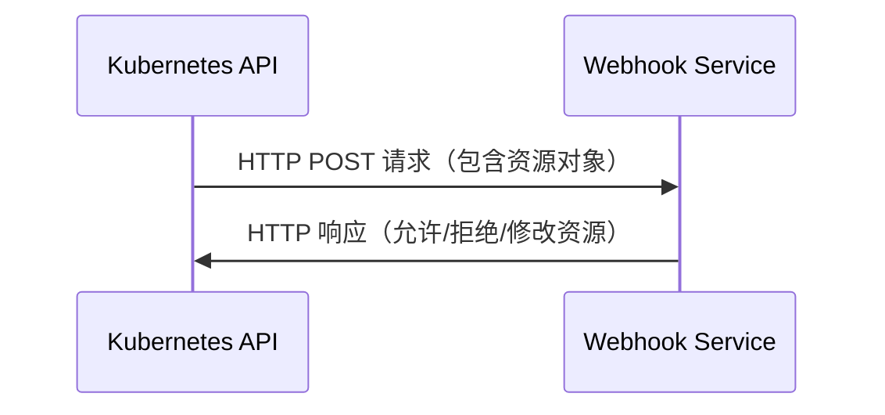

## 什么是 Kubernetes Webhook？

Kubernetes Webhook 是一种扩展 Kubernetes API 的机制，允许你在 Kubernetes 的某些操作（如创建、更新或删除资源）发生时，触发自定义的逻辑。Webhook 通过 HTTP 请求将事件发送到外部服务，外部服务可以对这些事件进行处理，并返回响应以影响 Kubernetes 的行为。

:::note
Webhook 通常用于实现准入控制（Admission Control）、验证资源、修改资源或执行其他自定义逻辑。
:::

## Webhook 的工作原理

Kubernetes Webhook 的工作原理可以分为以下几个步骤：

1. **事件触发**：当 Kubernetes 中的某个操作（如创建 Pod）发生时，Kubernetes API 会触发一个事件。
2. **Webhook 调用**：Kubernetes 会将事件的相关信息（如资源对象）通过 HTTP POST 请求发送到预先配置的外部服务（即 Webhook 服务）。
3. **外部服务处理**：外部服务接收到请求后，可以根据业务逻辑对资源进行验证、修改或拒绝操作。
4. **响应返回**：外部服务将处理结果返回给 Kubernetes，Kubernetes 根据响应决定是否继续执行操作。



## Webhook 的类型

Kubernetes 支持两种主要的 Webhook 类型：

1. **Mutating Webhook**：用于修改资源对象。例如，在创建 Pod 时自动注入 Sidecar 容器或修改环境变量。
2. **Validating Webhook**：用于验证资源对象。例如，检查 Pod 的资源配置是否符合安全策略。

:::tip
Mutating Webhook 和 Validating Webhook 可以结合使用，先通过 Mutating Webhook 修改资源，再通过 Validating Webhook 验证资源。
:::

## 如何配置 Webhook

要配置 Webhook，你需要完成以下步骤：

1. **创建 Webhook 服务**：编写一个 HTTP 服务，用于接收 Kubernetes 的请求并返回响应。
2. **配置 Webhook 的 TLS**：Kubernetes 要求 Webhook 服务必须使用 HTTPS，因此你需要为 Webhook 服务配置 TLS 证书。
3. **创建 ValidatingWebhookConfiguration 或 MutatingWebhookConfiguration**：在 Kubernetes 中创建相应的配置对象，指定 Webhook 服务的 URL 和规则。

### 示例：创建一个简单的 Validating Webhook

以下是一个简单的 Validating Webhook 示例，用于验证 Pod 的名称是否符合特定规则。

#### Webhook 服务代码（Python Flask）

```python
from flask import Flask, request, jsonify

app = Flask(__name__)

@app.route('/validate', methods=['POST'])
def validate():
    request_data = request.get_json()
    pod_name = request_data['request']['object']['metadata']['name']
    
    if "test" not in pod_name:
        return jsonify({
            "apiVersion": "admission.k8s.io/v1",
            "kind": "AdmissionReview",
            "response": {
                "uid": request_data['request']['uid'],
                "allowed": False,
                "status": {
                    "message": "Pod name must contain 'test'"
                }
            }
        })
    
    return jsonify({
        "apiVersion": "admission.k8s.io/v1",
        "kind": "AdmissionReview",
        "response": {
            "uid": request_data['request']['uid'],
            "allowed": True
        }
    })

if __name__ == '__main__':
    app.run(ssl_context=('cert.pem', 'key.pem'), host='0.0.0.0', port=443)
```

#### ValidatingWebhookConfiguration

```yaml
apiVersion: admissionregistration.k8s.io/v1
kind: ValidatingWebhookConfiguration
metadata:
  name: pod-validation-webhook
webhooks:
- name: pod-validation.example.com
  rules:
  - apiGroups: [""]
    apiVersions: ["v1"]
    operations: ["CREATE"]
    resources: ["pods"]
  clientConfig:
    url: "https://webhook-service.example.com/validate"
    caBundle: <base64-encoded-ca-cert>
  admissionReviewVersions: ["v1"]
  sideEffects: None
  timeoutSeconds: 5
```

:::caution
确保 Webhook 服务的 URL 和 CA 证书配置正确，否则 Kubernetes 将无法调用 Webhook。
:::

## 实际应用场景

### 场景 1：自动注入 Sidecar 容器

在微服务架构中，通常需要在每个 Pod 中注入 Sidecar 容器（如 Istio 的 Envoy 代理）。通过 Mutating Webhook，可以在 Pod 创建时自动注入 Sidecar 容器，而无需手动修改每个 Pod 的配置。

### 场景 2：资源验证

在 Kubernetes 集群中，可能需要确保所有 Pod 都符合特定的安全策略（如不允许使用特权容器）。通过 Validating Webhook，可以在 Pod 创建时验证其配置，如果不符合安全策略，则拒绝创建。

## 总结

Kubernetes Webhook 是一种强大的扩展机制，允许你在 Kubernetes 的某些操作发生时执行自定义逻辑。通过 Mutating Webhook 和 Validating Webhook，你可以实现资源修改、验证等功能，从而更好地管理和控制 Kubernetes 集群中的资源。

## 附加资源

- [Kubernetes 官方文档：动态准入控制](https://kubernetes.io/docs/reference/access-authn-authz/extensible-admission-controllers/)
- [Kubernetes Webhook 示例代码](https://github.com/kubernetes/kubernetes/tree/master/test/images/agnhost/webhook)

## 练习

1. 尝试编写一个 Mutating Webhook，在 Pod 创建时自动添加一个环境变量。
2. 配置一个 Validating Webhook，确保所有 Pod 的 CPU 请求不超过 1 核。

通过实践这些练习，你将更深入地理解 Kubernetes Webhook 的工作原理和应用场景。