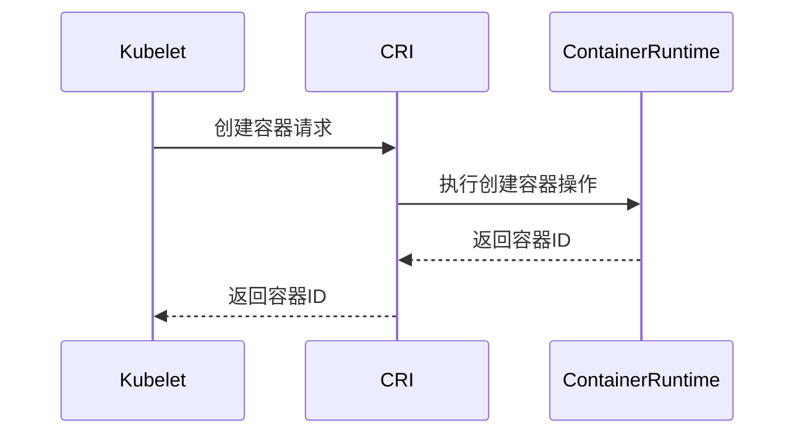

# Kubernetes CRI

Kubernetes CRI（Container Runtime Interface，容器运行时接口）是 Kubernetes 与容器运行时之间的桥梁。它定义了 Kubernetes 如何与底层容器运行时（如 Docker、containerd、CRI-O 等）进行交互。通过 CRI，Kubernetes 可以管理容器的生命周期，而无需直接依赖于特定的容器运行时实现。

## 什么是 CRI？

CRI 是 Kubernetes 中的一个抽象层，它允许 Kubernetes 与不同的容器运行时进行通信。Kubernetes 通过 CRI 向容器运行时发送请求，例如创建、启动、停止或删除容器。CRI 的设计使得 Kubernetes 可以支持多种容器运行时，而无需修改核心代码。

:::note
CRI 并不是一个具体的容器运行时，而是一个接口规范。它定义了 Kubernetes 如何与容器运行时交互。
:::

## CRI 的工作原理

Kubernetes 的 `kubelet` 组件负责与容器运行时交互。`kubelet` 通过 CRI 接口发送请求，容器运行时则根据这些请求执行相应的操作。CRI 接口主要包括以下两个部分：

1. **RuntimeService**：负责容器的生命周期管理，例如创建、启动、停止和删除容器。
2. **ImageService**：负责镜像的管理，例如拉取、列出和删除镜像。

以下是一个简化的 CRI 工作流程：



## CRI 的实际应用

### 1. 使用 containerd 作为容器运行时

containerd 是一个流行的容器运行时，它实现了 CRI 接口。以下是如何在 Kubernetes 中配置 containerd 作为容器运行时的示例：

1. 安装 containerd：
   ```bash
   sudo apt-get update
   sudo apt-get install containerd
   ```

2. 配置 containerd 以支持 CRI：
   ```bash
   sudo containerd config default > /etc/containerd/config.toml
   sudo systemctl restart containerd
   ```

3. 配置 `kubelet` 使用 containerd：
   ```bash
   sudo vi /var/lib/kubelet/kubeadm-flags.env
   ```
   添加以下内容：
   ```bash
   KUBELET_KUBEADM_ARGS="--container-runtime=remote --container-runtime-endpoint=unix:///run/containerd/containerd.sock"
   ```

4. 重启 `kubelet`：
   ```bash
   sudo systemctl restart kubelet
   ```

### 2. 使用 CRI-O 作为容器运行时

CRI-O 是另一个实现了 CRI 接口的容器运行时，专为 Kubernetes 设计。以下是如何在 Kubernetes 中配置 CRI-O 的示例：

1. 安装 CRI-O：
   ```bash
   sudo apt-get install cri-o
   ```

2. 启动 CRI-O 服务：
   ```bash
   sudo systemctl start crio
   ```

3. 配置 `kubelet` 使用 CRI-O：
   ```bash
   sudo vi /var/lib/kubelet/kubeadm-flags.env
   ```
   添加以下内容：
   ```bash
   KUBELET_KUBEADM_ARGS="--container-runtime=remote --container-runtime-endpoint=unix:///var/run/crio/crio.sock"
   ```

4. 重启 `kubelet`：
   ```bash
   sudo systemctl restart kubelet
   ```

## 总结

Kubernetes CRI 是 Kubernetes 与容器运行时之间的关键接口，它使得 Kubernetes 可以灵活地支持多种容器运行时。通过 CRI，Kubernetes 能够管理容器的生命周期，而无需依赖于特定的容器运行时实现。理解 CRI 的工作原理对于深入掌握 Kubernetes 的容器管理机制至关重要。

:::tip
如果你想进一步了解 CRI 的细节，可以参考 Kubernetes 官方文档中的 [CRI 规范](https://github.com/kubernetes/community/blob/master/contributors/devel/sig-node/container-runtime-interface.md)。
:::

## 附加资源

- [Kubernetes CRI 官方文档](https://kubernetes.io/docs/concepts/architecture/cri/)
- [containerd 官方文档](https://containerd.io/)
- [CRI-O 官方文档](https://cri-o.io/)

## 练习

1. 尝试在本地 Kubernetes 集群中配置 containerd 作为容器运行时，并观察其行为。
2. 阅读 CRI 的源代码，理解其接口定义和实现细节。