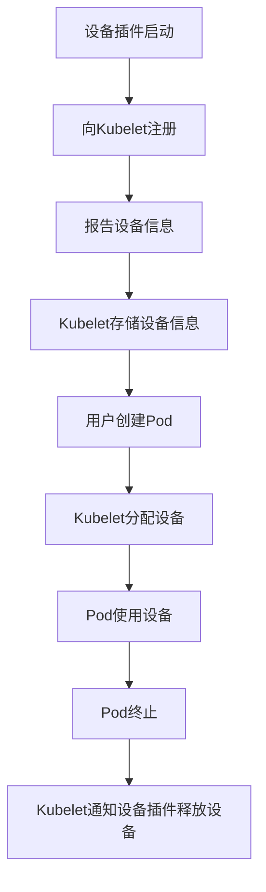

# Kubernetes 设备插件

Kubernetes设备插件（Device Plugin）是Kubernetes中用于管理和调度硬件资源（如GPU、FPGA、高性能网络接口等）的扩展机制。通过设备插件，Kubernetes可以识别和管理集群中的特殊硬件设备，并将其分配给需要这些资源的Pod。

## 什么是Kubernetes设备插件？

Kubernetes设备插件是一种扩展机制，允许Kubernetes与集群中的硬件设备进行交互。这些设备插件负责向Kubernetes报告设备的存在、健康状况以及可用性，并在Pod调度时将这些设备分配给需要它们的容器。

设备插件通常用于管理以下类型的硬件资源：

- GPU（图形处理单元）
- FPGA（现场可编程门阵列）
- 高性能网络接口（如InfiniBand）
- 其他专用硬件加速器

## 设备插件的工作原理

设备插件通过Kubernetes的Device Plugin API与Kubelet（节点上的Kubernetes代理）进行通信。以下是设备插件的基本工作流程：

1. **注册**：设备插件启动后，会向Kubelet注册自己，并报告它所管理的设备类型和数量。
2. **设备发现**：Kubelet通过Device Plugin API获取设备信息，并将其存储在节点的资源池中。
3. **资源分配**：当用户创建一个需要特定硬件资源的Pod时，Kubelet会根据设备插件的报告，将可用的设备分配给Pod中的容器。
4. **设备清理**：当Pod终止时，Kubelet会通知设备插件释放已分配的设备。



## 设备插件的实现

设备插件通常以守护进程（DaemonSet）的形式运行在每个节点上。以下是一个简单的设备插件示例，展示了如何实现一个基本的设备插件。

```go
package main

import (
    "context"
    "log"
    "time"

    "google.golang.org/grpc"
    pluginapi "k8s.io/kubelet/pkg/apis/deviceplugin/v1beta1"
)

type MyDevicePlugin struct {
    devices []*pluginapi.Device
}

func (m *MyDevicePlugin) ListAndWatch(e *pluginapi.Empty, s pluginapi.DevicePlugin_ListAndWatchServer) error {
    for {
        s.Send(&pluginapi.ListAndWatchResponse{Devices: m.devices})
        time.Sleep(5 * time.Second)
    }
}

func (m *MyDevicePlugin) Allocate(ctx context.Context, r *pluginapi.AllocateRequest) (*pluginapi.AllocateResponse, error) {
    // 分配设备的逻辑
    return &pluginapi.AllocateResponse{}, nil
}

func main() {
    plugin := &MyDevicePlugin{
        devices: []*pluginapi.Device{
            {ID: "device1", Health: pluginapi.Healthy},
            {ID: "device2", Health: pluginapi.Healthy},
        },
    }

    server := grpc.NewServer()
    pluginapi.RegisterDevicePluginServer(server, plugin)

    // 启动gRPC服务器
    log.Println("Starting device plugin server")
    if err := server.Serve(lis); err != nil {
        log.Fatalf("Failed to serve: %v", err)
    }
}
```

:::note
上述代码是一个简化的设备插件实现，实际生产环境中的设备插件可能需要处理更多的细节，如设备健康检查、错误处理等。
:::

## 实际应用场景

### GPU加速的深度学习任务

在深度学习中，GPU是加速模型训练的关键硬件资源。通过Kubernetes设备插件，集群可以动态分配GPU资源给需要加速的Pod。例如，一个TensorFlow训练任务可以请求GPU资源，Kubernetes会根据设备插件的报告，将可用的GPU分配给该任务。

```yaml
apiVersion: v1
kind: Pod
metadata:
  name: gpu-pod
spec:
  containers:
  - name: tensorflow-container
    image: tensorflow/tensorflow:latest-gpu
    resources:
      limits:
        nvidia.com/gpu: 1
```

:::tip
在上述示例中，`nvidia.com/gpu`是NVIDIA设备插件注册的资源名称。Kubernetes会根据设备插件的报告，将GPU资源分配给该Pod。
:::

## 总结

Kubernetes设备插件为管理和调度集群中的硬件资源提供了一种灵活的机制。通过设备插件，Kubernetes可以识别和管理GPU、FPGA等专用硬件设备，并将其分配给需要这些资源的Pod。设备插件的实现通常涉及与Kubelet的通信、设备发现和资源分配等步骤。

## 附加资源与练习

- **官方文档**：阅读Kubernetes官方文档中关于[设备插件](https://kubernetes.io/docs/concepts/extend-kubernetes/compute-storage-net/device-plugins/)的部分，了解更多细节。
- **练习**：尝试在本地Kubernetes集群中部署一个简单的设备插件，并创建一个使用该插件资源的Pod。

通过学习和实践，你将能够更好地理解Kubernetes设备插件的工作原理，并在实际项目中应用这一技术。