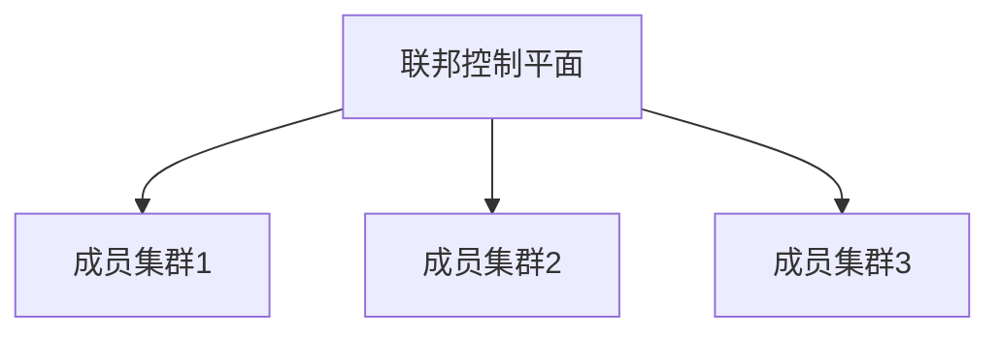

# Kubernetes 集群联邦

Kubernetes集群联邦（Kubernetes Federation）是一种用于管理多个Kubernetes集群的工具。它允许你在多个集群之间共享资源、配置和服务，从而实现跨集群的统一管理。对于需要管理多个Kubernetes集群的组织来说，集群联邦是一个强大的工具，可以帮助简化操作、提高资源利用率并增强容错能力。

## 什么是Kubernetes集群联邦？

Kubernetes集群联邦（也称为KubeFed）是一个开源项目，旨在简化多个Kubernetes集群的管理。它通过提供一个中央控制平面，允许你在多个集群中部署和管理资源，而无需单独操作每个集群。

集群联邦的核心思想是“一次定义，多处部署”。你可以在联邦控制平面中定义资源（如Deployment、Service、ConfigMap等），然后将其分发到多个集群中。联邦控制平面会确保这些资源在所有集群中保持一致。

## 集群联邦的工作原理

Kubernetes集群联邦通过以下组件实现多集群管理：

1. **联邦控制平面（Federation Control Plane）**：这是集群联邦的核心组件，负责管理多个集群的状态和配置。它通过API与各个集群通信，并确保资源的一致性。

2. **成员集群（Member Clusters）**：这些是被联邦管理的Kubernetes集群。每个成员集群都需要注册到联邦控制平面中。

3. **联邦资源（Federated Resources）**：这些是在联邦控制平面中定义的资源，可以分发到多个成员集群中。

以下是一个简单的架构图，展示了集群联邦的工作原理：



## 如何设置Kubernetes集群联邦

### 1. 安装KubeFed

首先，你需要在联邦控制平面中安装KubeFed。可以通过以下命令安装KubeFed CLI工具：

```bash
curl -LO https://github.com/kubernetes-sigs/kubefed/releases/download/v0.8.1/kubefedctl-0.8.1-linux-amd64.tgz
tar -xzf kubefedctl-0.8.1-linux-amd64.tgz
sudo mv kubefedctl /usr/local/bin/
```

### 2. 初始化联邦控制平面

接下来，初始化联邦控制平面。假设你已经有一个Kubernetes集群作为控制平面，可以运行以下命令：

```bash
kubefedctl init my-federation --host-cluster-context=my-host-cluster
```

### 3. 添加成员集群

将其他Kubernetes集群添加到联邦中。假设你已经有两个集群`cluster1`和`cluster2`，可以运行以下命令：

```bash
kubefedctl join cluster1 --host-cluster-context=my-host-cluster
kubefedctl join cluster2 --host-cluster-context=my-host-cluster
```

### 4. 创建联邦资源

现在，你可以在联邦控制平面中创建联邦资源。以下是一个简单的联邦Deployment示例：

```yaml
apiVersion: types.kubefed.io/v1beta1
kind: FederatedDeployment
metadata:
  name: my-federated-deployment
  namespace: default
spec:
  template:
    metadata:
      labels:
        app: my-app
    spec:
      replicas: 3
      selector:
        matchLabels:
          app: my-app
      template:
        metadata:
          labels:
            app: my-app
        spec:
          containers:
          - name: nginx
            image: nginx:1.19
  placement:
    clusters:
    - name: cluster1
    - name: cluster2
```

这个资源将被分发到`cluster1`和`cluster2`中，并在每个集群中创建3个副本。

## 实际应用场景

### 1. 跨区域部署

假设你有一个全球分布的应用，需要在多个区域的Kubernetes集群中运行。通过集群联邦，你可以轻松地将应用部署到多个区域的集群中，并确保配置的一致性。

### 2. 高可用性和容错

通过将应用部署到多个集群中，你可以提高应用的可用性和容错能力。即使一个集群发生故障，其他集群仍然可以继续提供服务。

### 3. 资源优化

集群联邦允许你根据集群的资源使用情况动态调整应用的部署。例如，你可以将更多的副本部署到资源充足的集群中，从而优化资源利用率。

## 总结

Kubernetes集群联邦是一个强大的工具，可以帮助你管理多个Kubernetes集群。通过联邦控制平面，你可以轻松地在多个集群中部署和管理资源，从而实现跨集群的统一管理。无论是跨区域部署、高可用性还是资源优化，集群联邦都能为你提供强大的支持。

## 附加资源

- [KubeFed官方文档](https://github.com/kubernetes-sigs/kubefed)
- [Kubernetes多集群管理指南](https://kubernetes.io/docs/concepts/cluster-administration/federation/)

## 练习

1. 尝试在你的本地环境中设置一个简单的Kubernetes集群联邦。
2. 创建一个联邦Deployment，并将其分发到多个集群中。
3. 探索如何在联邦中管理ConfigMap和Service资源。

:::tip
如果你在设置过程中遇到问题，可以参考KubeFed的官方文档或社区论坛获取帮助。
:::