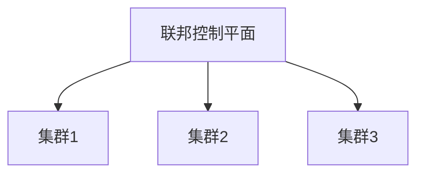
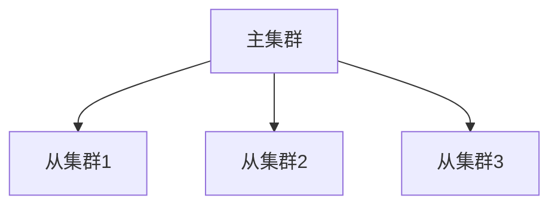
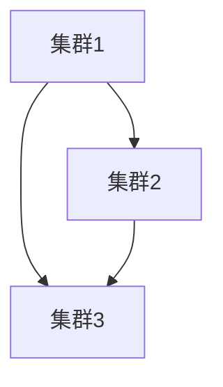

# Kubernetes 多集群架构

在现代云原生环境中，Kubernetes已经成为容器编排的事实标准。随着业务规模的扩大和复杂性的增加，单一Kubernetes集群可能无法满足所有需求。因此，**多集群架构**应运而生。本文将详细介绍Kubernetes多集群架构的概念、设计模式以及实际应用场景，帮助初学者全面理解这一重要主题。

## 什么是Kubernetes多集群架构？

Kubernetes多集群架构是指通过管理和协调多个Kubernetes集群来实现更高的可用性、容错性和资源利用率。与单一集群相比，多集群架构可以更好地支持跨地域部署、混合云环境以及多租户场景。

:::note
多集群架构并不是简单的“多个集群”，而是通过统一的控制平面或管理工具来协调这些集群，使其能够协同工作。
:::

## 多集群架构的设计模式

在设计多集群架构时，通常有以下几种常见模式：

### 1. 联邦集群（Federation）

联邦集群是一种将多个Kubernetes集群联合起来的方式，通过一个中央控制平面来管理这些集群。联邦集群可以跨多个区域或云提供商，提供统一的API入口。



### 2. 主从集群（Hub-Spoke）

主从集群模式中，一个主集群（Hub）负责管理多个从集群（Spoke）。主集群通常用于集中管理策略、配置和资源分配，而从集群则负责具体的应用部署。



### 3. 对等集群（Peer-to-Peer）

对等集群模式中，多个集群之间是平等的，彼此之间可以直接通信和共享资源。这种模式适用于需要高可用性和低延迟的场景。



## 多集群架构的实际应用场景

### 1. 跨地域部署

对于全球化的业务，多集群架构可以帮助将应用部署在离用户更近的地理位置，从而减少延迟并提高用户体验。

### 2. 混合云环境

在混合云环境中，企业可能同时使用公有云和私有云。多集群架构可以帮助统一管理这些不同的云环境，实现资源的灵活调配。

### 3. 多租户场景

在多租户场景中，不同的租户可能需要隔离的资源。通过多集群架构，可以为每个租户分配独立的Kubernetes集群，确保资源的安全性和隔离性。

## 代码示例：使用Kubefed管理多集群

以下是一个简单的示例，展示如何使用Kubefed（Kubernetes Federation）来管理多集群。

1. 安装Kubefed：

```bash
kubectl apply -f https://github.com/kubernetes-sigs/kubefed/releases/download/v0.8.1/kubefedctl-0.8.1-linux-amd64.tgz
```

2. 初始化联邦控制平面：

```bash
kubefedctl init my-federation --host-cluster-context=cluster1 --dns-provider=aws-route53
```

3. 加入其他集群：

```bash
kubefedctl join cluster2 --host-cluster-context=cluster1
kubefedctl join cluster3 --host-cluster-context=cluster1
```

4. 部署应用：

```yaml
apiVersion: types.kubefed.io/v1beta1
kind: FederatedDeployment
metadata:
  name: my-app
  namespace: default
spec:
  template:
    metadata:
      labels:
        app: my-app
    spec:
      replicas: 3
      selector:
        matchLabels:
          app: my-app
      template:
        metadata:
          labels:
            app: my-app
        spec:
          containers:
          - name: my-app
            image: my-app:latest
  placement:
    clusters:
    - name: cluster1
    - name: cluster2
    - name: cluster3
```

## 总结

Kubernetes多集群架构为现代云原生应用提供了更高的灵活性和可扩展性。通过联邦集群、主从集群和对等集群等设计模式，企业可以更好地应对跨地域部署、混合云环境和多租户场景的挑战。

:::tip
在实际应用中，选择合适的多集群架构模式需要根据具体的业务需求和环境来决定。建议初学者从简单的联邦集群开始，逐步探索更复杂的模式。
:::

## 附加资源与练习

- **官方文档**：[Kubernetes Federation](https://kubernetes.io/docs/concepts/cluster-administration/federation/)
- **练习**：尝试在本地环境中使用Minikube创建多个Kubernetes集群，并使用Kubefed进行管理。
- **进一步学习**：探索其他多集群管理工具，如Rancher、OpenShift等。

通过本文的学习，你应该对Kubernetes多集群架构有了初步的了解。接下来，可以通过实践和进一步的学习来深化这一知识。