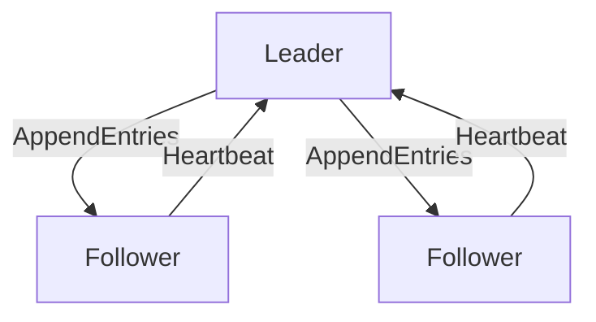

# Kubernetes 数据一致性

在Kubernetes中，数据一致性是一个至关重要的概念，尤其是在多集群管理场景中。数据一致性确保系统中的数据在不同节点或集群之间保持一致，从而避免数据冲突和不一致的问题。本文将详细介绍Kubernetes中的数据一致性，并通过实际案例帮助初学者理解其重要性。

## 什么是数据一致性？

数据一致性指的是在分布式系统中，所有节点或集群中的数据在任何时刻都保持一致的状态。在Kubernetes中，这意味着无论你在哪个集群或节点上查看数据，都应该看到相同的结果。

:::note
数据一致性是分布式系统的核心挑战之一，尤其是在多集群环境中。
:::

## Kubernetes 中的数据一致性

Kubernetes通过多种机制来确保数据一致性，包括：

1. **etcd**：Kubernetes使用etcd作为其分布式键值存储，etcd通过Raft一致性算法确保数据的一致性。
2. **控制器模式**：Kubernetes中的控制器通过不断调整系统状态，确保实际状态与期望状态一致。
3. **资源版本控制**：Kubernetes为每个资源对象分配一个唯一的版本号，用于检测和解决冲突。

### etcd与Raft算法

etcd是Kubernetes的核心组件之一，负责存储集群的所有配置数据。etcd使用Raft一致性算法来确保数据在多个节点之间的一致性。



在上图中，Leader节点负责接收客户端的写请求，并将这些请求复制到Follower节点。只有当大多数节点确认写入成功后，写操作才会被认为是成功的。

### 控制器模式

Kubernetes中的控制器通过不断比较实际状态与期望状态，确保系统的一致性。例如，Deployment控制器会确保指定数量的Pod副本始终在运行。

```yaml
apiVersion: apps/v1
kind: Deployment
metadata:
  name: nginx-deployment
spec:
  replicas: 3
  selector:
    matchLabels:
      app: nginx
  template:
    metadata:
      labels:
        app: nginx
    spec:
      containers:
      - name: nginx
        image: nginx:1.14.2
```

在上面的示例中，Deployment控制器会确保始终有3个nginx Pod在运行。如果某个Pod崩溃或被删除，控制器会自动创建一个新的Pod来替换它。

### 资源版本控制

Kubernetes为每个资源对象分配一个唯一的资源版本（resourceVersion），用于检测和解决冲突。当多个客户端同时更新同一个资源时，Kubernetes会使用资源版本来确保只有一个更新能够成功。

```yaml
apiVersion: v1
kind: Pod
metadata:
  name: my-pod
  resourceVersion: "12345"
spec:
  containers:
  - name: my-container
    image: nginx
```

在上面的示例中，`resourceVersion`字段用于标识Pod的当前版本。如果两个客户端同时尝试更新同一个Pod，只有第一个更新会成功，第二个更新会因为资源版本不匹配而失败。

## 实际案例

假设你正在管理一个多集群Kubernetes环境，每个集群都运行着相同的应用程序。为了确保数据一致性，你需要确保所有集群中的配置和状态保持一致。

### 场景：跨集群配置同步

你有一个应用程序需要在多个集群中运行，并且所有集群的配置必须保持一致。你可以使用Kubernetes的ConfigMap来存储配置，并使用工具如`kubefed`或`Argo CD`来同步配置。

```yaml
apiVersion: v1
kind: ConfigMap
metadata:
  name: my-config
data:
  config.json: |
    {
      "key": "value"
    }
```

通过将ConfigMap同步到所有集群，你可以确保所有集群中的应用程序使用相同的配置。

## 总结

Kubernetes通过etcd、控制器模式和资源版本控制等机制，确保在多集群环境中的数据一致性。理解这些机制对于管理复杂的Kubernetes环境至关重要。

:::tip
在实际应用中，建议使用工具如`kubefed`或`Argo CD`来简化多集群管理，并确保数据一致性。
:::

## 附加资源

- [Kubernetes官方文档](https://kubernetes.io/docs/home/)
- [etcd官方文档](https://etcd.io/docs/)
- [Argo CD官方文档](https://argo-cd.readthedocs.io/)

## 练习

1. 创建一个Deployment，并观察控制器如何确保Pod数量的一致性。
2. 使用ConfigMap存储配置，并尝试在多个集群中同步配置。
3. 研究Raft算法，并理解其在etcd中的作用。

通过以上练习，你将更深入地理解Kubernetes中的数据一致性及其在多集群管理中的应用。