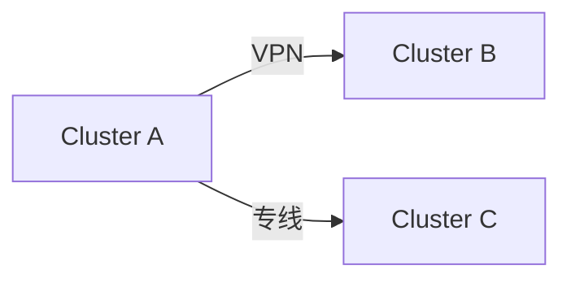

# Kubernetes 多集群网络

在现代云原生架构中，Kubernetes已经成为容器编排的事实标准。随着业务规模的扩大，许多企业需要管理多个Kubernetes集群，这些集群可能分布在不同的区域、云服务提供商或数据中心。为了确保这些集群之间的高效通信，Kubernetes多集群网络成为了一个关键的技术领域。

## 什么是Kubernetes多集群网络？

Kubernetes多集群网络是指在多个Kubernetes集群之间建立网络连接，使得这些集群中的服务能够相互通信。这种网络连接可以是跨区域的、跨云的，甚至是跨数据中心的。多集群网络的目标是提供一个统一的网络层，使得不同集群中的Pod、Service和其他资源能够无缝地交互。

## 为什么需要多集群网络？

1. **高可用性**：通过将应用部署在多个集群中，可以提高应用的可用性和容错能力。
2. **地理分布**：为了降低延迟，应用可能需要部署在靠近用户的多个地理位置。
3. **多云策略**：企业可能希望在不同的云服务提供商之间分配工作负载，以避免供应商锁定。
4. **资源隔离**：不同的集群可以用于不同的环境（如开发、测试、生产），以确保资源隔离。

## 多集群网络的实现方式

### 1. 服务网格（Service Mesh）

服务网格是一种常见的多集群网络解决方案，它通过在集群之间部署代理（如Envoy）来管理服务之间的通信。Istio是一个流行的服务网格实现，它支持多集群部署。

```yaml
apiVersion: networking.istio.io/v1alpha3
kind: Gateway
metadata:
  name: multi-cluster-gateway
spec:
  selector:
    istio: ingressgateway
  servers:
    - port:
        number: 80
        name: http
        protocol: HTTP
      hosts:
        - "*"
```

### 2. 网络插件（CNI插件）

一些CNI（Container Network Interface）插件支持跨集群的网络连接。例如，Calico和Cilium都提供了多集群网络的功能。

```yaml
apiVersion: projectcalico.org/v3
kind: GlobalNetworkPolicy
metadata:
  name: allow-multi-cluster
spec:
  selector: all()
  ingress:
    - action: Allow
      source:
        namespaceSelector: has(kubernetes.io/metadata.name)
  egress:
    - action: Allow
      destination:
        namespaceSelector: has(kubernetes.io/metadata.name)
```

### 3. VPN或专线连接

对于需要更高安全性和稳定性的场景，可以使用VPN或专线连接来建立集群之间的网络通道。



## 实际应用场景

### 场景1：跨区域部署

假设你有一个全球性的应用，需要在北美、欧洲和亚洲三个区域部署。为了确保用户能够快速访问应用，你可以在每个区域部署一个Kubernetes集群，并通过多集群网络实现这些集群之间的通信。

### 场景2：多云策略

你的企业可能希望在不同的云服务提供商（如AWS、GCP和Azure）之间分配工作负载。通过多集群网络，你可以确保这些云上的Kubernetes集群能够无缝地协同工作。

## 总结

Kubernetes多集群网络是实现跨集群通信的关键技术。通过服务网格、CNI插件或VPN/专线连接，企业可以在多个Kubernetes集群之间建立高效、安全的网络连接。无论是为了高可用性、地理分布还是多云策略，多集群网络都能提供强大的支持。

## 附加资源

- [Istio官方文档](https://istio.io/latest/docs/)
- [Calico多集群网络指南](https://docs.projectcalico.org/networking/multi-cluster)
- [Cilium多集群网络](https://docs.cilium.io/en/stable/gettingstarted/clustermesh/)

## 练习

1. 尝试在本地使用Minikube创建两个Kubernetes集群，并使用Istio配置多集群网络。
2. 使用Calico或Cilium配置跨集群的网络策略，确保集群之间的Pod可以相互通信。

通过以上内容，你应该对Kubernetes多集群网络有了初步的了解。继续探索和实践，你将能够更好地掌握这一技术。