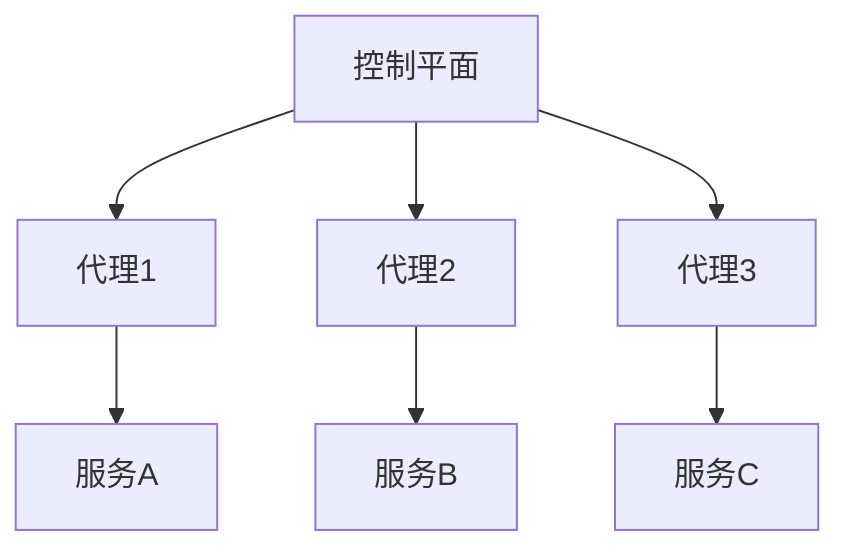

# Kubernetes 服务网格概述

在现代微服务架构中，服务网格（Service Mesh）已成为管理和监控服务间通信的重要工具。Kubernetes服务网格通过在服务之间插入一个透明的代理层，提供了流量管理、安全性、可观测性和弹性等功能。本文将为您详细介绍Kubernetes服务网格的基本概念、工作原理及其实际应用。

## 什么是服务网格？

服务网格是一种专门用于管理微服务间通信的基础设施层。它通过在服务之间插入一个轻量级的代理（如Envoy），来控制和监控服务间的流量。这些代理通常以Sidecar模式部署，即每个服务实例都附带一个代理实例。

服务网格的核心功能包括：
- **流量管理**：控制服务间的流量路由、负载均衡和故障恢复。
- **安全性**：提供加密通信、身份验证和授权。
- **可观测性**：收集和展示服务间通信的指标、日志和追踪信息。
- **弹性**：实现重试、超时和熔断等机制，提高系统的稳定性。

## Kubernetes 服务网格的工作原理

在Kubernetes中，服务网格通常通过以下组件实现：
1. **控制平面**：负责配置和管理数据平面的代理。
2. **数据平面**：由一组代理组成，负责实际的服务间通信。

以下是一个简单的服务网格架构图：



### 流量管理示例

假设我们有两个服务：`service-a`和`service-b`。我们希望将80%的流量路由到`service-a`的v1版本，20%的流量路由到v2版本。可以通过以下配置实现：

```yaml
apiVersion: networking.istio.io/v1alpha3
kind: VirtualService
metadata:
  name: service-a
spec:
  hosts:
    - service-a
  http:
    - route:
        - destination:
            host: service-a
            subset: v1
          weight: 80
        - destination:
            host: service-a
            subset: v2
          weight: 20
```

:::note
**注意**：上述配置使用了Istio的`VirtualService`资源。不同的服务网格工具可能有不同的配置方式。
:::

## 实际应用场景

### 场景1：金丝雀发布

金丝雀发布是一种逐步将新版本服务引入生产环境的技术。通过服务网格，您可以轻松控制新版本服务的流量比例，逐步增加流量以观察其稳定性。

### 场景2：服务间通信的安全性

在微服务架构中，服务间通信的安全性至关重要。服务网格可以提供自动的TLS加密，确保服务间的通信是安全的。

### 场景3：故障恢复

服务网格可以实现重试、超时和熔断等机制，帮助系统在部分服务出现故障时仍能正常运行。

## 总结

Kubernetes服务网格为微服务架构提供了强大的流量管理、安全性、可观测性和弹性功能。通过本文的介绍，您应该对服务网格的基本概念和工作原理有了初步了解。希望这些知识能帮助您在实际项目中更好地应用服务网格技术。

## 附加资源

- [Istio官方文档](https://istio.io/latest/docs/)
- [Linkerd官方文档](https://linkerd.io/docs/)
- [Envoy代理介绍](https://www.envoyproxy.io/docs/envoy/latest/)

## 练习

1. 在本地Kubernetes集群中部署一个简单的服务网格（如Istio或Linkerd）。
2. 尝试配置一个金丝雀发布策略，观察流量分配的效果。
3. 使用服务网格提供的可观测性工具，查看服务间通信的指标和日志。

:::tip
**提示**：如果您是初学者，建议从Istio开始，因为它的文档和社区支持非常丰富。
:::