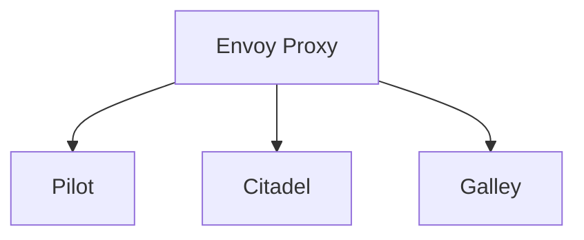

# Kubernetes Istio

## 介绍

Istio 是一个开源的服务网格（Service Mesh），专为 Kubernetes 环境设计，用于管理、保护和监控微服务之间的通信。它通过在服务之间插入一个轻量级的代理（Envoy）来实现流量控制、安全性和可观测性，而无需修改应用程序代码。

Istio 的核心功能包括：
- **流量管理**：控制服务之间的流量，支持负载均衡、故障恢复、A/B 测试等。
- **安全性**：提供身份验证、授权和加密通信。
- **可观测性**：通过指标、日志和分布式追踪监控服务行为。

## Istio 的核心组件

Istio 由以下几个核心组件组成：

1. **Envoy**：一个高性能的代理，负责处理服务之间的通信。
2. **Pilot**：负责配置 Envoy 代理，管理流量规则。
3. **Citadel**：提供身份管理和安全通信。
4. **Galley**：负责配置验证和分发。



## 安装 Istio

在 Kubernetes 集群中安装 Istio 非常简单。以下是安装步骤：

1. 下载 Istio 的最新版本：
   ```bash
   curl -L https://istio.io/downloadIstio | sh -
   ```
2. 将 Istio 的 `bin` 目录添加到 PATH 中：
   ```bash
   export PATH=$PWD/istio-1.16.1/bin:$PATH
   ```
3. 安装 Istio：
   ```bash
   istioctl install --set profile=demo -y
   ```

安装完成后，Istio 会自动在 Kubernetes 集群中部署所需的组件。

## 流量管理示例

Istio 的流量管理功能非常强大。以下是一个简单的示例，展示如何将流量从 `v1` 版本的服务路由到 `v2` 版本的服务。

1. 部署两个版本的服务：
   ```yaml
   apiVersion: apps/v1
   kind: Deployment
   metadata:
     name: myapp-v1
   spec:
     replicas: 1
     selector:
       matchLabels:
         app: myapp
         version: v1
     template:
       metadata:
         labels:
           app: myapp
           version: v1
       spec:
         containers:
         - name: myapp
           image: myapp:v1
   ---
   apiVersion: apps/v1
   kind: Deployment
   metadata:
     name: myapp-v2
   spec:
     replicas: 1
     selector:
       matchLabels:
         app: myapp
         version: v2
     template:
       metadata:
         labels:
           app: myapp
           version: v2
       spec:
         containers:
         - name: myapp
           image: myapp:v2
   ```

2. 创建 VirtualService 和 DestinationRule：
   ```yaml
   apiVersion: networking.istio.io/v1alpha3
   kind: VirtualService
   metadata:
     name: myapp
   spec:
     hosts:
     - myapp
     http:
     - route:
       - destination:
           host: myapp
           subset: v1
         weight: 50
       - destination:
           host: myapp
           subset: v2
         weight: 50
   ---
   apiVersion: networking.istio.io/v1alpha3
   kind: DestinationRule
   metadata:
     name: myapp
   spec:
     host: myapp
     subsets:
     - name: v1
       labels:
         version: v1
     - name: v2
       labels:
         version: v2
   ```

通过上述配置，Istio 会将流量均匀分配到 `v1` 和 `v2` 版本的服务。

## 安全性示例

Istio 提供了强大的安全性功能。以下是一个简单的示例，展示如何启用双向 TLS（mTLS）来保护服务之间的通信。

1. 启用 mTLS：
   ```yaml
   apiVersion: security.istio.io/v1beta1
   kind: PeerAuthentication
   metadata:
     name: default
   spec:
     mtls:
       mode: STRICT
   ```

2. 创建 DestinationRule 以启用 mTLS：
   ```yaml
   apiVersion: networking.istio.io/v1alpha3
   kind: DestinationRule
   metadata:
     name: myapp
   spec:
     host: myapp
     trafficPolicy:
       tls:
         mode: ISTIO_MUTUAL
   ```

通过上述配置，Istio 会强制服务之间使用 mTLS 进行通信。

## 实际应用场景

Istio 在实际应用中有多种用途。以下是一些常见的场景：

1. **蓝绿部署**：通过 Istio 的流量管理功能，可以轻松实现蓝绿部署，逐步将流量从旧版本切换到新版本。
2. **金丝雀发布**：通过权重控制，逐步将流量引入新版本，确保新版本的稳定性。
3. **故障注入**：通过 Istio 的故障注入功能，可以模拟服务故障，测试系统的弹性。

## 总结

Istio 是一个功能强大的服务网格，能够显著提升 Kubernetes 环境中微服务的管理能力。通过流量管理、安全性和可观测性功能，Istio 帮助开发者和运维人员更好地控制和管理微服务架构。

## 附加资源

- [Istio 官方文档](https://istio.io/latest/docs/)
- [Istio GitHub 仓库](https://github.com/istio/istio)
- [Envoy 代理文档](https://www.envoyproxy.io/docs/envoy/latest/)

## 练习

1. 在 Kubernetes 集群中安装 Istio，并部署一个简单的微服务应用。
2. 使用 Istio 的流量管理功能，实现蓝绿部署。
3. 启用 mTLS，保护服务之间的通信。

通过实践这些练习，您将更好地理解 Istio 的功能和应用场景。