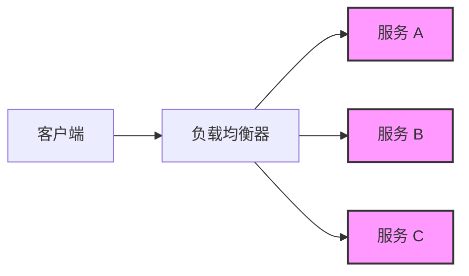

# Kubernetes 故障注入

在现代分布式系统中，故障是不可避免的。为了确保系统在故障发生时仍能正常运行，我们需要模拟故障场景并测试系统的容错能力。Kubernetes 故障注入（Fault Injection）是一种主动引入故障的技术，用于验证系统的健壮性和恢复能力。

## 什么是故障注入？

故障注入是一种测试技术，通过人为地在系统中引入故障（如延迟、错误或服务中断），观察系统在这些异常情况下的行为。这种技术可以帮助开发者和运维人员识别系统中的潜在问题，并验证系统的容错机制是否有效。

在 Kubernetes 中，故障注入通常与**服务网格**（如 Istio 或 Linkerd）结合使用，通过配置规则来模拟故障场景。

## 为什么需要故障注入？

1. **验证系统的容错能力**：通过模拟故障，确保系统能够在异常情况下继续运行。
2. **发现潜在问题**：在开发或测试阶段发现并修复问题，避免在生产环境中出现故障。
3. **提高系统可靠性**：通过反复测试和优化，提升系统的稳定性和可靠性。

## 如何在 Kubernetes 中实现故障注入？

在 Kubernetes 中，故障注入通常通过服务网格实现。以 Istio 为例，我们可以通过配置 `VirtualService` 和 `DestinationRule` 来模拟故障。

### 示例：使用 Istio 注入延迟和错误

以下是一个简单的示例，展示如何在 Istio 中注入延迟和错误。

#### 1. 注入延迟

```yaml
apiVersion: networking.istio.io/v1alpha3
kind: VirtualService
metadata:
  name: my-service
spec:
  hosts:
    - my-service
  http:
    - route:
        - destination:
            host: my-service
      fault:
        delay:
          percentage:
            value: 50
          fixedDelay: 5s
```

在这个配置中，我们为 `my-service` 注入了 5 秒的延迟，并且有 50% 的请求会受到延迟影响。

#### 2. 注入错误

```yaml
apiVersion: networking.istio.io/v1alpha3
kind: VirtualService
metadata:
  name: my-service
spec:
  hosts:
    - my-service
  http:
    - route:
        - destination:
            host: my-service
      fault:
        abort:
          percentage:
            value: 10
          httpStatus: 500
```

在这个配置中，我们为 `my-service` 注入了 10% 的错误率，并且这些错误会返回 HTTP 500 状态码。

### 输入和输出

- **输入**：上述 YAML 配置文件。
- **输出**：50% 的请求会延迟 5 秒，10% 的请求会返回 HTTP 500 错误。

## 实际应用场景

### 场景 1：测试微服务的容错能力

假设我们有一个微服务架构，其中服务 A 依赖于服务 B。我们可以通过故障注入模拟服务 B 的延迟或错误，观察服务 A 的行为。例如：

- 如果服务 B 延迟 5 秒，服务 A 是否会超时？
- 如果服务 B 返回错误，服务 A 是否会重试或降级？

### 场景 2：验证负载均衡策略

在 Kubernetes 中，负载均衡是确保高可用性的关键。我们可以通过故障注入模拟部分后端服务的故障，验证负载均衡器是否能够正确地将流量路由到健康的服务。



在上图中，我们可以通过故障注入模拟服务 A 和服务 B 的故障，观察负载均衡器是否将流量正确地路由到服务 C。

## 总结

Kubernetes 故障注入是一种强大的工具，可以帮助我们验证系统的容错能力和健壮性。通过模拟故障场景，我们可以在开发或测试阶段发现并修复潜在问题，从而提高系统的可靠性。

:::tip
在实际生产环境中使用故障注入时，请务必小心操作，避免对用户造成影响。建议在测试环境中充分验证后再应用到生产环境。
:::

## 附加资源

- [Istio 官方文档 - 故障注入](https://istio.io/latest/docs/tasks/traffic-management/fault-injection/)
- [Kubernetes 故障注入实践指南](https://kubernetes.io/docs/concepts/cluster-administration/fault-injection/)
- [服务网格与故障注入：理论与实践](https://www.servicemesh.io/fault-injection)

## 练习

1. 在本地 Kubernetes 集群中部署 Istio，并尝试为某个服务注入延迟和错误。
2. 观察服务的响应时间和服务降级行为，记录并分析结果。
3. 尝试调整故障注入的配置（如延迟时间或错误率），观察系统的变化。

通过以上练习，您将更深入地理解 Kubernetes 故障注入的工作原理及其在实际中的应用。