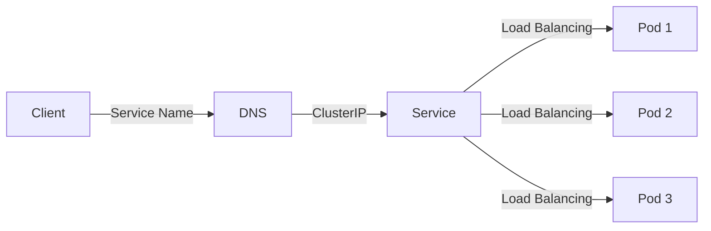

## 什么是 Kubernetes 服务发现？

在 Kubernetes 中，**服务发现**是一种机制，用于自动检测和定位集群中运行的应用程序或服务。由于 Kubernetes 的动态特性，Pod 的 IP 地址可能会频繁变化。服务发现通过为 Pod 提供稳定的网络端点（如 DNS 名称或 IP 地址），使得其他服务能够可靠地访问它们。

服务发现的核心是 Kubernetes 的 **Service** 资源。Service 为 Pod 提供了一个抽象层，使得 Pod 的 IP 变化不会影响服务的调用方。

## 为什么需要服务发现？

在微服务架构中，服务之间需要相互通信。由于 Pod 是动态创建和销毁的，直接使用 Pod 的 IP 地址是不可靠的。服务发现解决了以下问题：

1. **动态 IP 管理**：Pod 的 IP 地址可能会变化，服务发现通过 Service 提供稳定的访问点。
2. **负载均衡**：Service 可以将流量分发到多个 Pod 实例，实现负载均衡。
3. **服务抽象**：调用方无需关心具体的 Pod 实例，只需通过 Service 名称访问服务。

## Kubernetes 服务发现的工作原理

Kubernetes 服务发现的核心是 **Service** 资源。Service 通过标签选择器（Label Selector）与一组 Pod 关联。当创建 Service 时，Kubernetes 会为其分配一个稳定的 IP 地址（ClusterIP），并通过 DNS 将该 IP 映射到一个可解析的名称。

### 服务发现的流程

1. **创建 Service**：定义一个 Service，指定标签选择器以匹配目标 Pod。
2. **分配 ClusterIP**：Kubernetes 为 Service 分配一个 ClusterIP，该 IP 在集群内是唯一的。
3. **DNS 解析**：Kubernetes 的 DNS 服务（如 CoreDNS）将 Service 名称解析为 ClusterIP。
4. **流量转发**：当其他服务通过 Service 名称访问时，流量会被转发到匹配的 Pod。



## 如何定义 Service？

以下是一个简单的 Service 定义示例：

```yaml
apiVersion: v1
kind: Service
metadata:
  name: my-service
spec:
  selector:
    app: my-app
  ports:
    - protocol: TCP
      port: 80
      targetPort: 8080
```

- **selector**：通过标签 `app: my-app` 选择目标 Pod。
- **ports**：定义 Service 的端口映射。`port` 是 Service 暴露的端口，`targetPort` 是 Pod 监听的端口。

### 创建 Service

使用以下命令创建 Service：

```bash
kubectl apply -f service.yaml
```

### 验证 Service

创建后，可以通过以下命令查看 Service 的详细信息：

```bash
kubectl get svc my-service
```

输出示例：

```
NAME         TYPE        CLUSTER-IP      EXTERNAL-IP   PORT(S)   AGE
my-service   ClusterIP   10.96.123.45    <none>        80/TCP    10s
```

## 实际案例：微服务通信

假设我们有两个微服务：`frontend` 和 `backend`。`frontend` 需要调用 `backend` 提供的 API。

1. **定义 backend Service**：

```yaml
apiVersion: v1
kind: Service
metadata:
  name: backend
spec:
  selector:
    app: backend
  ports:
    - protocol: TCP
      port: 80
      targetPort: 8080
```

2. **在 frontend 中调用 backend**：

`frontend` 可以通过 `http://backend:80` 访问 `backend` 服务。Kubernetes 的 DNS 会自动将 `backend` 解析为 `backend` Service 的 ClusterIP。

## 总结

Kubernetes 服务发现是微服务架构中不可或缺的一部分。通过 Service 资源，Kubernetes 提供了一种简单而强大的方式来实现服务之间的通信。无论是动态 IP 管理、负载均衡还是服务抽象，服务发现都为我们提供了可靠的解决方案。

:::tip 提示
- 使用 Service 时，确保 Pod 的标签与 Service 的 `selector` 匹配。
- 如果需要从集群外部访问服务，可以使用 `NodePort` 或 `LoadBalancer` 类型的 Service。
:::

## 附加资源

- [Kubernetes 官方文档：Service](https://kubernetes.io/docs/concepts/services-networking/service/)
- [CoreDNS：Kubernetes 的 DNS 服务](https://coredns.io/)
- [Kubernetes 网络模型详解](https://kubernetes.io/docs/concepts/cluster-administration/networking/)

## 练习

1. 创建一个包含两个 Pod 的 Deployment，并为它们定义一个 Service。
2. 尝试从另一个 Pod 中通过 Service 名称访问这些 Pod。
3. 修改 Service 的 `selector`，观察流量如何变化。