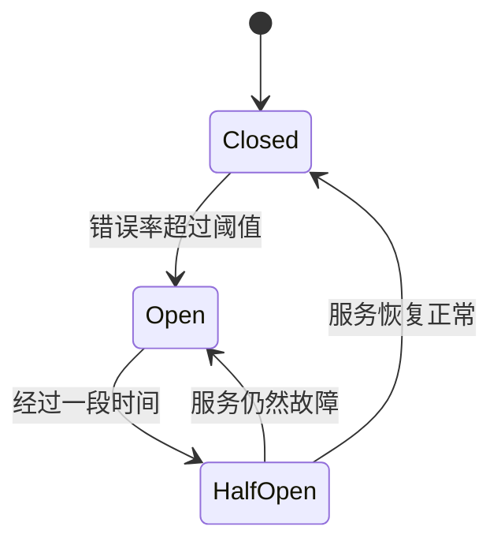

# Kubernetes 熔断器

在微服务架构中，服务之间的依赖关系复杂，一个服务的故障可能会引发连锁反应，导致整个系统的崩溃。为了避免这种情况，Kubernetes引入了**熔断器**（Circuit Breaker）模式。熔断器是一种设计模式，用于防止服务在出现故障时继续发送请求，从而保护系统免受级联故障的影响。

## 什么是熔断器？

熔断器的概念来源于电路中的保险丝。当电路中的电流过大时，保险丝会熔断，从而保护电路不受损坏。类似地，在微服务架构中，熔断器会在服务出现故障时“熔断”，停止向该服务发送请求，直到服务恢复正常。

熔断器通常有三种状态：
1. **关闭状态（Closed）**：熔断器关闭，请求正常发送到服务。
2. **打开状态（Open）**：熔断器打开，请求不再发送到服务，直接返回错误。
3. **半开状态（Half-Open）**：熔断器尝试恢复，允许部分请求发送到服务，以检测服务是否恢复正常。

## 熔断器的工作原理

熔断器通过监控服务的响应时间和错误率来决定是否触发熔断。当错误率超过设定的阈值时，熔断器会进入打开状态，停止向服务发送请求。经过一段时间后，熔断器会进入半开状态，尝试恢复服务。如果服务恢复正常，熔断器会重新关闭；否则，熔断器会继续保持打开状态。



## 在Kubernetes中实现熔断器

在Kubernetes中，熔断器通常通过服务网格（如Istio）来实现。Istio提供了丰富的流量管理功能，包括熔断器、重试、超时等。

### 使用Istio实现熔断器

以下是一个使用Istio实现熔断器的示例。假设我们有一个名为`product-service`的服务，我们希望为其配置熔断器。

```yaml
apiVersion: networking.istio.io/v1alpha3
kind: DestinationRule
metadata:
  name: product-service
spec:
  host: product-service
  trafficPolicy:
    connectionPool:
      tcp:
        maxConnections: 100
      http:
        http1MaxPendingRequests: 50
        maxRequestsPerConnection: 10
    outlierDetection:
      consecutiveErrors: 5
      interval: 10s
      baseEjectionTime: 30s
      maxEjectionPercent: 50
```

在这个配置中：
- `maxConnections`：设置最大连接数为100。
- `http1MaxPendingRequests`：设置最大等待请求数为50。
- `maxRequestsPerConnection`：设置每个连接的最大请求数为10。
- `consecutiveErrors`：设置连续错误数为5，超过这个数后触发熔断。
- `interval`：设置检测间隔为10秒。
- `baseEjectionTime`：设置基础熔断时间为30秒。
- `maxEjectionPercent`：设置最大熔断百分比为50%。

### 示例输出

当熔断器触发时，Istio会返回一个`503 Service Unavailable`错误，表示服务不可用。

```bash
HTTP/1.1 503 Service Unavailable
content-length: 19
content-type: text/plain
date: Mon, 01 Jan 2023 00:00:00 GMT
server: istio-envoy

Service Unavailable
```

## 实际应用场景

假设我们有一个电商系统，其中`product-service`负责处理商品信息的查询。在高并发情况下，`product-service`可能会出现响应缓慢或故障。通过配置熔断器，我们可以防止`product-service`的故障影响到整个系统。

1. **正常情况**：用户请求商品信息，`product-service`正常响应。
2. **故障情况**：`product-service`出现故障，熔断器触发，返回`503 Service Unavailable`错误。
3. **恢复情况**：经过一段时间后，熔断器进入半开状态，尝试恢复服务。如果服务恢复正常，熔断器关闭，请求恢复正常。

## 总结

熔断器是微服务架构中保护系统稳定性的重要工具。通过监控服务的错误率和响应时间，熔断器可以在服务出现故障时及时“熔断”，防止故障扩散。在Kubernetes中，我们可以通过Istio等服务网格工具轻松实现熔断器。

## 附加资源与练习

- **练习**：尝试在本地Kubernetes集群中部署一个简单的微服务，并使用Istio配置熔断器，观察熔断器的行为。
- **资源**：
  - [Istio官方文档](https://istio.io/latest/docs/)
  - [Kubernetes官方文档](https://kubernetes.io/docs/home/)

通过学习和实践，你将能够更好地理解和应用Kubernetes中的熔断器模式，从而构建更加稳定和可靠的微服务系统。