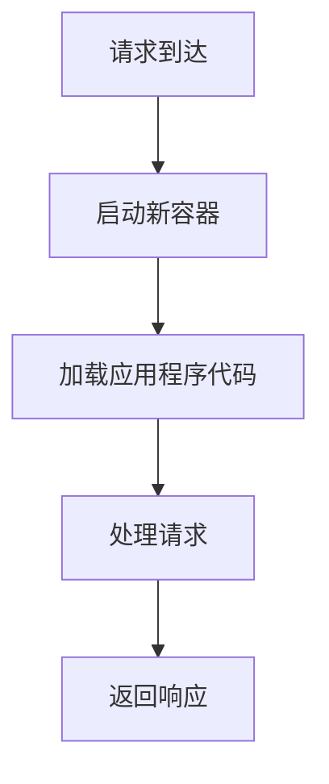

# Kubernetes 无服务器限制

Kubernetes 无服务器架构（Serverless on Kubernetes）是一种允许开发者在无需管理底层基础设施的情况下运行应用程序的模式。它通过自动扩展、按需分配资源以及按使用量计费的方式，简化了应用程序的部署和管理。然而，尽管 Kubernetes 无服务器架构带来了许多便利，但它也存在一些限制。本文将深入探讨这些限制，并帮助初学者理解如何在实际应用中应对这些挑战。

## 什么是 Kubernetes 无服务器架构？

Kubernetes 无服务器架构通常通过 Knative、Kubeless 或 OpenFaaS 等工具实现。这些工具在 Kubernetes 之上构建了一层抽象，使开发者能够专注于编写代码，而无需关心底层的基础设施管理。无服务器架构的核心思想是“按需运行”，即应用程序只在需要时运行，并在不需要时自动缩减到零。

## Kubernetes 无服务器架构的限制

尽管 Kubernetes 无服务器架构提供了许多优势，但它也存在一些限制。以下是几个主要限制：

### 1. 冷启动延迟

**冷启动延迟** 是指当应用程序从零扩展到运行状态时所需的时间。由于无服务器架构按需分配资源，当请求到达时，系统需要启动新的容器并加载应用程序代码，这可能导致延迟。

:::caution
冷启动延迟可能会影响用户体验，尤其是在需要快速响应的应用程序中。
:::



### 2. 资源限制

Kubernetes 无服务器架构通常会对每个函数或应用程序的资源使用进行限制。这些限制包括 CPU、内存和存储等。如果应用程序需要更多的资源，可能会遇到性能瓶颈。

:::tip
在设计无服务器应用程序时，务必考虑资源限制，并优化代码以在有限的资源下高效运行。
:::

### 3. 状态管理

无服务器架构通常是**无状态**的，这意味着每次函数调用都是独立的，无法保留前一次调用的状态。对于需要持久化状态的应用程序，开发者需要依赖外部存储服务（如数据库或对象存储）来管理状态。

:::warning
无状态设计可能会增加应用程序的复杂性，尤其是在需要处理复杂业务流程时。
:::

### 4. 调试和监控

由于无服务器架构的抽象性，调试和监控可能会变得更加困难。开发者可能无法直接访问底层基础设施，因此需要依赖日志、指标和跟踪工具来诊断问题。

:::note
使用适当的监控工具（如 Prometheus 和 Grafana）可以帮助开发者更好地理解和优化无服务器应用程序的性能。
:::

## 实际案例

### 案例 1：冷启动延迟的应对

假设你正在开发一个电子商务网站，用户在下单时需要快速响应。为了减少冷启动延迟，你可以使用以下策略：

1. **预热函数**：定期调用函数以保持容器的运行状态。
2. **增加最小实例数**：设置一个最小实例数，确保始终有足够的容器来处理请求。

```yaml
apiVersion: serving.knative.dev/v1
kind: Service
metadata:
  name: ecommerce-service
spec:
  template:
    spec:
      containerConcurrency: 10
      minScale: 2
      maxScale: 10
```

### 案例 2：资源限制的优化

假设你正在开发一个图像处理服务，每个请求都需要大量的 CPU 和内存。为了优化资源使用，你可以：

1. **拆分任务**：将大任务拆分为多个小任务，并行处理。
2. **调整资源请求**：根据实际需求调整 Kubernetes 资源请求和限制。

```yaml
resources:
  requests:
    memory: "512Mi"
    cpu: "500m"
  limits:
    memory: "1Gi"
    cpu: "1"
```

## 总结

Kubernetes 无服务器架构为开发者提供了极大的便利，但也带来了一些挑战。通过理解冷启动延迟、资源限制、状态管理和调试监控等方面的限制，开发者可以更好地设计和优化无服务器应用程序。在实际应用中，合理使用预热函数、调整资源请求和依赖外部存储服务等策略，可以有效应对这些限制。

## 附加资源

- [Knative 官方文档](https://knative.dev/docs/)
- [Kubeless 官方文档](https://kubeless.io/docs/)
- [OpenFaaS 官方文档](https://docs.openfaas.com/)

## 练习

1. 尝试在 Kubernetes 集群中部署一个简单的无服务器函数，并观察冷启动延迟。
2. 调整函数的资源请求和限制，观察性能变化。
3. 设计一个需要状态管理的无服务器应用程序，并使用外部存储服务来管理状态。
