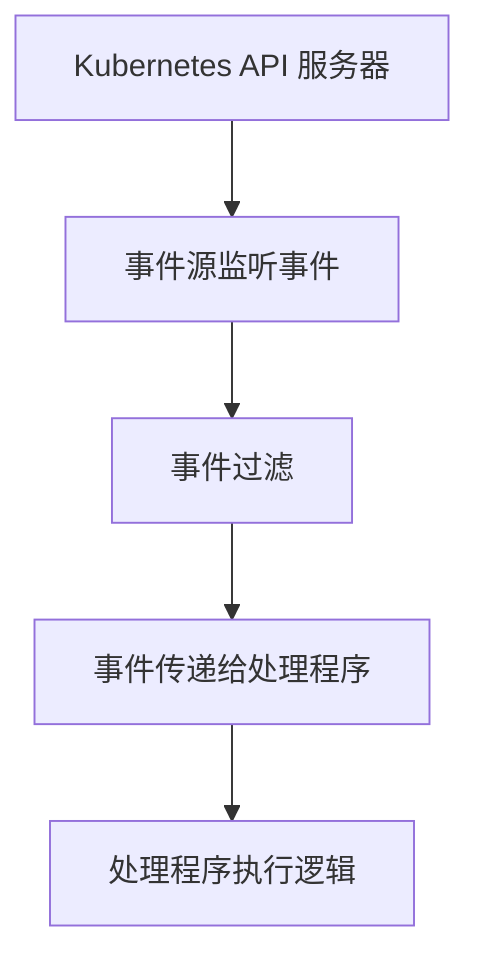

# Kubernetes 事件源

## 介绍

在 Kubernetes 中，**事件源（Event Source）** 是一种机制，用于捕获和响应集群中发生的事件。这些事件可以是 Pod 的创建、删除、更新，或者是服务的状态变化等。事件源是无服务器架构（Serverless）中的重要组成部分，它允许开发者基于事件触发函数或工作流，从而实现自动化和高效的资源管理。

本文将逐步介绍 Kubernetes 事件源的概念、工作原理，并通过代码示例和实际案例帮助你理解其应用场景。

---

## 什么是 Kubernetes 事件源？

Kubernetes 事件源是一种触发器，用于监听 Kubernetes 集群中的特定事件，并将这些事件传递给处理程序（如函数或工作流）。事件源通常与无服务器框架（如 Knative 或 Kubeless）结合使用，以实现基于事件的自动化操作。

例如，当一个新的 Pod 被创建时，事件源可以捕获这一事件，并触发一个函数来处理该事件。这种机制非常适合用于自动化部署、监控和扩展等场景。

---

## 事件源的工作原理

Kubernetes 事件源的工作原理可以分为以下几个步骤：

1. **事件监听**：事件源会监听 Kubernetes API 服务器中的事件流。
2. **事件过滤**：根据配置的规则，过滤出感兴趣的事件（如 Pod 创建、服务更新等）。
3. **事件传递**：将过滤后的事件传递给处理程序（如函数或工作流）。
4. **事件处理**：处理程序执行相应的逻辑，例如更新数据库、发送通知或触发其他操作。

以下是一个简单的事件源工作流程示意图：



---

## 代码示例：使用 Knative 创建事件源

Knative 是一个流行的 Kubernetes 无服务器框架，它提供了事件源的功能。以下是一个使用 Knative 创建事件源的示例。

### 1. 安装 Knative

首先，确保你已经安装了 Knative。可以通过以下命令安装 Knative Eventing 组件：

```bash
kubectl apply -f https://github.com/knative/eventing/releases/download/v1.0.0/eventing-crds.yaml
kubectl apply -f https://github.com/knative/eventing/releases/download/v1.0.0/eventing-core.yaml
```

### 2. 创建事件源

接下来，创建一个事件源来监听 Kubernetes 中的 Pod 创建事件。以下是一个 YAML 配置文件示例：

```yaml
apiVersion: sources.knative.dev/v1
kind: ApiServerSource
metadata:
  name: pod-created-source
spec:
  serviceAccountName: default
  mode: Resource
  resources:
    - apiVersion: v1
      kind: Pod
  sink:
    ref:
      apiVersion: serving.knative.dev/v1
      kind: Service
      name: event-handler
```

### 3. 创建事件处理程序

创建一个 Knative 服务来处理事件。以下是一个简单的 Python 函数示例：

```python
from flask import Flask, request
app = Flask(__name__)

@app.route("/", methods=["POST"])
def handle_event():
    event = request.json
    print(f"Received event: {event}")
    return "Event processed", 200

if __name__ == "__main__":
    app.run(host="0.0.0.0", port=8080)
```

### 4. 部署并测试

将事件源和处理程序部署到 Kubernetes 集群中，然后创建一个新的 Pod 来测试事件源是否正常工作：

```bash
kubectl apply -f pod-created-source.yaml
kubectl apply -f event-handler.yaml
kubectl run test-pod --image=busybox -- sleep 3600
```

如果一切正常，你应该会在事件处理程序的日志中看到类似以下的输出：

```
Received event: {"kind": "Pod", "metadata": {"name": "test-pod", ...}}
```

---

## 实际案例：自动化部署

假设你有一个 CI/CD 流水线，每当有新的镜像推送到 Docker Registry 时，你希望自动部署该镜像到 Kubernetes 集群中。你可以使用 Kubernetes 事件源来实现这一功能。

1. **事件源**：监听 Docker Registry 的 Webhook 事件。
2. **处理程序**：解析事件中的镜像信息，并调用 Kubernetes API 创建或更新 Deployment。

通过这种方式，你可以实现完全自动化的部署流程，而无需手动干预。

---

## 总结

Kubernetes 事件源是一种强大的工具，可以帮助你在无服务器架构中实现基于事件的自动化操作。通过监听 Kubernetes 集群中的事件，并将其传递给处理程序，你可以轻松实现自动化部署、监控和扩展等功能。

希望本文能帮助你理解 Kubernetes 事件源的概念和应用场景。如果你对无服务器架构感兴趣，可以继续探索 Knative 或其他相关工具。

---

## 附加资源

- [Knative 官方文档](https://knative.dev/docs/)
- [Kubernetes API 参考](https://kubernetes.io/docs/reference/kubernetes-api/)
- [无服务器架构入门指南](https://www.serverless.com/)
