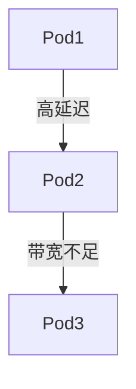

# Kubernetes 性能问题

Kubernetes 是一个强大的容器编排工具，但随着集群规模的扩大和应用的复杂性增加，性能问题可能会逐渐显现。对于初学者来说，理解如何识别和解决这些问题是至关重要的。本文将带你逐步了解 Kubernetes 性能问题的常见原因、诊断方法以及解决方案。

## 1. 什么是 Kubernetes 性能问题？

Kubernetes 性能问题通常表现为应用响应变慢、资源利用率过高、Pod 启动时间过长或调度延迟等现象。这些问题可能由多种因素引起，包括资源配置不当、网络瓶颈、存储性能问题或集群本身的限制。

:::note
性能问题并不总是显而易见的，有时它们会以微妙的方式影响整个系统。因此，掌握基本的诊断工具和方法是解决这些问题的关键。
:::

## 2. 常见的 Kubernetes 性能问题

### 2.1 资源限制与请求配置不当

Kubernetes 允许你为 Pod 设置资源请求（requests）和限制（limits）。如果这些值设置不当，可能会导致资源争用或浪费。

```yaml
resources:
  requests:
    memory: "64Mi"
    cpu: "250m"
  limits:
    memory: "128Mi"
    cpu: "500m"
```

:::caution
如果资源请求设置过低，Pod 可能无法获得足够的资源，导致性能下降。如果资源限制设置过高，可能会导致资源浪费或节点过载。
:::

### 2.2 网络瓶颈

Kubernetes 集群中的网络性能问题通常表现为 Pod 之间的通信延迟或带宽不足。这可能是由于网络插件配置不当或网络策略过于严格。



### 2.3 存储性能问题

存储性能问题通常与持久卷（Persistent Volume, PV）和持久卷声明（Persistent Volume Claim, PVC）相关。如果存储后端性能不足，可能会导致应用响应变慢。

```yaml
apiVersion: v1
kind: PersistentVolumeClaim
metadata:
  name: my-pvc
spec:
  accessModes:
    - ReadWriteOnce
  resources:
    requests:
      storage: 10Gi
```

:::tip
使用高性能存储后端（如 SSD）或优化存储类（StorageClass）配置可以显著提升存储性能。
:::

## 3. 诊断 Kubernetes 性能问题

### 3.1 使用 `kubectl top` 监控资源使用情况

`kubectl top` 命令可以帮助你查看节点和 Pod 的资源使用情况。

```bash
kubectl top nodes
kubectl top pods
```

### 3.2 使用 `kubectl describe` 查看 Pod 状态

`kubectl describe` 命令可以提供 Pod 的详细信息，包括事件日志和资源分配情况。

```bash
kubectl describe pod <pod-name>
```

### 3.3 使用 Prometheus 和 Grafana 进行监控

Prometheus 和 Grafana 是 Kubernetes 中常用的监控工具，可以帮助你实时监控集群性能。


## 4. 实际案例：解决 Pod 启动延迟问题

假设你发现某个 Pod 启动时间过长，经过诊断发现是由于资源请求设置过低导致的。你可以通过以下步骤解决问题：

1. **查看 Pod 资源请求**：
   ```bash
   kubectl describe pod <pod-name>
   ```
2. **调整资源请求**：
   ```yaml
   resources:
     requests:
       memory: "128Mi"
       cpu: "500m"
   ```
3. **重新部署 Pod**：
   ```bash
   kubectl apply -f pod.yaml
   ```

:::warning
在调整资源请求时，请确保不会导致节点资源过载。
:::

## 5. 总结

Kubernetes 性能问题可能由多种因素引起，包括资源配置不当、网络瓶颈和存储性能问题。通过使用 `kubectl top`、`kubectl describe` 以及 Prometheus 和 Grafana 等工具，你可以有效地诊断和解决这些问题。

## 6. 附加资源与练习

- **练习**：尝试在本地 Kubernetes 集群中模拟资源争用问题，并使用本文介绍的工具进行诊断和解决。
- **资源**：
  - [Kubernetes 官方文档](https://kubernetes.io/docs/)
  - [Prometheus 官方文档](https://prometheus.io/docs/)
  - [Grafana 官方文档](https://grafana.com/docs/)

通过不断实践和学习，你将能够更好地掌握 Kubernetes 性能问题的诊断和解决方法。