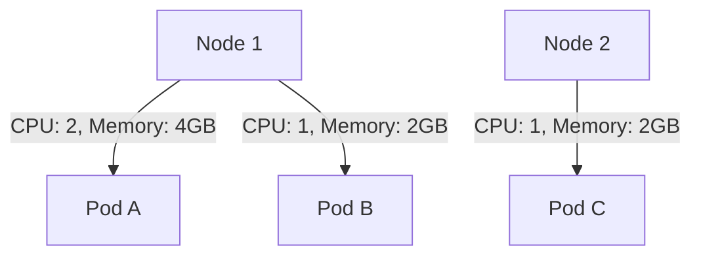

# Kubernetes 容量规划

Kubernetes是一个强大的容器编排工具，但在生产环境中，如何有效地规划和管理集群的资源容量是一个关键问题。容量规划不仅影响应用的性能，还直接关系到成本控制和系统的稳定性。本文将带你逐步了解Kubernetes容量规划的核心概念、方法和实际应用。

## 什么是Kubernetes容量规划？

容量规划是指根据应用的需求和集群的资源限制，合理分配和管理计算、存储和网络资源的过程。在Kubernetes中，容量规划的目标是确保集群能够高效地运行所有工作负载，同时避免资源浪费或资源不足的情况。

:::note
容量规划不仅仅是关于CPU和内存的分配，还包括存储、网络带宽、节点数量等多个维度的资源管理。
:::

## 容量规划的核心概念

### 1. 资源请求（Requests）和限制（Limits）

在Kubernetes中，每个Pod都可以通过`requests`和`limits`来定义其资源需求：

- **Requests**：表示Pod运行所需的最小资源量。Kubernetes调度器会根据`requests`来决定将Pod调度到哪个节点。
- **Limits**：表示Pod可以使用的最大资源量。如果Pod尝试使用超过`limits`的资源，Kubernetes会对其进行限制或终止。

```yaml
apiVersion: v1
kind: Pod
metadata:
  name: example-pod
spec:
  containers:
  - name: example-container
    image: nginx
    resources:
      requests:
        memory: "64Mi"
        cpu: "250m"
      limits:
        memory: "128Mi"
        cpu: "500m"
```

在上面的示例中，Pod请求了64Mi内存和250m CPU，但最多可以使用128Mi内存和500m CPU。

### 2. 节点容量

每个Kubernetes节点都有固定的资源容量，包括CPU、内存和存储。容量规划需要确保所有节点的资源总和能够满足所有Pod的`requests`。



### 3. 集群自动扩展（Cluster Autoscaler）

Kubernetes提供了集群自动扩展功能，可以根据工作负载的需求动态调整节点数量。当资源不足时，自动扩展器会添加新的节点；当资源过剩时，它会删除多余的节点。

:::tip
集群自动扩展器通常与云服务提供商（如AWS、GCP）集成，以便动态创建和销毁节点。
:::

## 容量规划的步骤

### 1. 评估应用需求

首先，你需要了解每个应用对资源的需求。可以通过监控工具（如Prometheus）收集历史数据，分析应用的CPU、内存和存储使用情况。

### 2. 设置合理的`requests`和`limits`

根据应用的需求，为每个Pod设置合理的`requests`和`limits`。确保`requests`能够满足应用的最小需求，而`limits`能够防止资源过度使用。

### 3. 计算集群总容量

将所有节点的资源容量相加，确保集群的总容量能够满足所有Pod的`requests`。如果资源不足，可以考虑增加节点或优化资源分配。

### 4. 实施监控和调整

容量规划是一个持续的过程。通过监控工具实时跟踪资源使用情况，并根据需要进行调整。例如，如果某个Pod的`limits`经常被触发，可能需要增加其资源配额。

## 实际案例

假设你有一个包含3个节点的Kubernetes集群，每个节点有4个CPU和8GB内存。你运行了以下Pod：

- **Pod A**：`requests`为1 CPU和2GB内存，`limits`为2 CPU和4GB内存。
- **Pod B**：`requests`为1 CPU和2GB内存，`limits`为2 CPU和4GB内存。
- **Pod C**：`requests`为2 CPU和4GB内存，`limits`为4 CPU和8GB内存。


在这个案例中，集群的总容量为12 CPU和24GB内存，而所有Pod的`requests`总和为4 CPU和8GB内存。因此，集群有足够的资源来运行这些Pod。

## 总结

Kubernetes容量规划是确保集群高效运行的关键步骤。通过合理设置`requests`和`limits`，并结合监控和自动扩展功能，你可以有效地管理集群资源，避免资源浪费和性能瓶颈。

:::caution
不要忽视存储和网络资源的规划，它们同样对应用的性能有重要影响。
:::

## 附加资源

- [Kubernetes官方文档：资源管理](https://kubernetes.io/docs/concepts/configuration/manage-resources-containers/)
- [Prometheus：监控Kubernetes集群](https://prometheus.io/docs/introduction/overview/)
- [Kubernetes集群自动扩展器](https://github.com/kubernetes/autoscaler)

## 练习

1. 为你的Kubernetes集群中的某个应用设置`requests`和`limits`，并观察其资源使用情况。
2. 使用Prometheus监控集群的资源使用情况，并根据数据调整`requests`和`limits`。
3. 尝试启用集群自动扩展器，并观察节点数量的变化。

通过以上步骤，你将能够更好地理解和应用Kubernetes容量规划。