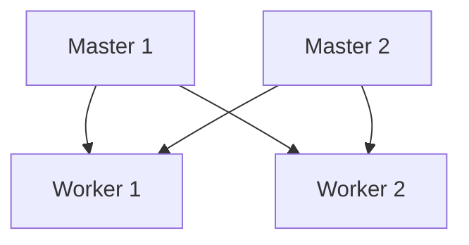

# Kubernetes 生产检查清单

Kubernetes是一个强大的容器编排工具，但在生产环境中使用它时，必须确保集群的配置和运行状态是稳定和安全的。本文将为您提供一个详细的检查清单，帮助您在生产环境中部署和管理Kubernetes集群。

## 1. 集群配置

### 1.1 节点配置
确保所有节点（包括Master和Worker节点）的资源配置满足应用需求。检查CPU、内存和存储的分配是否合理。

```bash
kubectl describe node <node-name>
```

### 1.2 网络配置
确保网络插件（如Calico、Flannel等）正确配置，并且Pod之间的通信正常。

```bash
kubectl get pods -n kube-system
```

### 1.3 存储配置
确保持久化存储（如Persistent Volumes）正确配置，并且数据能够持久化存储。

```bash
kubectl get pv
kubectl get pvc
```

## 2. 安全性

### 2.1 RBAC配置
确保Role-Based Access Control (RBAC) 正确配置，限制用户和服务的权限。

```bash
kubectl get roles
kubectl get rolebindings
```

### 2.2 网络策略
使用Network Policies限制Pod之间的网络流量，确保只有授权的Pod可以相互通信。

```yaml
apiVersion: networking.k8s.io/v1
kind: NetworkPolicy
metadata:
  name: default-deny
spec:
  podSelector: {}
  policyTypes:
  - Ingress
  - Egress
```

### 2.3 镜像安全
确保所有容器镜像来自可信的源，并且定期扫描镜像以发现安全漏洞。

```bash
kubectl get pods -o jsonpath="{.spec.containers[*].image}"
```

## 3. 监控与日志

### 3.1 监控工具
部署监控工具（如Prometheus、Grafana）以实时监控集群状态。

```bash
kubectl get pods -n monitoring
```

### 3.2 日志管理
使用日志管理工具（如Fluentd、Elasticsearch）集中管理日志，便于故障排查。

```bash
kubectl logs <pod-name>
```

## 4. 高可用性

### 4.1 多Master节点
在生产环境中，建议部署多个Master节点以确保高可用性。



### 4.2 自动扩展
配置Horizontal Pod Autoscaler (HPA) 以根据负载自动扩展Pod。

```yaml
apiVersion: autoscaling/v2beta2
kind: HorizontalPodAutoscaler
metadata:
  name: my-app-hpa
spec:
  scaleTargetRef:
    apiVersion: apps/v1
    kind: Deployment
    name: my-app
  minReplicas: 1
  maxReplicas: 10
  metrics:
  - type: Resource
    resource:
      name: cpu
      target:
        type: Utilization
        averageUtilization: 50
```

## 5. 备份与恢复

### 5.1 定期备份
定期备份etcd数据，以便在灾难发生时能够快速恢复集群。

```bash
etcdctl snapshot save snapshot.db
```

### 5.2 恢复策略
制定并测试恢复策略，确保在数据丢失或集群故障时能够快速恢复。

```bash
etcdctl snapshot restore snapshot.db
```

## 6. 实际案例

### 案例：电商平台
某电商平台在生产环境中使用Kubernetes管理其微服务架构。通过遵循上述检查清单，他们确保了集群的高可用性、安全性和稳定性，从而提供了无缝的用户体验。

## 总结

通过遵循本检查清单，您可以确保Kubernetes集群在生产环境中的稳定性和安全性。定期检查和更新配置，部署监控和日志管理工具，并制定备份和恢复策略，是确保集群长期稳定运行的关键。

## 附加资源

- [Kubernetes官方文档](https://kubernetes.io/docs/home/)
- [Prometheus监控指南](https://prometheus.io/docs/introduction/overview/)
- [Kubernetes安全最佳实践](https://kubernetes.io/docs/concepts/security/)

## 练习

1. 部署一个简单的应用，并配置HPA以自动扩展Pod。
2. 使用Network Policies限制Pod之间的网络流量。
3. 部署Prometheus和Grafana，并监控集群状态。
