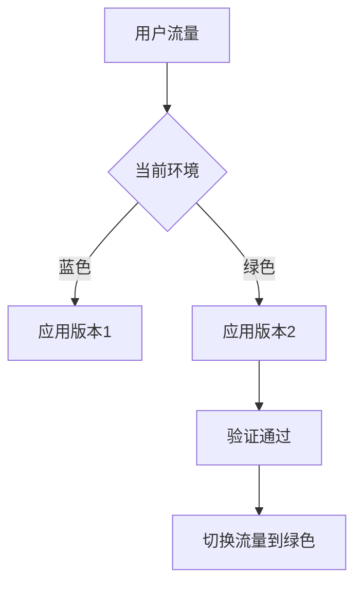
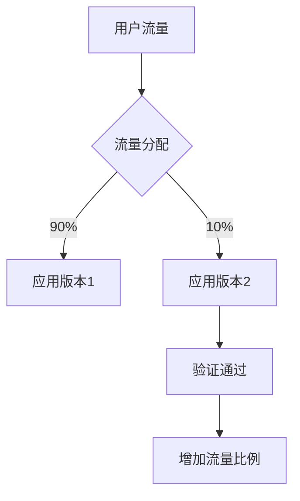

# Kubernetes 变更管理

在现代云原生应用中，Kubernetes已经成为容器编排的事实标准。随着应用规模的扩大和复杂性的增加，如何有效地管理Kubernetes集群中的变更变得至关重要。变更管理不仅仅是更新应用或配置，它还涉及到如何确保这些变更不会对生产环境造成负面影响。

## 什么是Kubernetes变更管理？

Kubernetes变更管理是指在Kubernetes集群中对应用、配置或基础设施进行更新、修改或删除的过程。变更管理的目标是确保这些变更能够在不影响系统稳定性和可靠性的前提下顺利实施。

变更管理通常包括以下几个步骤：

1. **变更计划**：确定需要进行的变更，并制定详细的计划。
2. **变更审批**：确保变更经过适当的审批流程。
3. **变更实施**：在集群中执行变更。
4. **变更验证**：验证变更是否按预期工作。
5. **变更回滚**：如果变更出现问题，能够快速回滚到之前的状态。

## 变更管理的关键概念

### 1. 声明式配置

Kubernetes使用声明式配置来管理资源。这意味着你只需要定义资源的期望状态，Kubernetes会自动处理如何达到这个状态。声明式配置使得变更管理更加可控和可预测。

```yaml
apiVersion: apps/v1
kind: Deployment
metadata:
  name: my-app
spec:
  replicas: 3
  template:
    metadata:
      labels:
        app: my-app
    spec:
      containers:
      - name: my-app
        image: my-app:1.0.0
```

在上面的示例中，我们定义了一个Deployment资源，期望有3个副本运行`my-app:1.0.0`镜像。如果我们需要更新镜像版本，只需修改`image`字段并重新应用配置，Kubernetes会自动处理更新过程。

### 2. 滚动更新

Kubernetes支持滚动更新，这意味着在更新应用时，Kubernetes会逐步替换旧的Pod实例，而不是一次性全部替换。这可以减少更新过程中对服务的影响。

```yaml
apiVersion: apps/v1
kind: Deployment
metadata:
  name: my-app
spec:
  replicas: 3
  strategy:
    type: RollingUpdate
    rollingUpdate:
      maxUnavailable: 1
      maxSurge: 1
  template:
    metadata:
      labels:
        app: my-app
    spec:
      containers:
      - name: my-app
        image: my-app:1.1.0
```

在这个示例中，我们定义了一个滚动更新策略，`maxUnavailable`表示在更新过程中最多允许1个Pod不可用，`maxSurge`表示在更新过程中最多允许1个额外的Pod被创建。

### 3. 蓝绿部署

蓝绿部署是一种部署策略，它通过维护两个独立的环境（蓝色和绿色）来减少部署风险。在蓝绿部署中，新版本的应用首先部署到绿色环境，经过验证后再将流量切换到绿色环境。



### 4. 金丝雀发布

金丝雀发布是一种逐步将新版本应用引入生产环境的策略。它通过将一小部分流量路由到新版本应用，逐步增加流量比例，直到完全替换旧版本。



## 实际案例

假设我们有一个运行在生产环境中的Web应用，当前版本为`1.0.0`。我们需要将应用升级到`1.1.0`，并确保升级过程不会影响用户体验。

### 步骤1：制定变更计划

我们决定使用滚动更新策略，逐步替换旧版本的Pod实例。我们还将设置`maxUnavailable`为1，`maxSurge`为1，以确保在更新过程中服务的可用性。

### 步骤2：实施变更

我们修改Deployment的配置，将`image`字段更新为`my-app:1.1.0`，并应用配置。

```bash
kubectl apply -f deployment.yaml
```

### 步骤3：验证变更

我们通过监控工具观察应用的性能和稳定性，确保新版本应用按预期工作。

### 步骤4：回滚（如果需要）

如果新版本应用出现问题，我们可以使用以下命令快速回滚到之前的版本：

```bash
kubectl rollout undo deployment/my-app
```

## 总结

Kubernetes变更管理是确保生产环境稳定性和可靠性的关键。通过使用声明式配置、滚动更新、蓝绿部署和金丝雀发布等策略，我们可以有效地管理Kubernetes集群中的变更，减少对生产环境的影响。

## 附加资源

- [Kubernetes官方文档](https://kubernetes.io/docs/home/)
- [Kubernetes Best Practices](https://cloud.google.com/kubernetes-engine/docs/best-practices)
- [Kubernetes Deployment Strategies](https://kubernetes.io/docs/concepts/workloads/controllers/deployment/#strategy)

## 练习

1. 创建一个Kubernetes Deployment，并使用滚动更新策略将应用从`1.0.0`升级到`1.1.0`。
2. 尝试使用蓝绿部署策略部署一个新版本的应用。
3. 使用金丝雀发布策略将10%的流量路由到新版本应用，并逐步增加流量比例。

通过完成这些练习，你将更好地理解Kubernetes变更管理的实际应用。