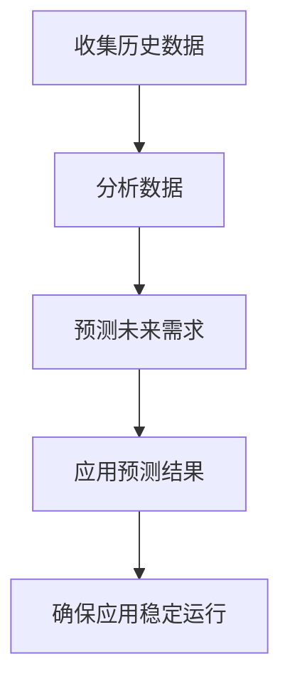

# Kubernetes 资源预测

在Kubernetes中，资源预测是一个关键的管理任务，它帮助管理员和开发者更好地规划和分配集群中的资源，如CPU、内存等。通过资源预测，可以避免资源浪费或资源不足的情况，从而提高应用的性能和稳定性。

## 什么是资源预测？

资源预测是指通过分析历史数据和当前资源使用情况，预测未来一段时间内应用或服务所需的资源量。在Kubernetes中，资源预测通常用于自动扩展（Horizontal Pod Autoscaler, HPA）和资源请求（Resource Requests）的配置。

## 为什么需要资源预测？

1. **避免资源浪费**：通过预测资源需求，可以避免过度分配资源，从而节省成本。
2. **提高应用性能**：合理的资源分配可以确保应用在高峰期也能稳定运行。
3. **自动化扩展**：资源预测可以帮助HPA更准确地扩展或缩减Pod数量。

## 如何进行资源预测？

### 1. 收集历史数据

首先，需要收集应用的历史资源使用数据。Kubernetes提供了多种工具来监控资源使用情况，如Metrics Server、Prometheus等。

```bash
kubectl top pod
```

### 2. 分析数据

使用数据分析工具（如Python的Pandas库）对收集到的数据进行分析，找出资源使用的趋势和模式。

```python
import pandas as pd

# 假设我们有一个CSV文件包含资源使用数据
data = pd.read_csv('resource_usage.csv')
print(data.describe())
```

### 3. 预测未来需求

使用时间序列分析或机器学习模型（如ARIMA、LSTM）来预测未来的资源需求。

```python
from statsmodels.tsa.arima_model import ARIMA

# 假设我们有一个时间序列数据
model = ARIMA(data['cpu_usage'], order=(5,1,0))
model_fit = model.fit(disp=0)
forecast = model_fit.forecast(steps=10)[0]
print(forecast)
```

### 4. 应用预测结果

将预测结果应用到Kubernetes的资源请求和限制配置中。

```yaml
apiVersion: apps/v1
kind: Deployment
metadata:
  name: my-app
spec:
  replicas: 3
  template:
    spec:
      containers:
      - name: my-app-container
        image: my-app-image
        resources:
          requests:
            cpu: "500m"
            memory: "512Mi"
          limits:
            cpu: "1000m"
            memory: "1024Mi"
```

## 实际案例

假设我们有一个电商应用，在双十一期间流量激增。通过资源预测，我们可以提前增加Pod的数量和资源分配，确保应用在高峰期也能稳定运行。



## 总结

资源预测是Kubernetes中确保应用高效运行的关键步骤。通过收集和分析历史数据，预测未来的资源需求，并将其应用到Kubernetes的资源配置中，可以避免资源浪费和性能问题。

## 附加资源

- [Kubernetes官方文档](https://kubernetes.io/docs/)
- [Prometheus监控工具](https://prometheus.io/)
- [Pandas数据分析库](https://pandas.pydata.org/)

## 练习

1. 使用`kubectl top pod`命令收集你集群中某个应用的资源使用数据。
2. 使用Pandas分析这些数据，找出资源使用的趋势。
3. 尝试使用ARIMA模型预测未来的资源需求，并将结果应用到Kubernetes的资源配置中。

通过以上步骤，你将能够更好地理解和应用Kubernetes中的资源预测技术。