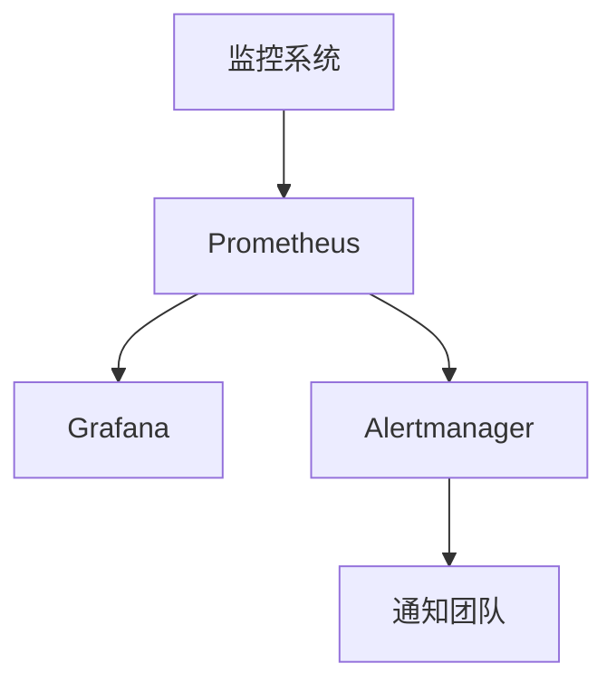

# Kubernetes 灾难计划

在现代云原生环境中，Kubernetes 已经成为容器编排的事实标准。然而，随着系统复杂性的增加，灾难恢复（Disaster Recovery, DR）变得至关重要。Kubernetes 灾难计划是一套策略和流程，旨在确保在发生重大故障时，集群能够快速恢复并继续提供服务。

## 什么是 Kubernetes 灾难计划？

Kubernetes 灾难计划是一组预先定义的步骤和策略，用于在发生灾难性事件（如硬件故障、网络中断、数据丢失等）时，恢复 Kubernetes 集群及其应用程序。灾难计划的目标是最小化停机时间，确保数据完整性，并尽快恢复服务。

## 为什么需要 Kubernetes 灾难计划？

Kubernetes 集群通常运行着关键业务应用，任何停机或数据丢失都可能导致严重的业务影响。通过制定灾难计划，您可以：

- **减少停机时间**：快速恢复服务，减少对业务的影响。
- **保护数据**：确保关键数据在灾难发生时不会丢失。
- **提高可靠性**：通过预先规划的恢复流程，提高系统的整体可靠性。

## 制定 Kubernetes 灾难计划的步骤

### 1. 识别关键组件

首先，您需要识别 Kubernetes 集群中的关键组件，包括：

- **控制平面组件**：如 API Server、etcd、Controller Manager、Scheduler。
- **工作节点**：运行应用程序的节点。
- **存储**：持久化存储，如 Persistent Volumes (PV) 和 Persistent Volume Claims (PVC)。
- **网络**：网络配置和服务发现。

:::note
**提示**：使用 `kubectl get nodes` 和 `kubectl get pods -n kube-system` 命令来查看集群中的节点和控制平面组件。
:::

### 2. 备份策略

备份是灾难恢复的核心。您需要定期备份以下内容：

- **etcd 数据**：etcd 是 Kubernetes 的键值存储，保存了集群的所有状态信息。
- **应用程序数据**：包括 Persistent Volumes 中的数据。
- **配置和密钥**：如 ConfigMaps、Secrets 等。

#### 备份 etcd

```bash
ETCDCTL_API=3 etcdctl --endpoints=https://127.0.0.1:2379 \
  --cacert=/etc/kubernetes/pki/etcd/ca.crt \
  --cert=/etc/kubernetes/pki/etcd/server.crt \
  --key=/etc/kubernetes/pki/etcd/server.key \
  snapshot save /var/lib/etcd/backup/snapshot.db
```

#### 恢复 etcd

```bash
ETCDCTL_API=3 etcdctl --endpoints=https://127.0.0.1:2379 \
  --cacert=/etc/kubernetes/pki/etcd/ca.crt \
  --cert=/etc/kubernetes/pki/etcd/server.crt \
  --key=/etc/kubernetes/pki/etcd/server.key \
  snapshot restore /var/lib/etcd/backup/snapshot.db
```

### 3. 高可用性配置

确保 Kubernetes 控制平面和工作节点的高可用性（High Availability, HA）。这包括：

- **多主节点**：部署多个主节点以防止单点故障。
- **负载均衡**：使用负载均衡器分发流量到多个主节点。
- **自动故障转移**：配置自动故障转移机制，如使用 `kubeadm` 或 `kops` 部署高可用集群。

### 4. 灾难恢复演练

定期进行灾难恢复演练，确保在实际灾难发生时能够快速执行恢复流程。演练应包括：

- **模拟故障**：如删除 etcd 数据或关闭主节点。
- **恢复流程**：按照预先定义的步骤恢复集群。
- **验证**：验证集群和应用程序是否恢复正常。

### 5. 监控和告警

实施全面的监控和告警系统，以便在灾难发生前或发生时及时发现问题。常用的监控工具包括 Prometheus、Grafana 和 Alertmanager。



## 实际案例

假设您的 Kubernetes 集群运行着一个电子商务平台，突然发生了主节点故障。由于您已经制定了灾难计划，您可以：

1. **启动备份主节点**：从备份中恢复 etcd 数据并启动新的主节点。
2. **恢复应用程序**：使用 Persistent Volumes 的备份恢复应用程序数据。
3. **验证服务**：确保所有服务正常运行，并进行必要的测试。

## 总结

Kubernetes 灾难计划是确保集群在发生灾难时能够快速恢复的关键。通过识别关键组件、制定备份策略、配置高可用性、进行灾难恢复演练以及实施监控和告警，您可以最大限度地减少停机时间并保护数据。

## 附加资源

- [Kubernetes 官方文档 - 备份和恢复](https://kubernetes.io/docs/tasks/administer-cluster/configure-upgrade-etcd/)
- [Prometheus 官方文档](https://prometheus.io/docs/)
- [Grafana 官方文档](https://grafana.com/docs/)

## 练习

1. 使用 `etcdctl` 备份您的 Kubernetes 集群的 etcd 数据。
2. 模拟主节点故障，并尝试从备份中恢复集群。
3. 配置 Prometheus 和 Grafana 监控您的 Kubernetes 集群，并设置告警规则。

通过以上步骤和练习，您将能够更好地理解和实施 Kubernetes 灾难计划，确保您的集群在灾难发生时能够快速恢复。