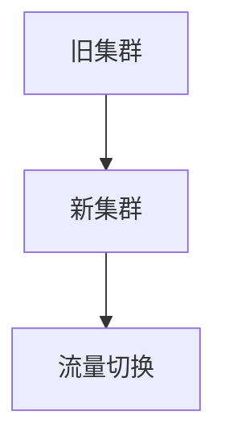

# Kubernetes 升级最佳实践

Kubernetes是一个快速发展的开源平台，用于自动化容器化应用程序的部署、扩展和管理。随着新版本的发布，Kubernetes引入了新功能、性能改进和安全补丁。因此，定期升级Kubernetes集群至关重要。然而，升级过程可能会带来风险，尤其是在生产环境中。本文将介绍Kubernetes升级的最佳实践，帮助您安全、高效地完成升级。

## 1. 升级前的准备工作

在升级Kubernetes集群之前，必须进行充分的准备工作，以确保升级过程顺利进行。

### 1.1 备份集群状态

在升级之前，务必备份集群的当前状态。这包括：

- **etcd数据**：Kubernetes使用etcd存储集群状态。备份etcd数据可以防止在升级过程中丢失关键信息。
- **资源定义文件**：备份所有YAML文件，包括Deployment、Service、ConfigMap等。

```bash
# 备份etcd数据
etcdctl snapshot save /path/to/backup.db
```

### 1.2 检查集群健康状况

确保集群中的所有节点和组件都处于健康状态。可以使用以下命令检查集群健康状况：

```bash
kubectl get nodes
kubectl get pods --all-namespaces
```

### 1.3 阅读发布说明

在升级之前，仔细阅读Kubernetes新版本的发布说明，了解新功能、已知问题和不兼容性。

## 2. 升级策略

Kubernetes支持多种升级策略，选择适合您环境的策略至关重要。

### 2.1 滚动升级

滚动升级是最常见的升级策略，它允许您逐步替换集群中的节点，从而最大限度地减少停机时间。

```bash
# 升级kubeadm
kubeadm upgrade apply v1.22.0
```

### 2.2 蓝绿部署

蓝绿部署是一种零停机时间的升级策略。您可以在新版本的集群上部署应用程序，然后将流量切换到新集群。



### 2.3 金丝雀发布

金丝雀发布是一种逐步将新版本引入生产环境的策略。您可以将一小部分流量路由到新版本，观察其行为，然后再逐步扩大范围。

```bash
# 创建金丝雀部署
kubectl apply -f canary-deployment.yaml
```

## 3. 升级步骤

以下是Kubernetes升级的详细步骤：

### 3.1 升级控制平面

首先升级控制平面组件，包括API Server、Controller Manager、Scheduler等。

```bash
# 升级kubeadm
kubeadm upgrade apply v1.22.0

# 升级kubelet和kubectl
yum install -y kubelet-1.22.0 kubectl-1.22.0
systemctl restart kubelet
```

### 3.2 升级工作节点

在控制平面升级完成后，逐步升级工作节点。

```bash
# 升级kubeadm
kubeadm upgrade node

# 升级kubelet和kubectl
yum install -y kubelet-1.22.0 kubectl-1.22.0
systemctl restart kubelet
```

### 3.3 验证升级

升级完成后，验证集群是否正常运行。

```bash
kubectl get nodes
kubectl get pods --all-namespaces
```

## 4. 实际案例

假设您正在管理一个生产环境的Kubernetes集群，当前版本为1.21.0，您计划升级到1.22.0。以下是升级过程的实际案例：

1. **备份集群状态**：使用etcdctl备份etcd数据，并备份所有资源定义文件。
2. **检查集群健康状况**：确保所有节点和Pod都处于健康状态。
3. **升级控制平面**：使用kubeadm升级控制平面组件。
4. **升级工作节点**：逐步升级每个工作节点。
5. **验证升级**：检查集群状态，确保所有组件正常运行。

## 5. 总结

Kubernetes升级是一个复杂但必要的过程。通过遵循最佳实践，您可以最大限度地减少升级过程中的风险，确保集群的稳定性和可用性。在升级之前，务必备份集群状态，阅读发布说明，并选择合适的升级策略。升级完成后，验证集群状态，确保一切正常运行。

## 6. 附加资源

- [Kubernetes官方升级文档](https://kubernetes.io/docs/tasks/administer-cluster/kubeadm/kubeadm-upgrade/)
- [etcd备份与恢复指南](https://etcd.io/docs/v3.5/op-guide/recovery/)
- [Kubernetes版本发布说明](https://kubernetes.io/docs/setup/release/notes/)

## 7. 练习

1. 在本地环境中创建一个Kubernetes集群，并尝试升级到最新版本。
2. 使用金丝雀发布策略，将新版本的应用程序逐步引入生产环境。
3. 编写一个脚本，自动化Kubernetes集群的备份和升级过程。

:::tip
在升级过程中，如果遇到问题，可以参考Kubernetes社区论坛或官方文档，获取帮助和支持。
:::