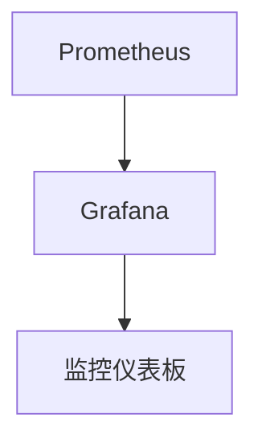

# Kubernetes 生产环境最佳实践

Kubernetes 是一个强大的容器编排工具，广泛应用于生产环境中。然而，在生产环境中运行 Kubernetes 集群需要遵循一些最佳实践，以确保其高效、安全和可靠。本文将逐步介绍这些最佳实践，帮助初学者更好地理解和应用 Kubernetes。

## 1. 资源管理

在生产环境中，资源管理是确保 Kubernetes 集群稳定运行的关键。以下是一些资源管理的最佳实践：

### 1.1 设置资源请求和限制

为每个容器设置资源请求（requests）和限制（limits）是确保集群资源合理分配的重要步骤。资源请求是容器启动时所需的最小资源量，而资源限制是容器可以使用的最大资源量。

```yaml
apiVersion: v1
kind: Pod
metadata:
  name: my-pod
spec:
  containers:
  - name: my-container
    image: my-image
    resources:
      requests:
        memory: "64Mi"
        cpu: "250m"
      limits:
        memory: "128Mi"
        cpu: "500m"
```

:::tip
**提示**：合理设置资源请求和限制可以防止资源争用，确保集群的稳定性。
:::

### 1.2 使用 Horizontal Pod Autoscaler (HPA)

Horizontal Pod Autoscaler (HPA) 可以根据 CPU 或内存使用率自动扩展或缩减 Pod 的数量。这有助于在负载波动时保持应用的性能。

```yaml
apiVersion: autoscaling/v2beta2
kind: HorizontalPodAutoscaler
metadata:
  name: my-hpa
spec:
  scaleTargetRef:
    apiVersion: apps/v1
    kind: Deployment
    name: my-deployment
  minReplicas: 1
  maxReplicas: 10
  metrics:
  - type: Resource
    resource:
      name: cpu
      target:
        type: Utilization
        averageUtilization: 50
```

:::note
**注意**：HPA 需要配置正确的资源请求和限制才能正常工作。
:::

## 2. 安全性

在生产环境中，安全性是 Kubernetes 集群管理的重中之重。以下是一些安全性最佳实践：

### 2.1 使用 Role-Based Access Control (RBAC)

RBAC 是 Kubernetes 中用于控制用户和服务账户访问权限的机制。通过 RBAC，可以确保只有授权的用户和服务账户能够访问特定的资源。

```yaml
apiVersion: rbac.authorization.k8s.io/v1
kind: Role
metadata:
  namespace: default
  name: pod-reader
rules:
- apiGroups: [""]
  resources: ["pods"]
  verbs: ["get", "watch", "list"]
```

:::caution
**警告**：确保为每个用户和服务账户分配最小必要的权限，以减少安全风险。
:::

### 2.2 启用 Network Policies

Network Policies 是 Kubernetes 中用于控制 Pod 之间网络通信的机制。通过启用 Network Policies，可以限制 Pod 之间的通信，防止未经授权的访问。

```yaml
apiVersion: networking.k8s.io/v1
kind: NetworkPolicy
metadata:
  name: allow-pod-to-pod
  namespace: default
spec:
  podSelector:
    matchLabels:
      role: db
  policyTypes:
  - Ingress
  ingress:
  - from:
    - podSelector:
        matchLabels:
          role: frontend
```

:::warning
**警告**：未启用 Network Policies 可能导致 Pod 之间的通信不受限制，增加安全风险。
:::

## 3. 监控和日志

在生产环境中，监控和日志是确保 Kubernetes 集群健康运行的关键。以下是一些监控和日志的最佳实践：

### 3.1 使用 Prometheus 和 Grafana

Prometheus 是一个开源的监控系统，广泛用于 Kubernetes 集群的监控。Grafana 是一个可视化工具，可以与 Prometheus 集成，提供丰富的监控仪表板。



:::tip
**提示**：通过 Prometheus 和 Grafana，可以实时监控集群的性能和健康状况。
:::

### 3.2 集中日志管理

在生产环境中，集中日志管理是确保问题排查和审计的关键。可以使用 Fluentd 或 Logstash 等工具将日志集中存储和分析。

```yaml
apiVersion: v1
kind: ConfigMap
metadata:
  name: fluentd-config
data:
  fluent.conf: |
    <source>
      @type tail
      path /var/log/containers/*.log
      pos_file /var/log/fluentd-containers.log.pos
      tag kubernetes.*
      format json
      time_key time
      time_format %Y-%m-%dT%H:%M:%S.%NZ
    </source>
    <match kubernetes.**>
      @type elasticsearch
      host elasticsearch
      port 9200
      logstash_format true
    </match>
```

:::note
**注意**：集中日志管理可以帮助快速定位和解决问题，提高运维效率。
:::

## 4. 实际案例

以下是一个实际案例，展示如何在生产环境中应用上述最佳实践：

### 4.1 案例：电商平台

假设我们有一个电商平台，使用 Kubernetes 部署了多个微服务。为了确保平台的稳定性和安全性，我们采取了以下措施：

1. **资源管理**：为每个微服务设置了资源请求和限制，并使用 HPA 自动扩展 Pod 数量。
2. **安全性**：启用了 RBAC 和 Network Policies，确保只有授权的用户和服务账户能够访问特定的资源。
3. **监控和日志**：使用 Prometheus 和 Grafana 监控集群性能，并使用 Fluentd 将日志集中存储到 Elasticsearch。

通过上述措施，电商平台在生产环境中运行稳定，能够应对高负载和潜在的安全威胁。

## 5. 总结

在生产环境中运行 Kubernetes 集群需要遵循一系列最佳实践，包括资源管理、安全性、监控和日志管理。通过合理设置资源请求和限制、启用 RBAC 和 Network Policies、使用 Prometheus 和 Grafana 进行监控，以及集中日志管理，可以确保 Kubernetes 集群的高效、安全和可靠运行。

## 6. 附加资源

- [Kubernetes 官方文档](https://kubernetes.io/docs/home/)
- [Prometheus 官方文档](https://prometheus.io/docs/)
- [Grafana 官方文档](https://grafana.com/docs/)

## 7. 练习

1. 为你的 Kubernetes 集群中的某个应用设置资源请求和限制。
2. 启用 RBAC 并为某个用户分配最小必要的权限。
3. 配置 Prometheus 和 Grafana，监控你的 Kubernetes 集群。

通过以上练习，你将更好地理解和应用 Kubernetes 生产环境的最佳实践。